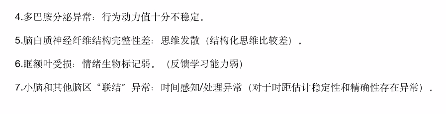
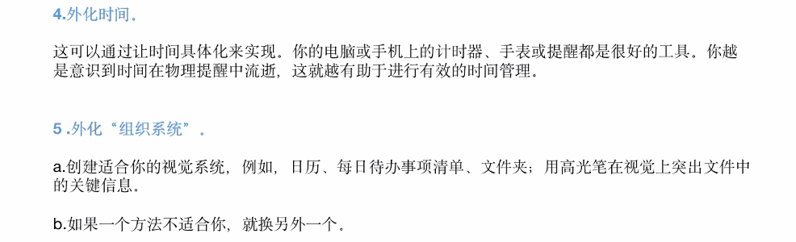

# ADHD

记住犯错误，与纠正时候的身体感觉！比如拖延作业，和到ddl时解决拖延

### 启动困难

任务：选题

流程：看文献，确定方向，写report

看文献：大概看一下三篇文献，明天找何豪咨询

结果：可以步入开发之旅了！积累项目经验！

任务：学习UE4

流程：打开网课，打开Unreal引擎，跟着做

结果：学会自己做demo！

任务：学习操作系统

流程：打开网课，开始看

结果：再也不怕面试被问！

任务排序：

- 最重要最紧急
- 次重要次紧急
- 感兴趣

### 首月总结

**对ADHD的认识**

- 更加全面，也有更多细节，对自己是ADHD这件事也更有信心（？）。原来不是很确定自己的问题是ADHD导致的，批判自己是懒惰，逃避，找理由。看了这么多症状和别人的分享，也感受了作正念时候注意力满天飞，现在可以骄傲而确定的说，全是ADHD的问题！我是个好人！（？）

**和ADHD共处的技巧**

- 前段时间比较抑郁，上个月还在情绪修复期，随遇而安，心态好想学的时候尽量多学，不想学的时候就睡觉打游戏，在和男朋友科普ADHD之后，在的监督下（主要原因），学习进度突飞猛进的提升，但是作息很阴间，四五点睡十二点起。
- 避开刺激源，如被家人批判，挑刺、陌生场合尴尬的多人社交、图书馆寒冷的空调、自习室惨白的灯光。宅在温馨的寝室，和不批判保持放松的好友多交往，保持心情愉悦（好像不太积极

**对正念的新认知**

- 正念是有科学支撑，有实验数据，可以切实改变大脑激活模式的，坚持练习一定会有效果

**正念带给我的变化**

- 可以更好的意识到自己在学习时的走神。之前走神到对自己批判的负面情绪里就出不来了，现在可以即使意识到只是走神了，大大减少负面情绪出现率
- 可以更即时的意识到生活中出现的负面情绪

**老师、ADHD教练、同学们给我的帮助**

- 整体课程安排，讲课和训练都太好了，逐渐意识到里面每个设计的精心安排，涛哥的课永远是做正念的最大动力
- 涛哥在我在群里说情绪抑郁的时候，私聊我，说了应对方法，有被安慰和感动到
- ADHD教练的每次训练和每天督促太重要了，如果没有，不可能坚持下来
- 表扬我的ADHD伙伴佳君！她打卡很及时，我每周都有被督促到，人也有趣温和，超棒！
- 小组讨论从陌生警惕，到放下比较，到之后的开心聊天和真心分享，第一次在线上感受到了切实的链接感

### 注意力不集中和过度集中

#### 健忘

- pre稿子记忆困难
- 桌游规则难以给别人讲解，忘记细节
- 丢东西，忘记东西放哪

#### 分心

- 听课走神

#### 组织&计划困难

- 多项任务难以分配
- 难以坚持执行计划
- 无法正确预估任务需要的时间
- 上一次无法完成计划ptsd，难以进行下一次计划

#### 难以开始或完成任务

- 启动困难，难以开始任务
- 开始之后走神，过度专注在刷知乎，玩游戏，画画，发呆等事情上
- 沉浸在无穷的细节里，进度极其缓慢
- 做完无法量化评价的任务，对完成质量评价低，无法面对进一步完善

#### 不能守时

- 经常踩点，迟到，睡过

#### 高度突出的任务暂时集中，日常基本活动无法控制

- 考试可以集中，有时也会走神
- 无法坚持听课，完成作业

#### 思维漫游：不想关的想法跳来跳去，多种想法同时袭来

- 需花费努力去做，但枯燥没有即时反馈的事情，如听课，看书等，会有无数其他想法涌过来，如游戏剧情，晚上吃什么，和之前聊天内容，学不会怎么办，gpa分数等等
- 晚上睡前无法清空思维，大脑活跃，难以入睡

#### 讲话混乱，无逻辑

无

### 执行功能

