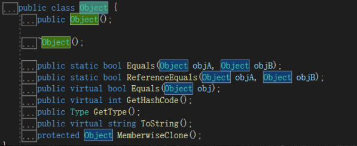

## C# 基础

Console.ReadLine 从控制台中读取一行数据

Console.WriteLine 输出一行数据到控制台中


#### 存储单位 

- 1 bit （位）表示 0 或 1 (正好对于计算机硬件的基础存储单位) 
- 1 Byte（字节） = 8bit ： 2^8 =256 种变化 
- 1KB( Kilobyte，千字节)=1024B  
- 1MB( Megabyte，兆字节)=1024KB  
- 1GB( Gigabyte，吉字节，千兆)=1024MB  
- 1TB( Trillionbyte，万亿字节，太字节)=1024GB
- 1 Byte（字节） = 8bit 表示 2^8 =256 中变化 


## 变量

- char 2B, 单个字符

- int 大小：4B 范围： -2,147,483,648 到 2,147,483,647 有符号整数，可以是负数

- uint 大小：4B 范围： 0 到 4,294,967,295 无符号整数 0 和正整数 ，不能表示负数 

- float 大小：4B 范围： ±1.5 x 10−45 至 ±3.4 x 1038 精度：大约 6-9 位数字 

  - float f = 3.14f; 

- double 大小：8B 范围：精度： ±5.0 × 10−324 到 ±1.7 × 10308 精度： 大约 15-17 位数字

- bool 由编译器决定

- 其他：sbyte,  short ,  long,  ushort,  ulong 

    			 8         16		 64 	   16 	 	64


#### 默认值

- 数值型: 0 					如: int ,float
- Bool : false 
- 引用型： null              如: string,  int []


#### 类型转化

**数值型**

```c#
double d = 1.94;
float f = d;   			//隐式转换
int i = (int)f;			//显示转换, i = 1
```

**数值与字符串**

```c#
string s = "5";
int i = int.Parse(s);
long l = int.Parse(s);
string s2 = l.ToString();
```


#### Str

```c#
int i = 3;
string input = "val";
string s1 = input + "的值为：" + i;     // val的值为：3
string s2 = $"{input}的值为：{i}";      // val的值为：3
```


#### switch & Enum

```c#
enum Weather{
    Sunny = 0,
    Cloudy,	// == 1
    Rainny = 3
}

Weather weather = Weather.Cloudy;
int s;
switch(weather)
{
    case Weather.Sunny: 
        s = 0;
        break;
    case Weather.cloudy:
        s = 1;
        break;
    case Weather.Rainny:
        s = 3;
        break;
    default:
        Console.WrithLine("无法识别：" + weather);
        break;
}

int i = (int)weather;			 // 1
Weather w2 = (Weather)2;	 	 // Rainny
string s2 = weather.ToString();	//  Cloudy
Weather w3 = (Weather)Enum.Parse((typeof(Weather)),"Sunny");	//Sunny
```


## Class 

- 引用类型
- 定义，初始化，与访问
- 静态变量，静态函数，const 常量 （都受 public 与 private 限制）

```c#
class Human1
{
    public const int MaxAge = 200;		//const 常量
    public string name;
    public static bool canFly = false;	//静态变量
    public static void PrintTypeName()	//静态函数
    {
        Console.WrithLine("Human");
    }
}

Human.canFly = True;		//访问静态变量
Human.PrintTypeName();		//访问静态函数

Human human = new Human();	// human == null
int humanMaxAge = Human.MaxAge	//访问 const 常量
human.name = "Tao";
```


- partial 让类的定义放在多个地方
- 静态函数模拟成员函数

```c#
partial class Human
{
    public static void SetAge(int value){
        this.age = value;
    }
    public static void SetAge(Human _this, int value){	//静态函数模拟成员函数
        _this.age = value;
    }
}

human.SetAge(18);
Human.SetAge(human, 20);	//静态函数模拟成员函数
```


#### 属性 property

- 属性 property 看起来像变量的函数
- 属性**不会确定存储位置**。它们**具有可读写或计算它们值的 访问器（accessors）**

```c#
partial class Human
{
    private int age;
    
    // 这个属性不会被分配内存, 读取和调用都不是它本身
    // 可以写成一行 Age { get { return age; } set { age = value; } }
    public int Age{
        get{
            return age;
        }
        set{
            age = value;
        }
    }
    
    // 这个属性会被分配内存，读取和调用都是它本身
    public static string? Name { get; set;}
    
}

human.Age = 18; 	//属性读写
Human.CanSwim = true;
bool b = Human.CanSwim;
```


- lamda 表达式定义属性

```c#
partial class Human
{
    static bool canSwim = false;
    
    // lamda 定义读写
    public static bool CanSwim{
        get => canSwim;
        set => canSwim = value > 12? 12 : value;
    }
    
    //简化定义只读属性
    public string Sex => "男";
}
    
    
```


- 构造函数

```c#
partial class Human
{
    public Human(){
        age = 16;
        name = "";
    }
    
    public Human(string name){
        age = 18;
        this.name = name;
    }
}

Human human = new Human();
Human human2 = new Human("Tao");
```


#### Struct

- 值类型
- 其他基本和类一样

```c#
struct Cat{
    public int age;
    // 函数、变量、属性...
}
```


#### 值类型 和 引用类型 区别

- class 拷贝只是拷贝地址（浅拷贝），struct 是所有数据都拷贝（深拷贝）
- 引用类型在堆中进行内存分配，在栈中存储堆中内存的地址
- 值类型在栈中进行内存分配
- 如果需要将 struct 的引用传递给函数内部，需要使用关键字 ref

```c#
Cat miaowu = new Cat();

void changeAge(Human human, ref Cat cat){
    human.Age = 22; 
    cat.age = 3;
}

changeAge(human, miaowu);
int age = miaowu.age;		// 3
```


#### 内存分布

- Read only：代码区，Const
- 代码执行区域：栈                               内存在函数调用完成后回收
- 数据存储：堆                                       内存由GC 回收
- 全局区域：static，类型信息


#### 继承

- 概念 : Class B : A {} 类型B 继承自类型A
- virtual：标记 virtual 的父类中的方法，子类可以重写
- abstrct：抽象类不能实例化，可以暂时不实现接口，等待子类的实现
  - 有 abstrct 函数的 class，必须要加 abstrct
- override： 子类可以重写父类 标记 virtual，abstrct，override 的方法

```c#
public abstract partial class Actor{
    public string skill;
    protected int power;	// 只有自己和子类可以访问
    private int money;		// 只能自身内部方法可以访问
    
    public vitural void Attack() {	// 虚函数
        power -= 10;
        Console.Writeline($"{name}Attack{skill}");
    }
}

public partial class Knight : Actor{
    public override void Attack() {		// 子类重写虚函数
        power -= 30;
    }
}
```


- interface：声明接口，不实现
- Interface 只能继承 Interface
- struct 只能继承 Interface
- class 可同时继承：一或零个 class  &&  任意个 interface

```c#
public interface IUpdate{
    void Update();
}

public interface IAwake{
    void Awake();
}

struce SVec : IAwake{
    public int x;
    public void Awake() { }
}

public interface ILifeCycle : IUpdate, IAwake{}

public abstract partial class Actor : ILifeCycle{
    public void Update(){
        power += 1;
    }
    public abstract void Awake();
}

public abstract partial class Mage : Actor, ILifeCycle, IDestroy{
    public override void Update(){
        power += 2;
    }
    
    public override void Update(){
        power += 2;
    }
}
```

- 父类指针 可以存储 子类的地址，但不能反过来 
  - 比如 A 是Human, B 是 Teacher，学生是人，但人不一定都是老师

```c#
Actor actor = new Knight();
```


- struct，class 默认继承自 object
- 其中 virtual 函数可以重写




## 泛型

- 类定义与初始化


```c#
public partial class GVector<T>{
    public T x;
    public T y;
    public GVector(T x, T y){
        this.x = x;
        this.y = y;
    }
}

GVector<int> giv = new GVector<int>(0, 1);
GVector<string> giv = new GVector<string>("", "1.5f");
```


- 泛型函数，where 约束

```c#
public partial class IntVector{
    public static void Attack<T>(T a, T b) where T : Actor {
        a.Attack();
        b.Attack();
    }
}

IntVector.Attack<Actor>(new Knight(), new Monster());
```


- 泛型类，where 约束
  - class  要求是 class，可以设置为 null
  - new ()  要求有默认构造函数，可以调用 new T ()


```c#
public partial class GVector3<T, T2>
    where T: class, ILifeCycle 
    where T2 : class
{
    public T x;
    public T2 y;
}

GVector3<int> gv3Int = new GVector3<int>(3, 6, 8);					//?
GVector3<Actor, string> dict1 = new GVector3<Actor, string>();		//?
```

其他可用约束：https://learn.microsoft.com/zh-cn/dotnet/csharp/programming-guide/generics/constraints-on-type-parameters


### 容器

#### List

- 动态数组，可通过下标访问

```c#
var l = new List<int>() {3, 4, 5};

l.Add(8);
l.Insert(2, 9);		// 下标 2 插入 9
l.RemoveAt(2);		// 移除下标 2 的节点
l[2] = 15;
l.Sort();
l.Reverse();	// 反转

static void PrintCollections<T>(IEnumerable<T> list)
{
    foreach(var item in list){
        Console.Write(item.ToString() + " ");
    }
    Console.Write("\n");
}

PrintCollections(l);		// 15 8 4 3
```

- List 的基类

```c#
public class List<T> : IList<T>, ICollection<T>, IEnumerable<T>, IEnumerable, IList, ICollection, IReadOnlyList<T>, IReadOnlyCollection<T>
```


#### Dictionary

```c#
var dict = new Dictionary<int, string>() {
    {3, "_3"},
    {5, "_5"},
};
```


**增删查改**

```c#
//插入
dict[6] = "_6";
dict.Add(8, "_8");

//访问
dict[6] = "_@6";

//查找
// 尝试访问 key = 2 的值，存在则存储到 val 中，并返回 true
if(dict.TeyGetValue(2, out string val)){
    Console.Write(val);
}

dict.ContainsKey(33);	//存在则返回 true

//删除
dict.Remove(8);			// 尝试删除 key = 8 的元素，之前存在则返回 true
```


**模板函数打印集合**

```c#
static void PrintCollections<TKey, TVal>(Dictionary<TKey, TVal> dict, string msg = ""){
    Console.WriteLine($"————————————{msg} count = {dict.Count()}————————————");
    
    foreach(KeyValuePair<TKey,TVal> item in dict){
        Console.Write($"({item.Key} = {item.Value})");
    }
}

PrintDict(dict);
PrintDict(dict.Values, "dict values");
PrintDict(dict.Keys, "dict Keys");
```


#### HashSet

- 元素唯一

```c#
var set = new HashSet<int>() {3, 4, 5};
PrintCollections(set, "HashSet");
 
set.Add(9);		// 插入成功，返回 true
set.Add(9);		// 插入失败，返回 false
set.Remove(9);	// 删除成功，返回 true
set.Contains(8);// 查询 8，false

```


#### Queue

- 动态增长，先进先出

```c#
var queue = new Queue<int>();

queue.Enqueue(1);	// 插入 1
queue.Enqueue(2);	// 插入 2

queue.Dequeue();	// 删除最后一位，返回值 (2)

queue.Count();		// 返回 1
```


#### Stack

- 动态增长，后进先出

```c#
var stack = new Stack<int>();

stack.Push(1);	// 插入 1
stack.Push(2);	// 插入 2

stack.Pop();	// 删除并返回首个元素 (1)
```


## 函数指针

- 已知运算函数

```c#
static float Add(float a, float b){
    Console.WriteLine($"{a} + {b} = {a + b}");
    return a + b;
}

static float Sub(float a, float b){
    Console.WriteLine($"{a} - {b} = {a - b}");
    return a - b;
}

static float Mul(float a, float b){
    Console.WriteLine($"{a} * {b} = {a * b}");
    return a * b;
}
```


- delegate 可以保存多个函数指针，使用 `+= -=` 进行操作

```c#
delegate float CalculateFunc(float val1, float cal2);

CalculateFunc listenerFunc = Add;
listenerFunc(3, 5.6f);	// 3 + 5.6 = 8.6

listenerFunc += sub;
listenerFunc(3, 5.6f);	// 3 + 5.6 = 8.6
						// 3 - 5.6 = -2.6

listenerFunc -= sub;
listenerFunc(3, 5.6f);	// 3 + 5.6 = 8.6

listenerFunc += Mul;
listenerFunc(3, 5.6f);	// 3 + 5.6 = 8.6
						// 3 * 5.6 = 16.8

```


##### Action

- 无返回值的 delegate

```c#
staitc void Print(string info) => Console.WriteLine(info);

public delegate void Action<in T>(T obj);
Action<string> print = Print;
print("Hello world!");
```


##### Func

- 有返回值的 delegate

```c#
public delegate TResult Func<in T1, in T2, out TResult>(T1 arg1, T2 arg2);

Func<float, float, float> func = Mul;
print(func(3, 4).ToString());	// 3 * 4 = 12
								// 12
```


##### 匿名函数

```c#
int i = 10;
Action closure = () => {
    i += 10;
}

closure();		// i = 20;
```


#### 案例：计算器

```c#
// 存储 string 的计算符号 与 计算机可识别的计算符号的转换
public class CalcInfo{
    public string tag;
    public Func<float, float, float> func;
    
    public CalcInfo(string tag, Func<float, float, float> func){
        this.tag = tag;
        this.func = func;
    }
}

// 存储每个的计算符号 与 计算函数的转换
static CalcInfo[] configs = new CalcInfo[]{
    new CalcInfo("+", (a, b) => a + b),
    new CalcInfo("-", (a, b) => a - b),
    new CalcInfo("*", (a, b) => a * b),
    new CalcInfo("/", (a, b) => a / b)
}

// 拆分字符串，得到数字，并用 func 计算
private static void CalcResult(string input, Func<float, float, float> func, int index){
    string numS1 = input.Substring(0, index);
    string numS2 = input.Substring(index + 1, input.Count() - index - 1);
    
    float num1 = float.Parse(numS1);
    float num2 = float.Parse(numS2);
    float result = func(num1, num2);
    
    Console.WrithLine($"计算结果为：{result}")；
}

// 获取输入，找到对应的 func 与 第一个数字的结尾位置
private static void CalcOneLine (string input){
    int index = -1; 	//第一个数字最后一位的位置
    Func<float, float, float> func = null;
    
    for(int i = 0; i < configs.Length; i++){
        var item = configs[i];
        index = input.IndexOf(item.tag);
        if(index != -1){
            func = item.func;
            break;
        }
    }
    
    CalcResult(input, func, index);
}
```


- 调用

```c#
static void Main(){
    while(true){
        string input = Console.Readline();
        CalcOneLine(inputStr);
    }
}
```


- 增加 % 运算符，只需更改一个位置

```c#
static CalcInfo[] configs = new CalcInfo[]{
    new CalcInfo("+", (a, b) => a + b),
    new CalcInfo("-", (a, b) => a - b),
    new CalcInfo("*", (a, b) => a * b),
    new CalcInfo("/", (a, b) => a / b),
    new CalcInfo("%", (a, b) => a % b)
}
```


#### 特性 Attribute

- 可以给函数，遍历，类型等，添加额外信息，方便对语言拓展

```c#
[InitCount (Value = 1)]
public class Player : Actor{
    
    [InitCount (Value = 3)]
    public override void Awake(){
    
    }
}
```


c# 与 c++ 对比

https://blog.csdn.net/qq_39568245/article/details/123240531
