# C++笔试IO汇总


## 两数之和

#### 1. 无限两数之和

```c++
#include<iostream>
using namespace std;
int main(){
    int a,b;
    while(cin >> a >> b)
        cout << a+b << endl;
}
```


#### 2. 有限两数之和

**输入描述:**

```
输入第一行包括一个数据组数t(1 <= t <= 100)
接下来每行包括两个正整数a,b(1 <= a, b <= 10^9)
```

**输出描述:**

```
输出a+b的结果
```

**输入例子1:**

```
2
1 5
10 20
```

**输出例子1:**

```
6
30
```

```c++
#include<iostream>
using namespace std;
int main(){
    //可以直接跳过第一个数，当作无限处理
    string s;
    getline(cin, s);
    int a,b;
    while(cin >> a >> b)
        cout << a+b << endl;
}
```


#### 3.  输入 0 0 即结束，无限两数之和

```c++
#include<iostream>
using namespace std;
int main(){
    int a,b;
    while(cin >> a >> b){
        if (a == 0 && b == 0) return 0;
        cout << a+b << endl;
    }
}
```


## 每行数字之和

#### 1. 每行数字之和，n表示每行数字个数，n = 0停止

**输入描述:**

```
输入数据包括多组。
每组数据一行,每行的第一个整数为整数的个数n(1 <= n <= 100), n为0的时候结束输入。
接下来n个正整数,即需要求和的每个正整数。
```

**输出描述:**

```
每组数据输出求和的结果
```

**输入例子**

```
4 1 2 3 4
5 1 2 3 4 5
0
```

**输出例子1:**

```
10
15
```

```c++
#include<iostream>
using namespace std;
int main(){
    int n,x;
    while(cin >> n){
        if(n == 0) break;
        int sum = 0;
        while(n--){
            cin >> x;
            sum += x;
        }
        cout << sum << endl;
    }
}
```


#### 2. 没有 n，cin.get() 判断一行结束

**输入描述:**

```
输入数据有多组, 每行表示一组输入数据。

每行不定有n个整数，空格隔开。(1 <= n <= 100)。
```

**输出描述:**

```
每组数据输出求和的结果
```

**输入例子1:**

```
1 2 3
4 5
0 0 0 0 0
```

**输出例子1:**

```
6
9
0
```

```c++
#include<iostream>
using namespace std;
int main(){
    int n, sum = 0;
    while(cin >> n){
        sum += n;
        if(cin.get() == '\n'){ //n后面是否为换行符
            cout << sum << endl;
            sum = 0;
        }
    }
}
```


#### 3. 第一个数为行数

**可以直接跳过第一个数，当作无限处理**

**输入描述:**

```
输入的第一行包括一个正整数t(1 <= t <= 100), 表示数据组数。
接下来t行, 每行一组数据。
每行的第一个整数为整数的个数n(1 <= n <= 100)。
接下来n个正整数, 即需要求和的每个正整数。
```

**输出描述:**

```
每组数据输出求和的结果
```

**输入例子1:**

```
2
4 1 2 3 4
5 1 2 3 4 5
```

**输出例子1:**

```
10
15
```


## 字符串排序

#### 1. n个字符串，排序

**输入描述:**

```
输入有两行，第一行n

第二行是n个空格隔开的字符串
```

**输出描述:**

```
输出一行排序后的字符串，空格隔开，无结尾空格
```

**输入例子1:**

```
5
c d a bb e
```

**输出例子1:**

```
a bb c d e
```

```c++
#include<iostream>
#include<vector>
#include<algorithm>
using namespace std;
int main(){
    vector<string> strs;
    string s;
    int n;
    cin >> n;
    while(n--){						//可跳过n，条件改成while(cin >> s)
        strs.push_back(s);
    }
    sort(strs.begin(), strs.end());
    for (auto letter : strs) {
        cout << letter << ' ';
    }
}
```


#### 2. 无限个字符串，排序

**输入描述:**

```
多个测试用例，每个测试用例一行。

每行通过空格隔开，有n个字符，n＜100
```

**输出描述:**

```
对于每组测试用例，输出一行排序过的字符串，每个字符串通过空格隔开
```

**输入例子1:**

```
a c bb
f dddd
nowcoder
```

**输出例子1:**

```
a bb c
dddd f
nowcoder
```


```c++
#include<iostream>
#include<vector>
#include<algorithm>
using namespace std;

int main(){
    string s;
    vector<string> strs;
    while(cin >> s){
        strs.push_back(s);
        if(cin.get() == '\n'){
            sort(strs.begin(), strs.end());
            for (auto letter : strs)
                    cout << letter << ' ';
            cout << endl;
            strs.clear();
        }
    }
}
```


#### 3. 无限字符串，间隔为逗号

**输入描述:**

```
多个测试用例，每个测试用例一行。
每行通过,隔开，有n个字符，n＜100
```

**输出描述:**

```
对于每组用例输出一行排序后的字符串，用','隔开，无结尾空格
```

**输入例子1:**

```
a,c,bb
f,dddd
nowcoder
```

**输出例子1:**

```
a,bb,c
dddd,f
nowcoder
```

```c++
#include<iostream>
#include<vector>
#include<algorithm>
using namespace std;

int main(){
    string s;
    vector<string> strs;
    while(cin >> s){
        string temp = "";
        for(char c : s){
            if(c == ','){
                strs.push_back(temp);
                temp = "";
            }
            else
                temp += c;
        }
        strs.push_back(temp);
        
        if(cin.get() == '\n'){
            sort(strs.begin(), strs.end());
            bool is_first_str = true;
            for (auto str : strs)
                if(is_first_str){
                    cout << str;
                    is_first_str = false;
                }
                else
                    cout << "," << str;
            cout << endl;
            strs.clear();
        }
    }
}
```


## **输入处理**

**常用方法如下**

一组输入数据

```cpp
int number;
string str;
cin >> number >> str;
```

多组测试数据，直到读到文件末尾为止

```text
int number;
string str;
while(cin >> number >> str)
    doSomething();
```

告知有多少组数据

```text
int n;
cin >> n;
while(n){
    int a, b;
    cin >> a >> b;
    doSomething(a, b);
    n --；
}
```

输入一整行字符串进行处理

```text
string input;
getline(cin, input);

```

**题目中往往会出现输入的字符串数字进行转换的情况，常用的方法如下:**

```cpp
// 字符串转数字
stoi(str); // toint
stod(str); // todouble

// 数字转字符串
to_string(type); //type可以是一系列数字类型
```


## 输入字符串解析

之前阿里笔试就遇到了十分复杂的输入字符串解析，需要将输入的一整行字符串解析成包含多个pair的map类型，因此记录下常见输入字符串解析方法:

1. 按空格解析成字符串数组，直接使用stringstream

```text
// 解析成array类型
// 按照空格分隔字符串并且转换成array类型
#include <string>
// stringstream需要该头文件
#include <sstream>
using namespace std;

string input;
getline(cin, input);
// 流式处理，背一下就好
stringstream ss;
ss << input;
string p;
while(ss >> p)
    cout << p << endl;
```

2. 按任意字符解析成字符串数组

```text
// 按照指定字符分隔字符串
void split(const string& s, vector<string>& tokens, const string& delimiters = " "){
    string::size_type lastPos = s.find_first_not_of(delimiters, 0);
    string::size_type pos = s.find_first_of(delimiters, lastPos);
    while(pos != string::npos || lastPos != string::npos){
        tokens.push_back(s.substr(lastPos, pos - lastPos));
        lastPos = s.find_first_not_of(delimiters, pos);
        pos = s.find_first_of(delimiters, lastPos);
    }
}
```

ps. push_back可以替换成emplace_back,后者是直接在原有内存上构建对象，而不像push_back是先构建对象，再将对象复制到原有内存上的,emplace_back效率会更高

3. 按一定格式将一整行输入解析成map

一个例子，假设给定的输入是这样的 **a:123 b:123 c:132** 需要解析成的类型为map<string,int>，做法如下：

```cpp
string input;
getline(cin, input);
map<string, int> hash;
stringstream ss;
ss << input;
string tp;
while(ss >> tp){
    vector<string> p;
    // split就是上述函数split
    split(tp, p, ":");
    hash[p[0]] = stoi(p[1]);
}
```


# 1竖读

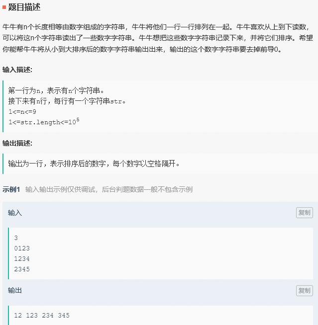

#include<iostream>
#include<vector>
#include<string>
#include<algorithm>
using namespace std;

int main() {
    int n, n1;
    cin >> n;
    n1 = n;

    string a;
    vector<string> s;
    while (n1) {
        cin >> a;
        s.push_back(a);
        --n1;
    }
    
    vector<int> nums;
    for (int i = 0; i < a.size(); ++i) {
        string out = "";
        for (int j = 0; j < n; ++j) {
            out += s[j][i];
        }
        nums.push_back(stoi(out));
    }
    
    sort(nums.begin(), nums.end());
    
    for (int i = 1; i < a.size(); ++i) {
        cout << nums[i] << " ";
    }

}


# 2质数下标

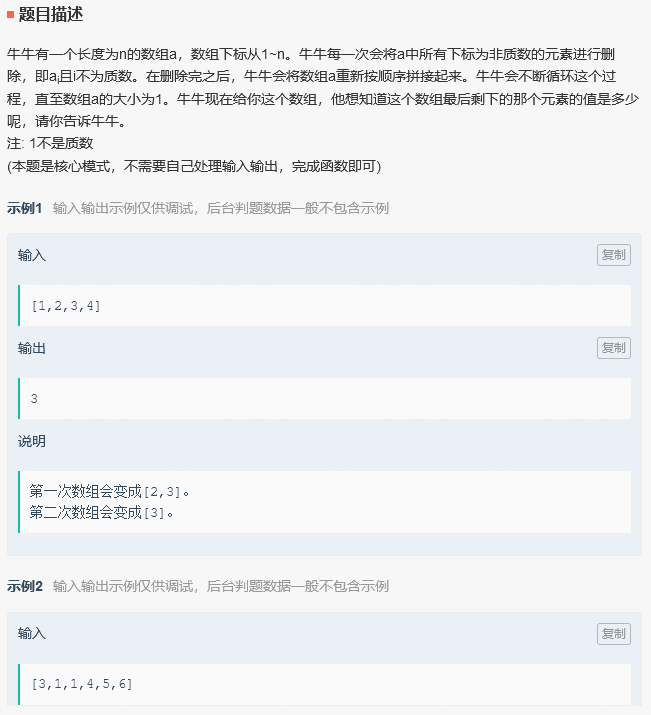

class Solution {
public:
    /**
     * 代码中的类名、方法名、参数名已经指定，请勿修改，直接返回方法规定的值即可
     * 
     * @param a int整型vector 
     * @return int整型
     */
    int getNumber(vector<int>& a) {
        // write code here
        vector<int> nums;
        for(int i = 1; i < a.size() + 1; ++i){
            if(isprime(i)){
                nums.push_back(i);
            }
        }
        
        if(nums.size() == 1){
            return a[nums[0] - 1];
        }
        
        for(int i = 0; i < nums.size(); ++i){
            nums[i] = a[nums[i] - 1];
        }
        
        return getNumber(nums);
    }
    
    bool isprime(int n){
        if(n == 2)
            return true;
        if(n%2 == 0 || n == 1)
            return false;
        else{
            for(int i = 3; i*i < n; i += 2){
                if(n%i == 0)
                    return false;
            }
            return true;
        }
    }
};


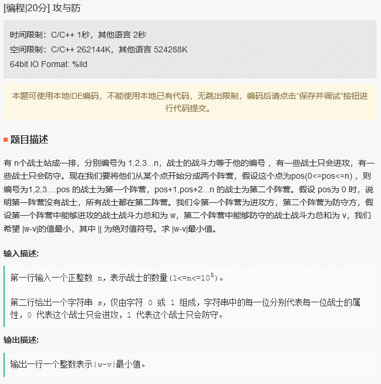

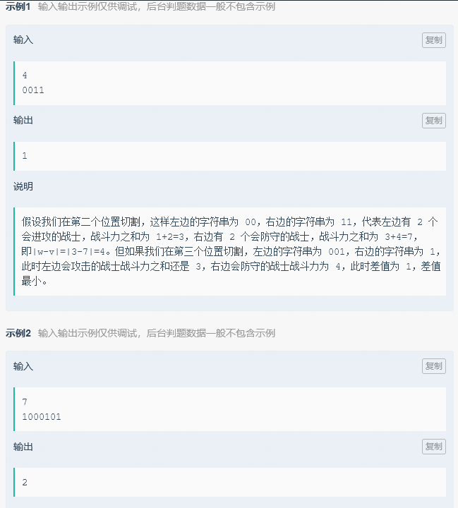

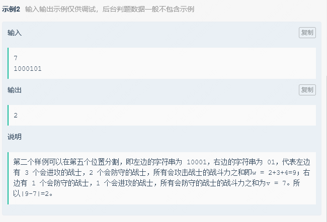


```c++
#include<iostream>
#include<vector>
#include<string>
#include<algorithm>
using namespace std;

int main() {
    int n;
    cin >> n;

    string s;
    cin >> s;

    vector<int> nums;

    for (int i = 0; i < s.size(); ++i) {
        if (s[i] == '0') {
            nums.push_back(i + 1);
        }
        else {
            nums.push_back(-(i + 1));
        }
    }

    int w = 0, v = 0;

    for (int i = 0; i < s.size() / 2; ++i) {
        if (nums[i] > 0) {
            w += nums[i];
        }
    }

    for (int i = s.size() / 2; i < s.size(); ++i) {
        if (nums[i] < 0) {
            v += nums[i];
        }
    }

    if (w + v > 0){
        cout <<  s.size()/2 - 1;
    }
    else {
        cout << s.size() / 2 + 1;
    }

    return 0;
}
```


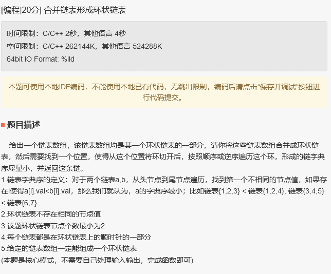

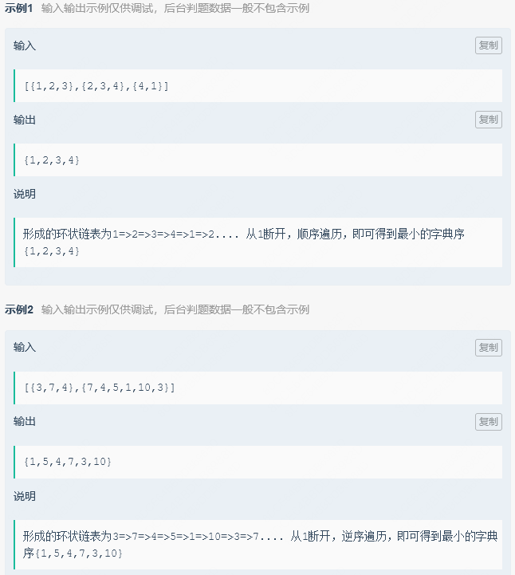

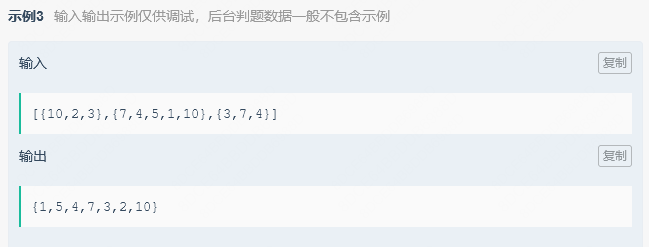


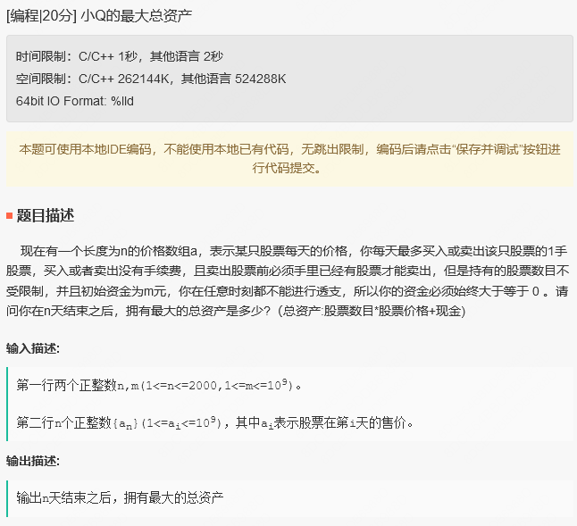

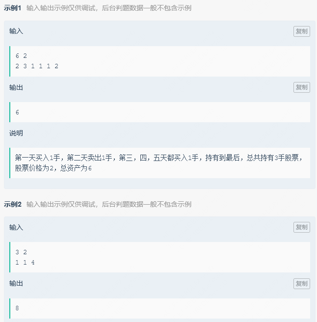

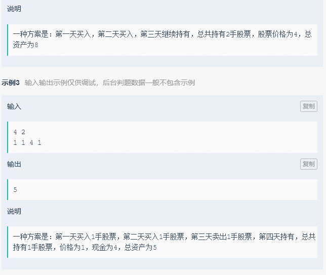

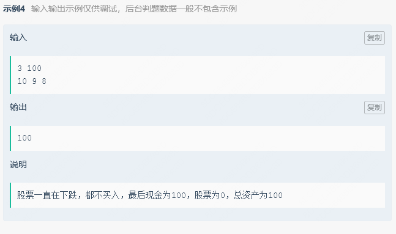