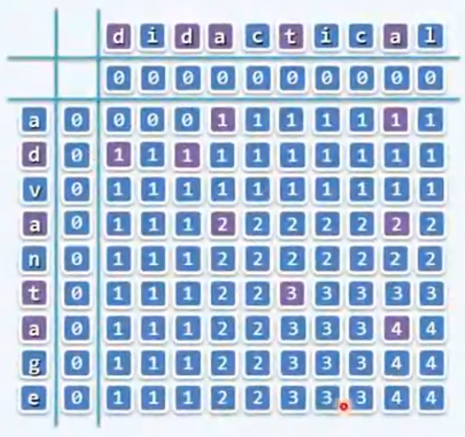

最短路径数量


```c++
#include <iostream>
#include <vector>
using namespace std;


int main()
{
	int n;
	cin >> n;

	vector<vector<int>> path(n, vector<int>(n, (1 << 31) - 1));

	int a, b, x;

	for (int i = 0; i < n; ++i) {
		cin >> a >> b >> x;
		if (a > b)
			swap(a, b);

		path[a][b] = min(x, path[a][b]);
	}

	cout << path[0][0];

	return 0;
}
```


## 并查集


判断根：`root[i] == i`

```
class Solution {
public:
    int findHead(int a, vector<int>& leader){
        while(leader[a] != a){
            a = leader[a];
        }

        return a;
    }

    void union(int a, int b, vector<int>& leader){
        leader[findHead(b, leader)] = findHead(a, leader);
    }

    bool test(int a, int b, vector<int>& leader){
        return findHead(a, leader) == findHead(b, leader);
    }
    
    //题目主函数中初始化
    int result(){
        int n;
        vector<int> leader(n);

        for(int i = 0; i < n; ++i){
            leader[i] = i;
        }
    }

};
```


- 统计不同并查集的数量，看  `leader[i] == i`  的数量即可


### 常用函数

- `swap(a,b)` 

## String

#### 最大回文数

⭐

**问题**：给定一个只包含 0 - 9 的字符串 `s`，返回 `s` 中数字能组成的最大回文数，返回的数字不能以 0 开头

**思路**：

- 记录 0 - 9 每位数字的数量
- 回文左右对称，必定只有一个数字的数量可以是奇数，其余数字的数量全为偶数
- 要求返回最大的回文数，因此从后向前遍历 `nums[]` 中每个数字的数量，大于 1 即可加入回文串中
- 回文前后分开储存，最后相加

```c++
#include <iostream>
using namespace std;

int main()
{
	string s;
	cin >> s;
	int nums[] = { 0, 0, 0, 0, 0, 0, 0, 0, 0, 0 };		// 储存数字数量
    
	for (char c : s) {
		++nums[c - 48];
	}

	string s_forward, s_backward;

	for (int i = 9; i > -1; --i) {
		if (nums[i] > 1) {    // 某个数字两个以上，都看作偶数
            
			if (s_forward.empty() && i == 0) 	// 排除首位是零
				break;
            
			s_forward += string(nums[i] / 2, (char)(i + 48));
			s_backward = string(nums[i] / 2, (char)(i + 48)) + s_backward;
		}
	}
	
	for (int i = 9; i > -1; --i) {    // 处理奇数
		if (nums[i] % 2 == 1) {
			cout << s_forward + (char)(i + 48) + s_backward;
			break;
		}
	}
    
	return 0;
}s
```


#### 最长回文字符串 No.5 

⭐⭐⭐

**问题**：给你一个字符串 `s`，找到 `s` 中最长的回文子串。

**思路：**两层循环，第一层找每一个回文的中心，找到后，确定回文左侧和右侧的边界，然后与当前最长的比较长度

**难点：**

- 确定边界。找到回文时，如果在两侧不相等时才确定长度，会在整串边界时被规避掉，从而无法正确返回整串边界的子串信息
- 边界溢出

**Tips**：先正确，再优化。第一次写如果考虑优化，得到错误答案，会浪费更多时间 debug

```c++
class Solution {
public:
//中心扩散法
    
    string longestPalindrome(string s) {
        if(s.size() < 1)
            return "";

        int maxsub_left = 0;
        int l = 0;

        for(int i = 1; i < s.size(); ++i){
            //aa，长度为偶数
            for(int j = 1; i + j - 1 < s.size() && i - j >= 0; ++j){
                if(s[i + j - 1] == s[i - j]){
                    if(2*j - 1 > l){
                        maxsub_left = i - j;
                        l = 2*j - 1;
                    }
                }
                else
                    break;
            }

            //a, aba 长度为奇数
            for(int j = 1; i - j >= 0 && i + j < s.size(); ++j){
                if(s[i - j] == s[i + j]){
                    if(2*j > l){
                        maxsub_left = i - j;
                        l = 2*j;
                    }
                }
                else
                    break;
            }
        }
        
        return s.substr(maxsub_left, l + 1);
    }
};
```


## 栈, 队列

#### 包含min函数的栈 Jz.30 

⭐

**问题**：完成栈的数据结构，加入 min 函数，永远返回栈内的最小值

**思路**：新建一个 stack 记录所有阶段的 min，stack pop时，记录 min 的 stack 也 pop


#### 栈的压入、弹出序列 Jz.31

⭐⭐

**问题**：给定栈的压入顺序，判断数组是否可以为栈的弹出顺序

**思路**：辅助栈，模拟一下


#### 两个栈实现队列 Jz.09

#### ⭐⭐

**问题**：用两个栈，实现头部出队和尾部入队

**思路**：

- 一个插入栈，一个输出栈
- 输出栈为空时，转移输入栈中元素到输出站

```c++
class CQueue {
public:
    stack<int> in_stack, out_stack;
	
    
    void appendTail(int value) {
        in_stack.push(value);
    }
    
    int deleteHead() {
        if(out_stack.empty()){
            if(in_stack.empty())
                return -1;

            while(!in_stack.empty()){
                out_stack.push(in_stack.top());
                in_stack.pop();
            }
        }

        int out = out_stack.top();
        out_stack.pop();
        return out;
    }
};
```


### 单调栈

#### 每日温度 No. [739](https://leetcode.cn/problems/daily-temperatures/) 

⭐⭐

**问题**：

给定一个整数数组 temperatures ，表示每天的温度，返回一个数组 answer ，其中 answer[i] 是指对于第 i 天，下一个更高温度出现在几天后。如果气温在这之后都不会升高，请在该位置用 0 来代替。

**示例**：

```
输入: temperatures = [73,74,75,71,69,72,76,73]
输出: [1,1,4,2,1,1,0,0]
```

**思路**：单调栈

1. 暴力一个个找，两层循环，最差 $O(n^2)$
2. 栈
   - 遍历 temperature 数组，在当前温度低于栈顶日期温度时，入栈当前日期
   - 当前日期温度高于栈顶日期温度时，栈顶日期出栈，答案记录温差


```c++
class Solution {
public:
    vector<int> dailyTemperatures(vector<int>& temperatures) {
        int n = temperatures.size();
        stack<int> s;
        vector<int> res(n, 0);
        
        for(int i = 0; i < n; ++i){
            while(!s.empty() && temperatures[s.top()] < temperatures[i]){
                res[s.top()] = i - s.top();
                s.pop();
            }

            s.push(i);	//为了让代码简短，此处没有优化效率。优化方式：把比第二天低的直接标记出来，而不是全都入栈
        }
        return res;
    }
};
```


#### 下一个更大元素 I  [No.496](https://leetcode.cn/problems/next-greater-element-i/)

⭐⭐

别慌，题目不难，但是题目真他妈绕。

为什么放英文？因为中文更看不懂，哈哈。

The **next greater element** of some element `x` in an array is the **first greater** element that is **to the right** of `x` in the same array.

You are given two **distinct 0-indexed** integer arrays `nums1` and `nums2`, where `nums1` is a subset of `nums2`.

For each `0 <= i < nums1.length`, find the index `j` such that `nums1[i] == nums2[j]` and determine the **next greater element** of `nums2[j]` in `nums2`. If there is no next greater element, then the answer for this query is `-1`.

Return *an array* `ans` *of length* `nums1.length` *such that* `ans[i]` *is the **next greater element** as described above.*

 

**Example:**

```
Input: nums1 = [4,1,2], nums2 = [1,3,4,2]
Output: [-1,3,-1]
Explanation: The next greater element for each value of nums1 is as follows:
- 4 is underlined in nums2 = [1,3,4,2]. There is no next greater element, so the answer is -1.
- 1 is underlined in nums2 = [1,3,4,2]. The next greater element is 3.
- 2 is underlined in nums2 = [1,3,4,2]. There is no next greater element, so the answer is -1.
```


力扣你能不能说人话！！看懂之后十分钟写完，看懂之前emo 一小时，我真的会谢。

**思路**：单调栈

和每日温度思路很像很像，用栈找到 nums2 的下一个最大值后，存进哈希表 {当前数字，当前数字对应的下一个更大的数字}，然后遍历nums1，一个一个从哈希表找就行了。

```c++
class Solution {
public:
    vector<int> nextGreaterElement(vector<int>& nums1, vector<int>& nums2) {
        stack<int> s;
        unordered_map<int, int> nextGreater;    //{当前数字，下一个更大的数字}

        for(int num : nums2){
            while(!s.empty() && s.top() < num){
                nextGreater[s.top()] = num;
                s.pop();
            }

            s.push(num);
        }

        vector<int> ans(nums1.size(), -1);
        for(int i = 0; i < nums1.size(); ++i){
            if(nextGreater.find(nums1[i]) != nextGreater.end()){
                ans[i] = nextGreater[nums1[i]];
            }
        }

        return ans;
    }
};
```


#### 接雨水 No.42

⭐⭐⭐

**问题**：给定 `n` 个非负整数表示每个宽度为 `1` 的柱子的高度图，计算按此排列的柱子，下雨之后能接多少雨水


**思路 1**：动态规划

- 按列求，每列上方能接的最多雨水，取决于左边最高的柱子与右边最高的柱子低的那个
- 从左到右，依次计算每个柱子可以接多少雨水
- 用指针，实时更新当前柱子左侧最高的柱子
- 建立数组，记录每根柱子右侧最高的柱子


本题多种解法，推导过程 和 双指针都挺有趣的，可以看看其他题解

```c++
class Solution {
public:
    int trap(vector<int>& height) {
        if(height.size() < 3)
            return 0;

        int left_high = height[0];
        int bottom = 1;
        
        // 对每一个bottom 记录 right high
        vector<int> right_max_high(height.size());
        right_max_high[height.size() - 1] = height[height.size() - 1];
        for(int i = height.size() - 2; i > 0; --i){
            right_max_high[i] = max(height[i], right_max_high[i + 1]);
        }

        int water = 0;
        for(int i = 1; i < height.size(); ++i){
            //维护 left_high
            left_high = max(left_high, height[i-1]);

            //计算雨水
            water += max(min(left_high, right_max_high[i]) - height[i], 0);
        }

        return water;
    }
};
```


**思路 2**：单调栈

- 从左向右遍历墙，如果当前高度小于等于栈顶墙的高度，则可能有积水，那么将当前墙的高度入栈
- 如果当前高度高于栈顶高度，三种可能
  1. 左侧没有更高的墙了，没积水，直接出栈
  2. 左侧有更高的墙，当前栈顶为底，出栈，计算积水
  3. 左侧的墙和当前墙一样高，那么继续出栈，直到左侧的墙更高


```c++
class Solution {
public:
    int trap(vector<int>& height) {
        stack<int> s;
        int ans = 0;

        for(int i = 0; i < height.size(); ++i){
            while(!s.empty() && height[s.top()] < height[i]){
                int bottom = height[s.top()];
                while(!s.empty() && bottom == height[s.top()]){
                    s.pop();
                }
                if(!s.empty()){
                    ans += (min(height[i], height[s.top()]) - bottom) * (i - s.top() - 1);
                }
            }

            s.push(i);
        }

        return ans;
    }
};
```


#### 柱状图中最大的矩形 No. [84](https://leetcode.cn/problems/largest-rectangle-in-histogram/)

⭐⭐⭐

给定 *n* 个非负整数，用来表示柱状图中各个柱子的高度。每个柱子彼此相邻，且宽度为 1 。

求在该柱状图中，能够勾勒出来的矩形的最大面积。


 

**思路**：单调栈

- 遍历柱子，如果当前柱子比栈顶高，存入栈中
- 如果当前柱子比栈顶低，将当前柱子出栈并记录高度，此高度的矩形面积
  - 如果此时栈顶元素等于当前柱子，持续出栈，直到栈顶元素小于当前柱子
  - 此时矩形宽度为 `i - Highest.top() - 1  `，如果栈空了则为 `i`，即从最左侧开始
- 此外，可以在一开始在最右侧放一个高度为零的柱子，便不用额外处理右侧的边界

```c++
class Solution {
public:
    int largestRectangleArea(vector<int>& heights) {
        stack<int> Highest;
        int ans = 0;
        heights.push_back(0);	// 处理右侧边界条件

        for(int i = 0; i < heights.size(); ++i){
            while(!Highest.empty() && heights[Highest.top()] > heights[i]){
                int top = heights[Highest.top()];
                while(!Highest.empty() && heights[Highest.top()] == top){
                    Highest.pop();
                }

                if(!Highest.empty()){
                    ans = max(ans, (i - Highest.top() - 1) * top);
                }
                else{
                    ans = max(ans, i * top);
                }
                
            }

            Highest.push(i);
        }

        return ans;
    }
};
```


### 双端队列

#### * 滑动窗口最大值 No. [239](https://leetcode.cn/problems/sliding-window-maximum/)

⭐⭐⭐

**问题**：给你一个整数数组 nums，有一个大小为 k 的滑动窗口从数组的最左侧移动到数组的最右侧。你只可以看到在滑动窗口内的 k 个数字。滑动窗口每次只向右移动一位。

返回 滑动窗口中的最大值 。

 

**示例**：

```
输入：nums = [1,3,-1,-3,5,3,6,7], k = 3
输出：[3,3,5,5,6,7]

滑动窗口的位置                	 最大值
---------------               -----

[1  3  -1] -3  5  3  6  7       3
 1 [3  -1  -3] 5  3  6  7       3
 1  3 [-1  -3  5] 3  6  7       5
 1  3  -1 [-3  5  3] 6  7       5
 1  3  -1  -3 [5  3  6] 7       6
 1  3  -1  -3  5 [3  6  7]      7
```


**思路**：双端队列

别怕！虽然是困难难度，但想通思路之后其实很简单~

- 双端队列，保持队列开头永远是最大值
  - 队列长度等于滑动窗口长度！
  - 如果当前最大值将要离开滑动窗口，队列 pop_front()
  - 如果当前要插入的值大于队尾的数，则 pop_back()，直到当前要插入的值小于队尾的数，然后 push_back()


## 链表

```c++
struct ListNode {
      int val;
      struct ListNode *next;
      ListNode(int x):
            val(x), next(NULL) {
      }
};
```


#### 从尾到头打印链表 Jz.6

**问题**：  输入一个链表的头节点，按链表从尾到头的顺序返回每个节点的值（用数组返回）

**递归**：

- 新建一个函数，递归，从尾到头把链表数字加入数组中
- 尽量检测 head 是否为空，而不是 head -> next

```c++
class Solution {
  public:
    vector<int> ret;

    void recursion(ListNode* head) {	// 新建的函数
        if (head != nullptr) {
            recursion(head -> next);
            ret.push_back(head -> val);
        }
    }

    vector<int> printListFromTailToHead(ListNode* head) {
        recursion(head);
        return ret;
    }
};
```


**迭代**

- 先储存正向的数组
- 反转正向数组

```c++
class Solution {
public:
    vector<int> printListFromTailToHead(ListNode* head) {
        vector<int> stack;
        
        while(head){
            stack.push_back(head->val);
            head = head->next;
        }
        
        int n = stack.size();
        int c;
        
        for(int i = 0; i < n/2; i++)
        {
            c = stack[i];
            stack[i] = stack[n-i-1];
            stack[n-i-1] = c;
        }

        return stack;
    }
};
```


#### 删除链表中重复的结点 Jz.76

**问题：**在一个排序的链表中，存在重复的结点，请删除该链表中重复的结点，重复的结点不保留，返回链表头指针。 例如，链表 1->2->3->3->4->4->5 处理后为 1->2->5 

**思路**：直接比较删除


```c++
class Solution {
  public:
    ListNode* deleteDuplication(ListNode* pHead) {
        if(!pHead){
            return nullptr;
        }

        ListNode* preHead = new ListNode(-1);
        preHead -> next = pHead;

        ListNode* cur = preHead;

        while(cur -> next != NULL && cur -> next -> next != NULL){
            //遇到相邻两个节点值相同
            if(cur -> next -> val == cur -> next -> next -> val){
                int temp = cur -> next -> val;
                //将所有相同的都跳过
                while(cur -> next != NULL && cur -> next -> val == temp){
                    cur -> next = cur -> next -> next;
                }
            }
            else
                cur = cur -> next;
        }

        return preHead -> next;

    }
};
```


#### 反转链表 Jz.24

**问题**：  

**迭代**

- 初始设置


- 逐步迭代，更新三个指针位置


- 返回 newHead
- 如此设置的好处
  - 可以处理输入为空
  - 不用特殊处理开头和结尾的节点

```c++
class Solution {
  public:
    ListNode* ReverseList(ListNode* pHead) {
        ListNode* newHead = nullptr;
        ListNode* nex = pHead;

        while (nex) {
			pHead = pHead -> next;
			nex -> next = newHead;
			newHead = nex;
			nex = pHead;
        }

        return newHead;
    }
};
```


#### 合并有序链表 No.21

**问题**：将两个升序链表合并为一个新的 **升序** 链表并返回

**递归**

思路：

- 想象编麻花辫，反过来。辫子尾部已经编好了，只需要捏着编好的一股绳子
- 注意递归传递回去时，链表状态已经改变
- 时间复杂度 O(n)
- 空间复杂度 O(n)

```c++
class Solution {
public:
    ListNode* mergeTwoLists(ListNode* list1, ListNode* list2) {
        if(!list1)
            return list2;
        else if(!list2)
            return list1;
        else if(list1 -> val < list2 -> val){
            list1 -> next = mergeTwoLists(list1 -> next, list2);
            return list1;
        }
        else{
            list2 -> next = mergeTwoLists(list2 -> next, list1);
            return list2;
        }
    }
};
```


#### 移除给定链表元素 No.203

**问题**：给定链表的头节点 `head` 和整数 `val` ，删除链表中所有满足 `Node.val == val` 的节点，并返回 **新的头节点** 。

**递归**

- 递归何时调用本函数，调用本函数前是否需要return，涉及的参数是否会被改变，都要仔细考虑
- 时间复杂度：O(n)
- 空间复杂度：O(n)

```c++
class Solution {
public:
    ListNode* removeElements(ListNode* head, int val) {
        if(!head)
            return nullptr;
        else if(head -> val == val)
            return removeElements(head -> next, val);
        else{
            head -> next = removeElements(head -> next, val);
            return head;
        }
    }
};
```

**迭代**

- prehead 节点和 pre 节点，真好用
- 循环时只有下一个结点没被删除，pre才能进入下一个，不然会漏
- 时间复杂度 O(n)
- 空间复杂度 O(1)

```c++
class Solution {
public:
    ListNode* removeElements(ListNode* head, int val) {
        if(!head)
            return nullptr;

        ListNode *preHead = new ListNode();
        preHead -> next = head;
        ListNode* pre = preHead;

        while(pre && pre -> next){
            if(pre -> next -> val == val)
                pre -> next = pre -> next ->next;
            else
                pre = pre -> next;
        }
        return preHead -> next;
    }
};
```


#### 复杂链表的复制 Jz.35

**问题**：输入一个复杂链表（每个节点中有节点值，以及两个指针，一个指向下一个节点，另一个特殊指针random指向一个随机节点），请对此链表进行深拷贝，并返回拷贝后的头节点

**思路** :alien:  ：

- :star:检查空指针！！
- 断开所有原来节点和新节点的连接！

```c++
class Solution {
public:
    RandomListNode* Clone(RandomListNode* pHead) {
        if(!pHead) return pHead;
        
        RandomListNode *temp， *cur = pHead;
        while(cur){
            temp = new RandomListNode(cur -> label);
            temp -> next = cur -> next;
            cur -> next = temp;
            cur = temp -> next;
        }

        cur = pHead;
        while(cur){
            cur -> next -> random = cur -> random == nullptr? nullptr : cur -> random -> next;
            cur = cur -> next -> next;
        }
        
        cur = pHead;
        while(cur){
            temp = cur -> next;
            cur = temp -> next;
            temp -> next = cur == nullptr ? nullptr : cur -> next;
        }
        
        RandomListNode *res = pHead -> next;
        pHead -> next = nullptr;

        return res;
    }
};
```


### 双指针

#### 两个链表的第一个公共结点 Jz.25     

**问题**：  输入两个无环的单向链表，找出它们的第一个公共结点，如果没有公共节点则返回空。

**思路**：

- 维护两个指针，p1 和 p2，交叉遍历两个列表
- 有公共节点的时候，p1和p2必会相遇，两者相等时即为第一个公共节点 
- 无公共节点的时候，此时 p1 和 p2 都会走到终点，都是null，也相等了 


```c++
class Solution {
public:
    ListNode* FindFirstCommonNode( ListNode* pHead1, ListNode* pHead2) {
        ListNode* p1 = pHead1, * p2 = pHead2;

		while(p1 != p2){
			p1 = p1 ? p1 -> next : pHead2;
			p2 = p2 ? p2 -> next : pHead1; 
		}

		return p1;
    }
};
```


#### 盛水最多的容器 No.3

**问题**：给定一个长度为 n 的整数数组 height 。有 n 条垂线，第 i 条线的两个端点是 (i, 0) 和 (i, height[i]) 。

​			找出其中的两条线，使得它们与 x 轴共同构成的容器可以容纳最多的水。


**思路**：双指针法

- 两个指针，分别从左右向内收缩，哪个小缩那个，记录形成最大的容器

```c++
class Solution {
public:
    int maxArea(vector<int>& height) {
        int water = 0;
        for(int left = 0, right = height.size() - 1; right > left; ){
            water = max(water, (right - left) * min(height[left], height[right]));
            
            if(height[left] < height[right])
                ++left;
            
            else
                --right;
        }
        return water;
    }
};
```


#### 排序链表

⭐⭐

给链表按升序排序，返回头节点。


**思路**

- 归并排序，递归，自顶向下切分！用递归去写，感觉起来可能不容易，但其实蛮简单的！
  - 递归的本质！把可以重复解决的问题抽象出来，一层一层搞定
  - 每次把需要排序的链表切分开，排好后返回头节点
  - 时间 O(nlogn)，空间
- 归并排序，自底向上！更困难一些，需要用step来计算间隔，从 1，到 2，到 4
  - 依然要每次且分开！搞完再连接起来！标准化的流程带来更好写的体验
  - 抽出两个操作（很好用！感谢大神，以后也可以常常用到！）：
    - `merge(head1, head2)`，双路归并，返回合并后链表头节点
    - `cut(head, n)`，断链操作，将链表 `head` 切掉前 n 个节点，并返回后半部分的链表头。
  - 时间 O(nlogn)，空间 O(1)
  - 努力之后写出来了！我真的可以做到！一定一定考虑逻辑上更方便，清楚的做法！不要为了优化一些无关紧要的，搞得写起来和思考起来都更复杂！
- 快速排序
  - 也用递归来写！递归，真好用
  - 设置好边界条件，把链表分开之后还要接上


```c++
// 自底向上归并
class Solution {
public:
    ListNode* cut(ListNode* head, int step){
        while(head && step > 1){
            head = head -> next;
            step--;
        }

        if(!head){
            return nullptr;
        }

        ListNode* nextHead = head -> next;
        head -> next = nullptr;
        return nextHead;
    }

    ListNode* merge(ListNode* head1, ListNode* head2){
        ListNode* preHead = new ListNode(0), *tail = preHead;

        while(head1 && head2){
            if(head1 -> val < head2 -> val){
                tail -> next = head1;
                head1 = head1 -> next;
            }
            else{
                tail -> next = head2;
                head2 = head2 -> next;
            }
            tail = tail -> next;
        }

        tail -> next = head1? head1 : head2;

        return preHead -> next;
    }

    ListNode* sortList(ListNode* head) {
        ListNode* preHead = new ListNode(0);
        preHead -> next = head;
        int size = 0;
        while(head){
            head = head -> next;
            size++;
        }
        head = preHead -> next;
        
        int step = 2;
        ListNode* tail = preHead, *cur1, *cur2, *follow;

        for(int step = 1; step <= size; step *= 2){
            tail = preHead;
                while(tail -> next){
                    cur1 = tail -> next;
                    cur2 = cut(tail -> next, step);
                    follow = cut(cur2, step);

                    tail -> next = merge(cur1, cur2);

                    while(tail -> next){
                        tail = tail -> next;
                    }

                    tail -> next = follow;
                }
        }

        return preHead -> next;
    }
};
```


### 快慢指针

#### 有序列表中位数

**问题**：找出有序列表中的中位数

**思路**：fast 指针每次移动两格， slow 指针每次移动一格。fast 指针移动到末尾时，slow 正好移动到中间。


#### 链表中倒数k个结点  Jz.22

**问题**：输入一个长度为 n 的链表，返回该链表中倒数第 k 个节点

**思路**：维护两个指针，一个比另外一个慢 k 步

- 注意边界，k = n 时怎么处理

```c++
class Solution {
  public:
    ListNode* FindKthToTail(ListNode* pHead, int k) {
        ListNode* p = pHead, * res = pHead;

        while(p){
            p = p -> next;
            if(--k < 0){
                res = res -> next;
            }
        }

        if(k > 0)
            return nullptr;

        return res;
    }
};
```


#### 环形列表 No.141

**问题**：判断列表中是否有环

**思路**：fast 指针每次移动两格， slow 指针每次移动一格， 如果存在环路， 则fast最终一定会和slow相遇

时间复杂度O(n)，空间复杂度O(1)

```c++
bool hasCycle(ListNode *head) {
    ListNode *fast = head, *slow = head;
    
    while(fast != NULL && fast->next != NULL ){
        fast = fast->next-> next;
        slow = slow->next;
        if(fast == slow)
            return true;
    }
    
    return false;
}
```


#### 环形列表 Ⅱ No.142

**问题**：给定一个链表，返回链表开始入环的第一个节点。 如果链表无环，则返回 `null`

**思路**


- 快慢指针判断链表中是否有环，记录相遇位置 z
- 两个指针分别从 z 和 x 同时出发，每次移动一个单位，相遇位置为环的起点
- 时间复杂度O(n)，空间复杂度O(1)


**详解**

在 z 相遇时，slow 指针移动距离为 $a+b$ ，fast 指针移动距离为 $a + n(b + c )+ b$ 

行动次数相同时，fast 指针走过的距离是 slow 指针走过的距离的2倍，即 $a + b + n(b + c) = 2 (a + b)$，简化得 $ a = (n-1)(b + c) + c$

可以看出，a 的长度，即为 n - 1 倍环的长度，再加上 c 的长度

因此，再放速度相同的两个指针，分别从 x 和 z 出发， 它们相遇位置即为环的起点

```c++
ListNode *detectCycle(ListNode *head){
    ListNode *fast = head, *slow = head;
    while (fast != NULL && fast->next != NULL){
        fast = fast->next->next;
        slow = slow->next;
        if (fast == slow)
            break;
    }

    if (fast == NULL || fast->next == NULL)
        return NULL;

    fast = head;
    while (fast != slow){
        fast = fast->next;
        slow = slow->next;
    }
    return fast;
}
```


### 滑动窗口

#### 找到字符串中所有字母异位词 No.[438](https://leetcode.cn/problems/find-all-anagrams-in-a-string/)

⭐⭐

给定两个字符串 `s` 和 `p`，找到 `s` 中所有 `p` 的 **异位词** 的子串，返回这些子串的起始索引。不考虑答案输出的顺序。

示例 :

```
输入: s = "cbaebabacd", p = "abc"
输出: [0,6]
解释:
起始索引等于 0 的子串是 "cba", 它是 "abc" 的异位词。
起始索引等于 6 的子串是 "bac", 它是 "abc" 的异位词。
```


**思路**

- 用两个长度为 26 的数组作为哈希表，分别记录字符串 p，与 s 的滑动窗口中字符出现次数
- 用 diff 记录两个字符串中不同字符的数量
- 时间复杂度 O(n)


```c++
class Solution {
public:
    vector<int> findAnagrams(string s, string p) {
        vector<int> sCount(26, 0);
        vector<int> pCount(26, 0);
        int totalDiff = 0, diff = 0;

        for(char c : p){
            pCount[c - 'a']++;
            diff++;
        }

        totalDiff = diff;
        vector<int> ans;

        int l = -1, r = 0;
        while(r < s.size()){
            if(pCount[s[r] - 'a'] == 0){
                l = r;
                fill(sCount.begin(), sCount.end(), 0);
                diff = totalDiff;
            }
            else if(sCount[s[r] - 'a'] == pCount[s[r] - 'a']){
                ++l;
                while(s[l] != s[r]){
                    sCount[s[l] - 'a']--;
                    ++l;
                    ++diff;
                }
            }
            else{
                sCount[s[r] - 'a']++;
                diff--;
            }

            if(diff == 0){
                ans.push_back(l + 1);
            }

            ++r;
        }

        return ans;

    }
};
```


## 树

### 二叉树

```c++
struct TreeNode {
	int val;
	struct TreeNode *left;
	struct TreeNode *right;
	TreeNode(int x) :
			val(x), left(NULL), right(NULL) {
	}
};
```

技巧：从最基本的 每个 tree node 怎么办去思考


#### 二叉树的深度 Jz.55 

**问题**：输入一棵二叉树，求该树的深度

**思路**：递归

```c++
class Solution {
public:
    int maxDepth(TreeNode* root) {
        //空节点没有深度
        if(root == NULL) 
            return 0;
        //返回子树深度+1
        return max(maxDepth(root->left), maxDepth(root->right)) + 1; 
    }
};
```


#### 判断是不是平衡二叉树 Jz.79

**问题**：判断一个数是否为平衡二叉树。平衡二叉树是左子树的高度与右子树的高度差的绝对值小于等于1

**递归**：

- 自底向上看每个节点是否平衡
- 后序遍历正好是自底向上的

```c++
class Solution {
public:
    // 计算每个节点的高度，顺便判断是否平衡
    // 平衡的话，返回当前节点高度；不平衡则返回 -1
    int Depth(TreeNode* root){
        if(!root)
            return 0;
		
        int leftDepth = Depth(root->left);	// 左子树高度
        if(leftDepth == -1)		// 左子树如果不平衡，直接返回 -1
            return -1;
        
        int rightDepth = Depth(root->right);	// 右子树同理，并判断当前
        if(rightDepth == -1 || leftDepth - rightDepth < -1 || leftDepth - rightDepth > 1)
            return -1;
        
        return max(Depth(root->left), Depth(root->right)) + 1;	// 当前节点平衡，则返回当前节点高度
    }

    bool IsBalanced_Solution(TreeNode* pRoot) {
        if(Depth(pRoot) == -1)
            return false;

        return true;
    }
};
```


#### 二叉树的镜像 Jz.27

**问题**：操作给定的二叉树，将其变换为源二叉树的镜像。

**思路：**

- 递归
- 子问题拆解：交换每一个节点的左子树和右子树

```c++
class Solution {
public:
    TreeNode* Mirror(TreeNode* pRoot) {
        if(pRoot == NULL)
            return NULL;
        
        TreeNode* temp(pRoot -> left);
        pRoot -> left = pRoot -> right;
        pRoot -> right = temp;
        Mirror(pRoot -> left);
        Mirror(pRoot -> right);
         
        return pRoot;
    }
};
```


#### 二叉树中和为某一值的路径(一)   Jz.82⭐

**问题**：给定一个二叉树root和一个值 sum ，判断是否有从根节点到叶子节点的节点值之和等于 sum 的路径

**思路**： 递归遍历二叉树

- 方法1：对左右子节点，加上父亲节点的值，最后叶节点即为整条路径的和
- 方法2：每次调用减去父节点的值，减到叶节点时是否恰好为 0
- 递归判断**当前节点是否为 NULL**


#### 二叉树中和为某一值的路径(二)   Jz.34⭐⭐

**问题**：给定一个二叉树root和一个值 sum ，判断是否有从根节点到叶子节点的节点值之和等于 sum 的路径，输出所有路径

**思路**： 递归遍历二叉树

- 每次调用减去父节点的值，减到叶节点时是否恰好为 0
- 递归判断**当前节点是否为叶节点**，即**无左右子节点**，是的话判断是否可以输出路径

```c++
class Solution {
public:
	vector<vector<int>> res;

	void recursion(TreeNode* root, int expectNumber, vector<int> path) {
		path.push_back(root -> val);
		expectNumber -= root -> val;

        if(!root -> left && !root -> right){
			if(!path.empty() && expectNumber == 0){
				res.push_back(path);
			}
			return;
		}

		if(root -> left)
			recursion(root -> left, expectNumber, path);
		if(root -> right)
			recursion(root -> right, expectNumber, path);
    }

    vector<vector<int>> FindPath(TreeNode* root,int expectNumber) {
		if(!root)
			return res;
        recursion(root, expectNumber, vector<int>());
		return res;
    }
}; 
```


#### 树的子结构  Jz.26 ⭐⭐

**问题**：输入两棵二叉树A，B，判断 B 是不是 A 的子结构。（空树不是任意一个树的子结构） 


**思路**：

- 新建一个函数 `IsSubtree`，判断以 pRoot1 与 pRoot2 为根的两个树是否嵌套（层次遍历？）
- 原函数 `HasSubtree` 遍历 A 树中每一个结点，判断  `IsSubtree` 

```c++
class Solution {
public:
	bool IsSubtree(TreeNode* pRoot1, TreeNode* pRoot2 ) {
		if(!pRoot1 && pRoot2)
			return false;
    	if(!pRoot2){
        	return true;
    	}
    	else if(pRoot2 -> val != pRoot1 -> val){
        	return false;
    	}
    	else{
        	return IsSubtree(pRoot1 -> left, pRoot2 -> left) && IsSubtree(pRoot1 -> right, pRoot2 -> right);
    	}
	}

	bool HasSubtree(TreeNode* pRoot1, TreeNode* pRoot2) {
		if(!pRoot1 || !pRoot2)
			return false;

		if(IsSubtree(pRoot1, pRoot2))
			return true;

		return HasSubtree(pRoot1 -> left, pRoot2) || HasSubtree(pRoot1 -> right, pRoot2);

	}
};
```


### 前中后序遍历

前序遍历、中序遍历和后序遍历是三种利用**深度优先搜索**遍历二叉树的方式


##### 前序遍历

- 父结点 —> 左结点 —> 右节点
- 1 2 4 5 3 6

```c++
void preorder(TreeNode* root) {
	visit(root);
	preorder(root->left);
	preorder(root->right);
}
```


##### 中序遍历

- 左结点 —> 父结点 —> 右节点
- 4 2 5 1 3 6

```c++
void preorder(TreeNode* root) {
	preorder(root->left);
    visit(root);
	preorder(root->right);
}
```


##### 后序遍历

- 左结点 —> 右节点 —> 父结点
- 4 5 2 6 3 1

```c++
void preorder(TreeNode* root) {
	preorder(root->left);
	preorder(root->right);
    visit(root);
}
```


#### 二叉树的下一个结点  Jz.8

**问题**：给定一个二叉树其中的一个结点，请找出中序遍历顺序的下一个结点并且返回。

- 注：此树每个节点包含 next 指针，指向父节点

```c++
class Solution {
public:
    TreeLinkNode* GetNext(TreeLinkNode* pNode) {
        //中序遍历，左边的节点都已经遍历过了，不用考虑，只考虑右节点与父节点
        if(pNode -> right){ 
            //有右节点，右节点的最深左子节点即为后继节点，无最深左子节点则为右节点本身
            pNode = pNode -> right;
            while(pNode -> left)
                pNode = pNode -> left;
        }
        else if(pNode -> next){ //有父节点
            //若有，使此节点为左子节点的最近父节点，为后继节点
            while(pNode -> next != NULL && pNode -> next -> left != pNode){
                pNode = pNode -> next;
            }
            pNode = pNode -> next;
        }
        else //没有右节点也没有父节点
            pNode = NULL;
        return pNode;
    }
};
```


#### 重建二叉树  No.105

⭐⭐

**问题：**给定节点数为 n 的二叉树的前序遍历和中序遍历，重建出该二叉树，并返回它的头结点。

**思路：**

- 递归

  

  - 子问题拆解：每次找到根节点的左子树和右子树
  - 哈希表记录中序遍历所有节点的位置，查找时间 O(1)
  - 时间空间复杂度皆为O(n)


```c++
class Solution {
public:
    unordered_map<int, int> inorderPos;

    TreeNode* helper(int preL, int preR, int inL, int inR, vector<int>& preorder, vector<int>& inorder){
        TreeNode* root = new TreeNode(preorder[preL]);

        int i = inorderPos[preorder[preL]];

        if(i > inL){
            root -> left = helper(preL + 1, preL + (i - inL), inL, i - 1, preorder, inorder);
        }

        if(i < inR){
            root -> right = helper(preL + (i - inL) + 1, preR, i + 1, inR, preorder, inorder);
        }

        return root;
    }

    TreeNode* buildTree(vector<int>& preorder, vector<int>& inorder) {
        for(int i = 0; i < inorder.size(); ++i){
            inorderPos[inorder[i]] = i;
        }

        return helper(0, preorder.size() - 1, 0, preorder.size() - 1, preorder, inorder);
    }
};
```


#### 缺失的第一个正数 [41](https://leetcode.cn/problems/first-missing-positive/)

⭐⭐⭐

给你一个未排序的整数数组 `nums` ，请你找出其中没有出现的最小的正整数。

请你实现时间复杂度为 `O(n)` 并且只使用常数级别额外空间的解决方案。

**思路 1**：数组当哈希表

- 创建一个长度为 nums.size() 的数组，如果 nums 里的数字小于 nums.size()，就存进去
- 从前向后遍历新数组，返回第一个正整数

**思路 2**：置换

- 对数组进行一次遍历，对于遍历到的数 x=nums[i]，如果 x∈[1,N]，我们就知道 x 应当出现在数组中的 x−1 的位置，因此交换 nums[i] 和 nums[x−1]，这样 xx 就出现在了正确的位置。在完成交换后，新的 nums[i] 可能还在 [1,N] 的范围内，我们需要继续进行交换操作，直到 x∉[1,N]

- 注意到上面的方法可能会陷入死循环。如果 nums[i]恰好与 nums[x−1]相等，那么就会无限交换下去，此时终止交换即可


```c++
class Solution {
public:
    int firstMissingPositive(vector<int>& nums) {
        for(int i = 0; i < nums.size(); ++i){
            int j = i;
            while(nums[j] != j + 1 && nums[j] < nums.size() + 1 && nums[j] > 0){
                if(nums[j] == nums[nums[j] - 1]){
                    break;
                }

                swap(nums[j], nums[nums[j] - 1]);
            }
        }

        for(int i = 0; i < nums.size(); ++i){
            if(nums[i] != i + 1){
                return i + 1;
            }
        }

        return nums.size() + 1;
    }
};
```


### 层次遍历

- 我们可以使用广度优先搜索进行层次遍历。
- 用一个队列储存未被打印的节点


#### 从上往下打印二叉树 Jz.32

**问题**：不分行从上往下打印出二叉树的每个节点，同层节点从左至右打印

**思路**：

- 建立队列，从根节点开始，对每个节点执行以下操作
- 打印当前节点，并把它的左右节点存入队列


```c++
class Solution {
public:
    vector<int> PrintFromTopToBottom(TreeNode* root) {
        vector<int> ret; 		//储存结果
        if(!root) return ret; 	//树为空
        
        queue<TreeNode*> q; 	//储存未被打印的节点
        q.push(root);
        while(q.size()){ 		//检验q不为空
            if(q.front() -> left)
                q.push(q.front() -> left); 	//把q头节点的左右节点加入q
            if(q.front() -> right)
                q.push(q.front() -> right);
            ret.push_back(q.front() -> val); //打印q头节点的值
            q.pop();
        }
        return ret;
    }
};

```


#### 按之字形顺序打印二叉树 Jz.77

**问题**：给定一个二叉树，返回该二叉树的之字形层序遍历（第一层从左向右，下一层从右向左）

**思路**：

- 用栈控制输出顺序
- 定义两个栈，分别存储奇数层和偶数层的节点


```c++
class Solution {
public:
    vector<vector<int>> Print(TreeNode* pRoot) {
        //辅助栈
        stack<TreeNode*> s1, s2;
        s1.push(pRoot);
        
        vector<vector<int>> res;
        
        while(!s1.empty()){
            vector<int> temp;
            
            //奇数层
            while(!s1.empty()){
                if(s1.top() != NULL){
                    s2.push(s1.top() -> left);
                    s2.push(s1.top() -> right);
                    temp.push_back(s1.top() -> val);
                }
                s1.pop();
            }
			
            //奇数层加入结果
            if(!temp.empty()){
                res.push_back(temp);
                temp.clear();
            }
            
            //偶数层
            while(!s2.empty()){
                if(s2.top()!= NULL){
                    s1.push(s2.top() -> right);
                    s1.push(s2.top() -> left);
                    temp.push_back(s2.top() -> val);
                }
                s2.pop();
            }
			
            //偶数层加入结果
            if(!temp.empty()){
                res.push_back(temp);
                temp.clear();
            }
        }

        return res;

    }
    
};
```


#### 把二叉树打印成多行 Jz.78

**问题**：给定一个节点数为 n 二叉树，返回一个二维数组。要求从上到下按层打印二叉树的值，同一层结点从左至右输出，每一层输出一行

**思路**：

- 定义两个栈，分别存储节点与层数

```c++
class Solution {
public:
    vector<vector<int>> Print(TreeNode* pRoot) {
        vector<vector<int>> res;
        if(pRoot == nullptr){
            return res;
        }

        queue<TreeNode*> nodes;
        queue<int> level;

        nodes.push(pRoot);
        level.push(0);
        res.push_back({});
        int curLevel = 0;
        
        while(!nodes.empty()){
            if(curLevel == level.front())		// 层数不变直接加入结果
                res[curLevel].push_back(nodes.front() -> val);
            else{								// 层数增加，在结果中新建一个 vector
                res.push_back({nodes.front() -> val});
                curLevel++;
            }

            if(nodes.front()->left){
                nodes.push(nodes.front()->left);
                level.push(curLevel + 1);   
            }
            if(nodes.front()->right){
                nodes.push(nodes.front()->right);
                level.push(curLevel + 1);
            }

            nodes.pop();
            level.pop(); 
        }
        
        return res;
    }
    
};
```


### 二叉搜索树

- **中序遍历**可得升序数组


#### 二叉搜索树的最近公共祖先 Jz.28 

#### ⭐

**题目**: 给定一个二叉搜索树, 找到该树中两个指定节点的最近公共祖先。

**思路**：对每个节点来说，比它大的数全在它右字数，比它小的数全在它左子树

```c++
class Solution {
public:
    int lowestCommonAncestor(TreeNode* root, int p, int q) {
        if(root -> val > p && root -> val > q){
            return lowestCommonAncestor(root -> left, p, q);
        }
        else if(root -> val < p && root -> val < q){
            return lowestCommonAncestor(root -> right, p, q);
        }
        else{
            return root -> val;
        }
    }
};
```


#### 二叉搜索树的后序遍历 Jz.33 

#### ⭐⭐

**题目: **输入一个数组，判断它是不是某二叉搜索树的后序遍历结果

**思路**：

- 后序遍历，先左再右，最后父节点
- 对二叉搜索树的每个节点来说，左子树不能大于右子树
- 实现在数列上，即为，从后向前遍历，出现小于当前数的数之后，前面不能有比这个数更大的数
- 建立数组，存储由前向后到每一位的最大值

```c++
class Solution {
public:
    bool VerifySquenceOfBST(vector<int> sequence) {
        if(sequence.size() == 0) return false;
        
        //建立数组，存储由前向后到每一位的最大值
        vector<int> forwardmax(sequence.size());
        forwardmax[0] = sequence[0];
        for(int i = 1; i < sequence.size(); ++i){
            forwardmax[i] = max(forwardmax[i - 1], sequence[i]);
        }
        
        for(int i = sequence.size(); i > 0; --i){
            for(int j = i - 1; j >= 0; --j){
                if(sequence[j] < sequence[i] && forwardmax[j] > sequence[i])
                    return false;
            }
        }
        
        return true;
        
    }
};
```


#### 二叉搜索树与双向链表 Jz.36

**问题**：将二叉搜索树原地转换为双向链表，返回第一个节点的指针


**思路**：

- preNode 指向当前节点 root 的双向链表中的前继节点
- 中序遍历，思考每个节点与它的两个孩子，假设左孩子已经处理完，右孩子还未处理

```c++
class Solution {
public:
    TreeNode* preNode;
    void inorder(TreeNode* root){
        if(!root) return; //判断树是否为空
        
        inorder(root -> left); //处理左边
        
        root -> left = preNode; //处理当前
        if(preNode)
            preNode -> right = root;
        preNode = root; 
        
        inorder(root -> right);//处理右边
    }
    
    TreeNode* Convert(TreeNode* pRootOfTree) {
        if(!pRootOfTree) return NULL;
        
        // 将返回的指针指向最小的节点
        TreeNode* ret = pRootOfTree;
        while(ret -> left)
            ret = ret -> left;
        
        inorder(pRootOfTree);
        return ret;
    }
};
```


### 前缀树

#### 实现 Trie No.208

- 原理讲解：https://www.bilibili.com/video/BV1Az4y1S7c7/
- 对于此题，可以不单独定义树的节点类，而是每个 Trie 类也代表一个节点。

- 代码太长，只放一个重要的框架，完整版详见[力扣](https://leetcode.cn/problems/implement-trie-prefix-tree/)

```c++
class Trie {
private:
    bool isEnd;
    Trie* next[26]; 

public:
    Trie() {
        isEnd = false;
        memset(next, 0, sizeof(next));
    }
    
    void insert(string word) {    }
    
    bool search(string word) {    }
    
    bool startsWith(string prefix) {    }
};
```


### 堆

- 基于二叉树，用数组实现

- 大根堆：父节点大于所有子节点；小根堆：父节点小于所有子节点

- 理论时间复杂度 O(nlogn)，实际表现和冒泡相似

- 空间复杂度 O(1)

- 不稳定排序

  

**父子节点规律** 

- parent  $=(c - 1) / 2 $ 
- child1  $=2i + 1$ 
- child2   $=2i + 2$ 


#### 从小到大的堆排序

1. heapfiy：只调整一个节点与它的两个子节点，建立局部大根堆
   - 如果堆已经建好，只改变其中一个节点，对它的父节点进行 heapfiy 即可完成对整个堆的维护

```c++
void heapfiy(vector<int>& nums, int n, int i) {
    if (i >= n) {
        return;
    }

    int c1 = i * 2 + 1;
    int c2 = i * 2 + 2;
    int max = i;
    if (c1 < n && nums[max] < nums[c1]) {
        max = c1;
    }
    if (c2 < n && nums[max] < nums[c2]) {
        max = c2;
    }

    if (max != i) {
        swap(nums[max], nums[i]);
        heapfiy(nums, n, max);
    }
}
```


2. 将乱序的数组（完全二叉树）变成大根堆

```c++
void build_heap(vector<int>& nums, int n) {
    int last_node = n - 1;
    int parent = (last_node - 1)/2;
    for (int i = parent; i >= 0; --i) {
        heapfiy(nums, n, i);
    }
}
```


3. 这时候已经得到了一个大根堆，但每个节点的子节点顺序没有确定。通过不断将根节点放到最后一位，之后 heapfiy 调整重建大根堆，得到从小到大的数组

```c++
void heap_sort(vector<int>& nums, int n) {
    build_heap(nums, n);
    for (int i = n - 1; i >= 0; --i) {
        swap(nums[i], nums[0]);
        heapfiy(nums, i, 0);
    }
}
```


- 测试

```c++
int main() {
    vector<int> nums = { 5,3,4,6,2,1 };
    heap_sort(nums, 6);
    
    for (int n : nums) {
        cout << n << " ";
    }
}
```


#### 数组中第 k 个最大元素 No.215

**问题**：给定整数数组 nums 和整数 k，请返回数组中第 k 个最大的元素，时间复杂度 O(n)

**思路**：建立 k 个元素的小根堆，维护堆顶为当前第 k 个最大的元素

**时间复杂度**：

```c++
class Solution {
public:
    void heapfiy(vector<int>& nums, int n, int i) {
        if (i >= n) {
            return;
        }
        int c1 = i * 2 + 1;
        int c2 = i * 2 + 2;
        int min = i;
        if (c1 < n && nums[min] > nums[c1]) {
            min = c1;
        }
        if (c2 < n && nums[min] > nums[c2]) {
            min = c2;
        }

        if (min != i) {
            swap(nums[min], nums[i]);
            heapfiy(nums, n, min);
        }
    }
fc
    void build_heap(vector<int>& nums, int n) {
        int last_node = n - 1;
        int parent = (last_node - 1)/2;
        for (int i = parent; i >= 0; --i) {
            heapfiy(nums, n, i);
        }
    }

    int findKthLargest(vector<int>& nums, int k) {
        build_heap(nums, k);

        int n = nums.size();
        for(int i = k; i < n; ++i){
            if(nums[0] < nums[i]){
                nums[0] = nums[i];
                heapfiy(nums, k, 0);
            }
        }

        return nums[0];
    }
};
```

堆排序讲解：https://www.bilibili.com/video/BV1Eb41147dK/?spm_id_from=333.788.recommend_more_video.-1&vd_source=120074d428e56ab223e0ce014bbd58b7

时间复杂度讲解：https://www.bilibili.com/video/BV1gX4y1G77q?spm_id_from=333.337.search-card.all.click&vd_source=120074d428e56ab223e0ce014bbd58b7


## 排序算法

#### Bubble sort

```c++
int bubblesort(vector<int> data) {
    int n = data.size();
    bool sorted;
    for(int i = 0; i < n - 1; --n){
        sorted = true;
        for(int j = 0; j < n - 1; ++j){
            if(data[j] > data[j + 1]){
                sorted = false;
                swap(data[j], data[j + 1]);
            }
        }
        if(sorted == true) break;
    }
    return cnt;
}
```

#### Merge sort

```c++
void merge(int lo, int mi, int hi){
    
}
```


| 查找算法 | 时间复杂度 | 数据结构 |
| -------- | ---------- | -------- |
| 二分查找 | $O(logn)$  |          |
|          |            |          |
|          |            |          |


| 排序算法 | 时间复杂度    | 最好情况      | 最坏情况      | 数据结构   |
| -------- | ------------- | ------------- | ------------- | ---------- |
| 归并排序 | $O(nlogn)$    |               |               | 向量、列表 |
|          |               |               |               |            |
| 插入排序 | $O(n^2)$      | $O(n)$        | $O(n^2)$      | 列表       |
| 选择排序 | $\Theta(n^2)$ | $\Theta(n^2)$ | $\Theta(n^2)$ | 列表       |
| 冒泡排序 | $O(n^2)$      |               |               |            |


### 栈

#### 有效的括号 No.20

**问题**：给定一个只包括 '('，')'，'{'，'}'，'['，']' 的字符串 s ，判断 s 中括号是否全部正确闭合

**思路**：

考虑特殊情况：

- string 为空
- 右括号多出
- 左括号多出
- 括号对不上

```c++
bool isValid(string s) {
        if(s == "" || s.size() % 2 == 1)
            return false;

        stack<char> box;
        box.push(' ');
        for(char c : s){
            if (c == '(' || c == '{' || c == '['){
                box.push(c);
                continue;
            }
            else if(c == ']'){
                if('[' != box.top())
                    return false;
            }
            else if(c == '}'){
                if('{' != box.top())
                    return false;
            }
            else if('(' != box.top()){
                return false; 
            }
            box.pop();
        }
        if(box.top() != ' ')
            return false;
        return true;
    }
```


## 动态规划

- 查找有很多重叠子问题的情况的最优解时有效
- 避免多次解决子问题，它们的结果都逐渐被计算并被保存，从简单的问题直到整个问题都被解决

- 拆解成子问题，从头到尾把每一步子问题的答案记录下来
- 先写下状态转移方程！！写完之后代码很好写！！
- 一点刷题感悟：如果目前记录的 `dp` 数组不足以推出后面的答案，可能是目前记录的信息不够，多搞几个数组记录一下试试

#### Longest Zig-Zag Subsequence

⭐⭐

If a sequence {𝑥1, 𝑥2, … 𝑥𝑛} is alternating sequence then its element satisfy one of the following relation:

- x1 < x2 > x3 < x4 > x5 < … xn 
- x1 > x2 < x3 > x4 < x5 > … xn 

返回最长 zig-zag 子序列的长度

```c++
int main() {
	int n = 10;
	vector<vector<int>> dp(n, vector<int>(2, 1));
	vector<int> num = { 1,3,2,4,3,5,4,3,7,8 };

	int sizeOfLongestSequence = 0;

	for (int i = 1; i < n; ++i) {
			if (num[i] > num[i - 1]) {
				dp[i][0] = dp[i - 1][1] + 1;
			}
			else if (num[i] < num[i - 1]) {
				dp[i][1] = dp[i - 1][0] + 1;
			}
			sizeOfLongestSequence = max(max(dp[i][0], dp[i][1]), sizeOfLongestSequence);
	}
	cout << sizeOfLongestSequence;
}
```


#### Longest Subsequence with Equal Step

⭐

**问题**：数组 `nums` 中，最长的步长为`step` 的子序列（不要求连续）

输入：

```c++
2 4 1 7 -2 -3 -5	//一个序列
-3					// 步长
```

输出： `4` 

解释：最长特定步长子序列为 ` 4 1 -2 -5`

**思路**：

- 从前向后遍历，`dp[i]` 记录以 `nums[i]` 为结尾的最长子序列

```c++
int LongestSubsequenceWithEqualStep(vector<int> nums, int step) {
	
	int ret = 1;
	int n = nums.size();

	vector<int> dp(n, 1);

	for (int i = 0; i < n; ++i) {
		int pre = nums[i] - step;

		for (int j = i - 1; j > -1; --j) {
			if (nums[j] == pre) {
				dp[i] = dp[j] + 1;
				break;
			}
		}
		ret = max(ret, dp[i]);
	}

	return ret;
}
```

相似题目：No. 1027 最长等差数列 ⭐⭐


#### 跳台阶 No.70

**题目**：需要 `n` 阶才能到达楼顶，每次可以爬 `1` 或 `2` 个台阶，有多少种不同的方法可以爬到楼顶呢？

**思路**：经典斐波那契数

```c++
class Solution {
public:
    int climbStairs(int n) {
        if(n == 1)
            return 1;
        if(n == 2)
            return 2;

        int f = 1;
        int g = 2;
        for(int i = 3; i < n + 1; ++i){
            g = f + g;
            f = g - f;
        }
        return g;
    }
};
```


#### 最长公共子序列 No.1143

**问题**：给定两个字符串 `text1` 和 `text2`，返回这两个字符串的最长 **公共子序列** 的长度。如果不存在 **公共子序列** ，返回 `0` 。

**思路**：

- 通过递归分析，得到迭代结果
- 第一行和第一列，初始化为 0
- 其他每个数字格，记录左上方到这里的最长子序列
- 当前数字格，如果对应的字母相等，直接分割考虑不包括它，左上侧字串最大 + 1
- 当前数字格，如果对应的字母不等，则保留两种都有可能，继承左侧与上侧较大的数字
- 按照特定顺序，如从左到右，从上到下，保证当前数字格左上侧所有都已算出



```c++
class Solution {
public:
    int longestCommonSubsequence(string text1, string text2) {
        int m = text1.size();
        int n = text2.size();
        //额外做出第0行和第0列，全部填充0
        vector<vector<int>> v(n + 1, vector<int>(m + 1, 0));
		
        // i 横向迭代，长度为 m；j 纵向迭代，长度为 n
        for(int j = 1; j < n + 1; ++j){
            for(int i = 1; i < m + 1; ++i){
                if(text1[i - 1] == text2[j - 1]){
                    v[j][i] = v[j - 1][i - 1] + 1;
                }
                else{
                    v[j][i] = max(v[j - 1][i], v[j][i - 1]);
                }
            }
        }
        return v[n][m];
    }
};
```

递归分析过程：

https://www.xuetangx.com/learn/thu08091000384intl/thu08091000384intl/3995174/video/4413045


#### 完全平方数 No.279

⭐⭐

- 动态规划的又一个里程碑！看懂递归公式！

**问题**：

给你一个整数 n ，返回和为 n 的完全平方数的最少数量 。

**示例 ：**

```
输入：n = 12
输出：3
解释：12 = 4 + 4 + 4

输入：n = 13
输出：2
解释：13 = 4 + 9
```

**思路**：

- 对一个数 $i$ 来说，假设和为 $i$ 的完全平方数的最少数量为$f(i)$,  
- 用它减去一个完全平方数 $j^2$ ，得到的数的完全平方数的最少数量为$f(i - j^2)$ 。 计算出所有可能的 $j$ 的 $f(i - j^2)$ 后，$f(i)$ 必定等于其中最小的那个 +1 
- 当 $i = 0$ 时，让 $f(0) = 0$ 方便计算。

$$
f[i]=1+min^{\sqrt i}_{j=1}
f[i−j^2]
$$


- 322. 零钱兑换：思路一样，试试看吧~


#### 多米诺和托米诺平铺 [No. 790](https://leetcode.cn/problems/domino-and-tromino-tiling/) 

有两种形状的瓷砖：一种是 `2 x 1` 的多米诺形，另一种是形如 "L" 的托米诺形。两种形状都可以旋转。


给定整数 n ，返回可以平铺 `2 x n` 的面板的方法的数量。**返回对** $10^9 + 7$ **取模** 的值。

**示例**：


```
输入: n = 3
输出: 5
解释: 五种不同的方法如上所示。
```

**思路**：

很逆天，看了答案之后，还是觉得很逆天。但是！！看懂答案后自己想出来啦！我真棒！

- 考虑这么一种平铺的方式：在第 iii 列前面的正方形都被瓷砖覆盖，在第 iii 列后面的正方形都没有被瓷砖覆盖（iii 从 111 开始计数）。那么第 iii 列的正方形有四种被覆盖的情况：
  - 一个正方形都没有被覆盖，记为状态 0
  - 只有上方的正方形被覆盖，记为状态 1
  - 只有下方的正方形被覆盖，记为状态 2
  - 上下两个正方形都被覆盖，记为状态 3
- 初始化：当 `i = 0` 时，只覆盖一块砖的方案是不存在的，因此设置为 0；覆盖 0 块状和两块砖的情况存在，数量设置为 1


```c++
class Solution {
public:
    int numTilings(int n) {
        vector<vector<long>> dp(n, vector<long>(4, 0));

        dp[0][0] = 1;
        dp[0][3] = 1;

        for(int i = 1; i < n; ++i){
            dp[i][0] = dp[i - 1][3];
            dp[i][1] = (dp[i - 1][0] + dp[i - 1][2]) % 1000000007;
            dp[i][2] = (dp[i - 1][0] + dp[i - 1][1]) % 1000000007;
            dp[i][3] = (dp[i - 1][0] + dp[i - 1][1] + dp[i - 1][2] + dp[i - 1][3]) % 1000000007;
        }

        return dp[n - 1][3];
    }
};
```


#### [打家劫舍](https://leetcode.cn/problems/house-robber/)  No.198

**问题**：如果两间相邻的房屋在同一晚上被小偷闯入，系统会自动报警。给定一个代表每个房屋存放金额的非负整数数组 `nums[i]`，计算不触动警报装置的情况下 ，一夜之内能够偷窃到的最高金额。

**思路**：

- 定义 dp 数组，`dpSteal[i]` 存储偷第 `i` 间房子的最大金额
- `dpSteal[i] = max(dpSteal[i - 1], dpSteal[i - 2] + nums[i])`

```c++
class Solution {
public:
    int rob(vector<int>& nums) {
        if(nums.size() < 2){	// 处理数组过短
            return nums[0];
        }

        vector<int> dpSteal(nums.size());

        dpSteal[0] = nums[0];
        dpSteal[1] = max(nums[1], nums[0]);

        for(int i = 2; i < nums.size(); ++i){
            dpSteal[i] = max(dpSteal[i - 1], dpSteal[i - 2] + nums[i]);
        }

        return dpSteal[nums.size() - 1];

    }
};
```


**优化储存空间**

```c++
class Solution {
public:
    int rob(vector<int>& nums) {
        int i_2 = 0, i_1 = 0;
        
        for(int i = 0; i < nums.size(); ++i){
            i_2 = max(i_2 + nums[i], i_1);
            swap(i_2, i_1);
        }

        return max(i_2, i_1);

    }
};
```


#### [最长有效括号](https://leetcode.cn/problems/longest-valid-parentheses/)  No.32

#### ⭐⭐⭐

给你一个只包含 `'('` 和 `')'` 的字符串，找出最长有效（格式正确且连续）括号子串的长度

**思路：**

- `dp[i] ` 里记录第 `i` 位的最长子串

- 确定状态转移方程：

  ```c++
  dp[i] = 2 + dp[i-1] + dp[i - dp[i-1] - 2]      if s[i - dp[i-1] - 1] == '('
  dp[i] = 0 									   other cases
  ```

- 然后再考虑边界条件之类的！一般也只是序号不能小于零

**代码**：

```c++
int longestValidParentheses(string s) {
        vector<int> dp(s.size(), 0);
        for(int i = 1; i < s.size(); ++i){
            if(s[i] == ')' && i - dp[i-1] - 1 >= 0 && s[i - dp[i-1] - 1] == '('){
                dp[i] = dp[i-1] + 2;
                if(i - dp[i-1] - 2 >= 0)
                    dp[i] += dp[i - dp[i-1] - 2];
            }
        }
    }
```


#### 不同的二叉搜索树 II  [No. 95](https://leetcode.cn/problems/unique-binary-search-trees-ii/)

⭐⭐

**问题**：给你一个整数 `n` ，请你生成并返回所有由 `n` 个节点组成且节点值从 `1` 到 `n` 互不相同的不同 **二叉搜索树** 。可以按 **任意顺序** 返回答案。


**思路**：递归

- 蛮有挑战性的！写的时候心烦意乱，但不愧是我，自己写出来啦！
- 考虑用 1 ~ n 每个数字作为根节点，左右子树的个数
- 用数组储存**所有可能**的左右子树，再为每种可能新建一个根节点，储存到当前函数的 `res` 中，最后返回全部的根节点即可
- 思路想通后，再挑战真正的动态规划——[96. 不同的二叉搜索树](https://leetcode.cn/problems/unique-binary-search-trees/) 

```c++
class Solution {
public:
    vector<TreeNode*> helper(int l, int r){
        if(l > r){
            return {nullptr};
        }

        vector<TreeNode*> res;
        for(int i = l; i <= r; ++i){
            vector<TreeNode*> leftTrees = helper(l, i - 1);
            vector<TreeNode*> rightTrees = helper(i + 1, r);
            for(TreeNode* left : leftTrees){
                for(TreeNode* right : rightTrees){
                    TreeNode* root = new TreeNode(i, left, right);
                    res.push_back(root);
                }
            }
        }

        return res;
    }

    vector<TreeNode*> generateTrees(int n) {
        return helper(1, n);
    }
};
```


#### 最短路径条数

⭐⭐⭐

**问题**：有 n 个点，求点 0 到点 n 之间的最短路径个数

**输入**：

- 第一行为 n，为点的个数
- 接下来每行三个数，前两个表示点，最后一个是它们之间的路径长度


**思路**：

**Dijkstra**：

- `preNode[a][i] ` 记录点 `a` 最短路径的前继节点
- `book[a]` 记录点 `a` 是否已经找点 0 到它的最短路径， `dis[i]` 记录点 0 到 点 `a` 最短路径的长度，初始值为 max
- 每个循环，找到所有 `book[i]` 为 `false` 中 `dis[i]` 最小的点 `a` ，更新所有与点 `a` 直接相连点的 `dis` 与 `preNode` 
- 重复以上过程，直到所有点 booked


**从 `preNode ` 中提取最短路径条数**：

- Set `numOfShortest[i]` denote number of shortest paths from node `0` to node `i`
- `numOfShortest[i]`  is equals to all `numOfShortest[preNode[i][j]]` puls together
- Then use iteration, calculate `numOfShortest[i]` for all nodes, the `answer is numOfShortest[n - 1]`

```c++
#include <iostream>
#include <vector>
using namespace std;

int main()
{
	int n;
	cin >> n;
    
	int a, b, x;
	const int MAXINT = 2147483647;
	vector<vector<int>> path(n, vector<int>(n, MAXINT));

	while (cin >> a >> b >> x) {
		path[a][b] = min(x, path[a][b]);
		path[b][a] = min(x, path[b][a]);
	}
    
// ---------------------------------------- Dijkstra ------------------------------------------
    vector<bool> book(n, false);
	vector<int> dis(n, MAXINT);
	vector<vector<int>> preNode(n, vector<int>(n, -1));
    dis[0] = 0;
    
	while(true){
		int min_unbook = -1;
		for(int i = 0; i < n; ++i){
			if(!book[i] && dis[i] < MAXINT){
				if(min_unbook == -1)
					min_unbook = i;
				else if(dis[min_unbook] > dis[i])
					min_unbook = i;
			}
		}

		if(min_unbook == -1)
			break;
		
		book[min_unbook] = true;

		for(int i = 0; i < n; ++i){
			if(!book[i] && path[min_unbook][i] < MAXINT){
				// 找到路径更短的
				if(path[min_unbook][i] + dis[min_unbook] < dis[i]){
					dis[i] = path[min_unbook][i] + dis[min_unbook];
					for(int j = 0; j < n; ++j){
						if(preNode[i][j] == -1)
							break;
						preNode[i][j] = -1;
					}
					preNode[i][0] = min_unbook;
				}
				// 路径最短路径一样长
				else if(path[min_unbook][i] + dis[min_unbook] == dis[i]){
					for(int j = 0; j < n; ++j){
						if(preNode[i][j] == -1){
							preNode[i][j] = min_unbook;
							break;
						}
					}
				}
			}
		}
	}

    //--------------------------------- 从 preNode 中提取最短路径条数 ------------------------------
	vector<int> numOfShortest(n, 0);
	numOfShortest[0] = 1;

	while(numOfShortest[n-1] == 0){
		int i = -1;
		while(i < n - 1){
			++i;
			if(numOfShortest[i] != 0){
				continue;
			}

			int j = 0;
			while(preNode[i][j] != -1 && j < n){
				if(numOfShortest[preNode[i][j]] == 0){
					j = -1;
					break;
				}
				++j;
			}

			if(j == -1){
				continue;
			}

			j = 0;
			while(preNode[i][j] != -1 && j < n){
				numOfShortest[i] += numOfShortest[preNode[i][j]];
				++j;
			}
		}
	}

	cout << numOfShortest[n-1] << endl;

	return 0;
}
```


### 背包问题

#### 01背包

n 种物品，每种物品只有一个

暴力解法：每个物品可以取或者不取，总共 $2^n$ 种情况，可以用回溯写

**动态规划步骤**：

1. **初始化** dp数组，dp[i] 表示当背包容量为i时可以装的最大物品总价值；
2. **遍历顺序**，个人习惯，对于0/1背包问题，每个物品只能用一次的情况下，采用外物品，内背包容量的遍历方式。由于每个物品只能用一次，所以背包容量遍历要倒序
3. **推导公式**：$dp[i]={dp[i],dp[i-wight[j]]+val[j]}$ 表示当前背包中物品的最大价值总和取决于是否添加物品j。


#### 分割等和子集 No.[416](https://leetcode.cn/problems/partition-equal-subset-sum/) 

给你一个 **只包含正整数** 的 **非空** 数组 `nums` 。请你判断是否可以将这个数组分割成两个子集，使得两个子集的元素和相等。


**思路**：

- 每个数字看成重量等同于价值的物体，问题变成，如何在装满背包时，让背包中的价值等于背包的重量
- 用二维数组思考，一维滚动数组记录
- 滚动数组每轮需从后向前更新，否则前面的被覆盖掉，会影响后面的数字准确性
- 


视频解题：https://www.bilibili.com/video/BV1cg411g7Y6

代码随想录：https://blog.csdn.net/weixin_44479862/article/details/127025765


#### 完全背包

n 种物品，每种物品无限个


#### N重背包

n 种物品，每种物品个数不同


### KMP

#### 找出字符串中第一个匹配项的下标 No.28

给两个字符串 haystack 和 needle ，请在 haystack 字符串中找出 needle 字符串的第一个匹配项的下标（下标从 0 开始）。如果 needle 不是 haystack 的一部分，则返回  -1 。


示例：

```
输入：haystack = "sadbutsad", needle = "sad"
输出：0
解释："sad" 在下标 0 和 6 处匹配。
第一个匹配项的下标是 0 ，所以返回 0 。
```


**思路**：

- 找到 next 数组（难点）

  - 测试：用 `ababaaababaab` 作为 needle，在纸上写过程，提炼公式！

- 用 next 数组求解

  - ```
     haystack: abababc
     needle:ababc
     next:  00120
    ```

    用以上测试，在纸上写过程！

*忘记怎么写就看视频啦：https://www.bilibili.com/video/BV1AY4y157yL

## 查找算法

### 二分查找

- 重点关注边界问题，一般用左边小于 or 小于等于右边来确定边界

- **时间复杂度**：log(n)

####  (★ ω ★)  不出错模板  (★ ω ★)

- 保证 `l` 与 `r` 在蓝红区域两侧！
- 此模板需额外考虑，超出边界的条件


```c++
int l = -1, r = n;		// 避免开头第一个，或结尾最后一个数也在另外的范围内
while(l + 1 != r){
    int m = (l + r)/2;
    
    if IsBlue(m)		// 实际情况注意划分蓝红区域
        l = m;
    else
        r = m;
}
```


#### x 的平方根 No.69

⭐

**问题**：给你一个非负整数 `x` ，计算并返回 `x` 的 **算术平方根**

**思路**：

- 确定边界：l < r，即左边小于右边
- 注意范围，要用到 `long` 

```c++
class Solution {
public:
    int mySqrt(int x) {
        if(x == 1){
            return x;
        }

        int l = 0, r = x;
        while(r > l + 1){
            long m = (l + r)/2;
            if(m * m > x){
                r = m;
            }
            else if(m * m < x){
                l = m;
            }
            else{
                return m;
            }
        }

        return l;
    }
};
```


#### 二分查找  No.704

⭐

**问题**：顺序 nums 中找 target，nums 中元素不重复

**思路**：

- 确定边界条件，确保查全
- low **<=** high，确保全部搜索
- mid - 1、mid + 1 确保每次 low 或 high 都有变化，(2 + 3) / 2 = 2
- mid 查中时 return

```c++
class Solution {
public:
    int search(vector<int>& nums, int target) {
        int low = 0, high = nums.size() - 1;
        while(low <= high){
            int mid = (low + high)/2;

            if(target < nums[mid])
                high = mid - 1;
            else if(nums[mid] < target)
                low = mid + 1;
            else
                return mid;
        }
        return -1;
    }
};
```


#### 数字在升序数组中出现的次数  Jz.53

⭐

**问题**：给定一个长度为 n 的非降序数组和一个非负数整数 k ，返回 k 在数组中出现的次数

**思路**：

- 利用 float，精确定位边界

```c++
class Solution {
public:
    //二分查找
    int bisearch(vector<int>& data, float k){ 
        int left = 0;
        int right = data.size() - 1;
        //二分左右界
        while(left <= right){ 
            int mid = (left + right) / 2;
            if(data[mid] < k)
                left = mid + 1;
            else if(data[mid] > k)
                right = mid - 1;
        }
        return left;
    }
    int GetNumberOfK(vector<int> data ,int k) {
        //分别查找k+0.5和k-0.5应该出现的位置，中间的部分就全是k
        return bisearch(data, k + 0.5) - bisearch(data, k - 0.5);
    }
};
```


#### 搜索旋转排序数组 II No.81

⭐⭐

**题目**：

已知存在一个按非降序排列的整数数组 nums ，nums 在预先未知的某个下标 k（0 <= k < nums.length）上进行了 旋转 ，使数组变为 [nums[k], nums[k+1], ..., nums[n-1], nums[0], nums[1], ..., nums[k-1]]（下标 从 0 开始 计数）。例如， [0,1,2,4,4,4,5,6,6,7] 在下标 5 处经旋转后可能变为 [4,5,6,6,7,0,1,2,4,4] 。

给你 旋转后 的数组 nums 和一个整数 target ，请你编写一个函数来判断给定的目标值是否存在于数组中。如果 nums 中存在这个目标值 target ，则返回 true ，否则返回 false 。

**思路**：

- 考虑**特殊情况**，nums[start] == nums[mid]，分不清前面有序还是后面有序
- 二分查找，**怎么分**是关键，举个例子：
  - 1011110111 和 1110111101 这种。此种情况下 nums[start] == nums[mid]，分不清到底是前面有序还是后面有序，此时 start++ 即可。相当于去掉一个重复的干扰项。
  - 22 33 44 55 66 77 11 这种，也就是 nums[start] < nums[mid]。此例子中就是 2 < 5；
    这种情况下，前半部分有序。因此如果 nums[start] <=target<nums[mid]，则在前半部分找，否则去后半部分找。
  - 66 77 11 22 33 44 55 这种，也就是 nums[start] > nums[mid]。此例子中就是 6 > 2；
    这种情况下，后半部分有序。因此如果 nums[mid] <target<=nums[end]。则在后半部分找，否则去前半部分找。
- 确定左侧还是右侧有序之后，就可以用有序的部分来比较target是否在其中了，无序的部分无法直接比较。

```c++
class Solution {
public:
    bool search(vector<int>& nums, int target) {
        int l = 0;
        int r = nums.size() - 1;

        if(r == 0 && target == nums[0]){
            return true;
        }

        while(l <= r){
            int m = (l + r)/2;
            if(target == nums[m]){
                return true;
            }

            if(nums[m] == nums[l]){
                ++l;
            }
            else if(nums[m] > nums[l]){
                //左边为增序
                if(nums[l] <= target && target < nums[m]){
                    r = m - 1;
                }
                else{
                    l = m + 1;
                }
            }
            else{
                if(nums[m] < target && target <= nums[r]){
                    l = m + 1;
                }
                else{
                    r = m - 1;
                }
            }
        }
        return false;
    }
};

```


```
select hp_cal_dt, page_city_name, count(distinct dpid) as nocheat_total_uv

from mart_shplat.dpdm_platform_aggr_mainapp_pv_d
where hp_cal_dt between "$$begindate" and "$$enddate"
and is_offline_cheat='0'
#and page city_name in ('上海', '北京')
group by 1,2 having nocheat_total_uv > 100000
order by 1,2
```


#### 无重复字符最长子串 No. 3

⭐⭐

**问题**：给定一个字符串 `s` ，找出其中不含有重复字符的 **最长子串** 的长度

**示例**：

```
输入: s = "abcabcbb"
输出: 3 
解释: 因为无重复字符的最长子串是 "abc"，所以其长度为 3。
```

**思路**：滑动窗口

- unordered map 进行任何操作只需O(1) 时间

```c++
class Solution {
public:
    int lengthOfLongestSubstring(string s) {
        unordered_set<char> m;
        int left = 0, right = 0;
        int ret = 0;
        
        for(int i = 0; i < s.size(); ++i){
            // 新字set典成功，right右移，最大长度+1
            if(m.insert(s[i]).second == true){
                right = i;
                ret = max(right - left  + 1, ret);
            }
			//插入失败，说明已经存在。right +1，left 右移到不包含相同字符，left 右移部字典中全部删除
            else{
                right = i;
                int j = left;
                for(;j < i && s[j] != s[i]; ++j){		//注
                    m.erase(s[j]);
                }
                left = j + 1;
            }
        }

        return ret;
    }
};
```

- 注：未解之谜：不加 j < i，结果可能会返回一个超大的数，如测试数据 "alouzxilkaxkufsu"，返回 32767


## 脑筋急转弯

#### 二维数组中的查找 Jz.4

**问题**

二维数组中（每个一维数组的长度相同），每行从左到右递增，每一列从上到下递增。判断数组中是否含有一个整数。

[[1,2,8,9],
 [2,4,9,12],
 [4,7,10,13],
 [6,8,11,15]] 

- 给定 target = 7，返回 true
- 给定 target = 3，返回 false


**思路**

- 从左下角开始查找，大则向右，小则向上
- 时间复杂度 O(N)


#### 多数元素 No.169

⭐

**问题**

给定一个大小为 n 的数组 nums ，返回其中的多数元素。多数元素是指在数组中出现次数 大于 ⌊ n/2 ⌋ 的元素。

你可以假设数组是非空的，并且给定的数组总是存在多数元素。

**思路**

1. **排序**
   - 排序后，1/2 的位置一定是众数

2. **摩尔投票法**
- 当票数 count 为 0 时，更换候选人，并将票数 count 重置为 1
  
- 当遇到与 cand_num 相同的数，则票数 count = count + 1，否则票数 count = count - 1
  
- 遍历完数组后，cand_num 即为最终答案


#### 轮转数组 No.189

⭐⭐

**问题**

给定一个整数数组 `nums`，将数组中的元素向右轮转 `k` 个位置，其中 `k` 是非负数。

**思路**

1. **额外数组**记录
2. 每个数隔 k 个替换，指针回到原来位置则向右移动一位。总计需要替换 n 次
3. 反转数组三次⭐


## 贪心

直接做出当前问题中看起来最优的解，而不是考虑到子问题的解


#### 股票的最大收益 No.122

**问题**

- 整数数组 `prices`，其中 `prices[i]` 表示某支股票第 i 天的价格。
- 每一天，可以购买和出售无限次但最多只能持有一股。也可以先购买，然后在同一天出售。

- 返回最大利润


**思路**

- a <= b <=c <= d 时，每天卖出后买入，等价于 d - a
- a <= b >=c <= d 时，a 买入，b卖出，c买入，d卖出即可
- 因此只要判断 i 和 i+1 天，若 i 的价格小于 i+1，则 i 天应该买入，并在 i+1 天卖出


#### 跳跃游戏 No.55

**问题**

- 给定一个非负整数数组 nums ，你最初位于数组的 第一个下标 。

- 数组中的每个元素代表你在该位置可以跳跃的最大长度。

- 判断你是否能够到达最后一个下标。


**思路**

- 如果某一个作为 **起跳点** 的格子可以跳跃的距离是 3，那么表示后面 3 个格子都可以作为 **起跳点**
- 对每一个能作为 **起跳点** 的格子都尝试跳一次，把 **能跳到最远的距离** 不断更新
- 如果可以一直跳到最后，就成功了


#### [跳跃游戏 II No.45](https://leetcode.cn/problems/jump-game-ii/) ⭐⭐

**问题**

- 给定一个非负整数数组 nums ，你最初位于数组的 第一个下标 。

- 数组中的每个元素代表你在该位置可以跳跃的最大长度

- 返回到达最后一个下标的最小跳越次数


**思路**

- 贪心算法，只考虑目前这一步跳到哪里，才能让下一步跳的最远
- 排除特例为 `nums.size() <= 1`，而非 `<= 0`


#### 划分字母区间 No.[763](https://leetcode.cn/problems/partition-labels/)

⭐⭐

**问题**：

给你一个字符串 `s` 。我们要把这个字符串划分为尽可能多的片段，同一字母最多出现在一个片段中。返回一个表示每个字符串片段的长度的列表。

**示例：**

```
输入：s = "ababcbacadefegdehijhklij"
输出：[9,7,8]
```

**思路**：

- 第一个想法是记录26个字母，每个出现的最早位置和最晚位置，但其实没必要，只要记录每个字母最后出现的位置就好
- 遍历数组，根据每个字母出现的最后位置更新当前片段末端位置

```c++
class Solution {
public:
    vector<int> partitionLabels(string s) {
        vector<int> ans;
        vector<int> letterPos(26, -1);

        for(int i = 0; i < s.size(); ++i){
            letterPos[s[i] - 'a'] = i;
        }

        int curEnd;
        for(int curStart = 0; curStart < s.size();){
            curEnd = letterPos[s[curStart] - 'a'];
            for(int i = curStart; i <= curEnd; ++i){
                curEnd = max(curEnd, letterPos[s[i] - 'a']);
            }

            ans.push_back(curEnd + 1 - curStart);
            curStart = curEnd + 1;
        }

        return ans;
    }
};
```


#### 无重叠区间 [No. 435](https://leetcode.cn/problems/non-overlapping-intervals/)

⭐⭐

给定一个区间的集合 `intervals` ，其中 `intervals[i] = [starti, endi]` 。返回 *需要移除区间的最小数量，使剩余区间互不重叠* 。

**示例:**

```
输入: intervals = [[1,2],[2,3],[3,4],[1,3]]
输出: 1
解释: 移除 [1,3] 后，剩下的区间没有重叠。
```

**思路**：

我自己想出来了！一次过！我好棒！

- 先按照起点把 intervals 排好序，此时前面的 interval 起点一定小于等于后面的，即前面的前方更长。
- 贪心！按照顺序从前向后看每两个 interval，标记为 cur 和 next。用 count 记录要删除的 interval 数量。
- 如果相交，则一定 `cur[1] > next[0]`，此时一定要删掉一个interval
  - 问题来了，此时删除哪个 interval，能最大可能减少相交的 interval ？答案是删除后面更长的那个，即比较 `cur[1]` 和`next[1]`，删除更大的那个
    - `cur[1] > next[1]` 删除 cur，但也不用真的删除，只要 ++count，然后把 cur 更新为 next，next++即可
    - `cur[1] < next[1]` 删除 next，但也不用真的删除，只要 ++count，保持 cur 不动，next++ 即可
- 如果不相交，则一定 `cur[1] <= next[0]`，此时更新 cur = next，next++ 即可，即不删除的情况下看下一组
  - 注意，不要 cur++，因为不排除之前删除过一些 next，cur++ 会加到已经被删掉的 interval 上

- 最后整理代码，可以先把逻辑写完整，再将一些相同的步骤从 if else 中抽出来

```c++
class Solution {
public:
    int eraseOverlapIntervals(vector<vector<int>>& intervals) {
        sort(intervals.begin(), intervals.end());
        int cur = 0, next = cur + 1, count = 0;
        while(next < intervals.size()){
            if(intervals[cur][1] > intervals[next][0]){
                count++;
                if(intervals[cur][1] > intervals[next][1]){
                    cur = next;
                }
            }
            else{
                cur = next;
            }
            
            ++next;
        }

        return count;
    }
};
```


## 回溯

- 排列组合，**画树形图** ！！！
- 是优先搜索的特殊情况，常基于深度优先搜索
- 在搜索到某一节点的时候，如果我们发现目前的节点并不是需求目标，则回退到原来的节点继续搜索，并且把在目前节点修改的状态还原
- 诀窍：
  	1. 按引用传状态
  	1. 所有的状态修改在递归完成后回改
- 无法预测循环数量，因此要用递归

#### 电话号码的字母组合 No.17

**问题**：

给定一个仅包含数字 2-9 的字符串，返回所有它能表示的字母组合。答案可以按 **任意顺序** 返回。


**思路**：

- 全局变量，分别为 `ret` 结果列表，和 `tel` 数字对应打表
- 创造递归函数 `backrack` ，参数为 **已有前置组合** 与 **所剩数字**
- **所剩数字** 不存在时，直接将 **已有前置组合** 添加到结果列表中
- **所剩数字** 存在时，循环最前数字所有字母，并对每种可能 `backrack` 

```c++
class Solution {
public:
    vector<string> ret;
    vector<string> tel = {"abc","def","ghi","jkl","mno","pqrs","tuv","wxyz"};

    vector<string> letterCombinations(string digits) {
        if(digits.empty())
            return {};

        backTrack("", digits);
        return {ret};
    }

    void backTrack(string combination, string digits){
        
        if(digits.empty())
            ret.push_back(combination);
        
        else{
            for(char l : tel[digits[0] - '0' - 2])  // 也可以写成 digits[0] - 50 // = digits[0] - 48 - 2
                backTrack(combination + l, digits.substr(1));
        }
    }
};
```


#### 括号生成 No.22

**问题**：数字 `n` 代表生成括号的对数，请你设计一个函数，用于能够生成所有可能的并且 **有效的** 括号组合

**思路**：

- 画排列组合树！会发现是二叉树，每个节点的最多只能有 **两个子节点**（左括号或右括号）
- 接下来只要限制括号完整性的条件即可。
  - 设置三个参数，总括号数 `n` ，已生成左侧括号数 `left` ，已生成右侧括号数 `right` 
  - 保证 `right < left < n` 即可


```c++
class Solution {
public:
    vector<string> ret;

    vector<string> generateParenthesis(int n) {
        if(n == 0)
            return {};

        backTrack("", n, 0, 0);
        return ret;
    }

    void backTrack(string combination, int n, int left, int right){
        if(left == n && right == n){
            ret.push_back(combination);
            return;
        }
        
        if(left < n)
            backTrack(combination + '(', n, left + 1, right);
        
        if(right < left)
            backTrack(combination + ')', n, left, right + 1);
    }
};
```


#### 全排列 No.46

⭐⭐

**问题**：给定一个不含重复数字的数组 `nums` ，返回其 *所有可能的全排列* 。你可以 **按任意顺序** 返回答案。

**思路**

- 

```c++
class Solution {
public:
    vector<int> temp = {};
    vector<vector<int>> res = {};

    void dfs(vector<int>& nums, vector<bool>& record, int depth){
        if(depth == nums.size()){
            res.push_back(temp);
            return;
        }

        for(int i = 0; i < nums.size(); ++i){
            if(record[i] == false){
                record[i] = true;
                temp.push_back(nums[i]);
                dfs(nums, record, depth + 1);
                record[i] = false;
                temp.pop_back();
            }
        }
    }

    vector<vector<int>> permute(vector<int>& nums) {
        if(nums.size() == 0){
            return res;
        }
        
        vector<bool> record(nums.size(), false);
        dfs(nums, record, 0);
        return res;
    }
};
```


## BFS

- 用循环处理即可
- 可能需要用数组/栈/队列把节点按照顺序存起来，依序搜索


#### 腐烂的橘子 No.[994](https://leetcode.cn/problems/rotting-oranges/)

⭐⭐

**问题**：

在给定的 m x n 网格 grid 中，每个单元格可以有以下三个值之一：

- 值 0 代表空单元格
- 值 1 代表新鲜橘子
- 值 2 代表腐烂的橘子

每分钟，腐烂的橘子 周围 4 个方向上相邻 的新鲜橘子都会腐烂。

返回 *直到单元格中没有新鲜橘子为止所必须经过的最小分钟数。如果不可能，返回 -1 。*


**思路**：

- 考虑每分钟的变化，一分钟内刚刚腐烂的橘子，不能让周围的新鲜橘子继续腐烂；于此同时，每回合只要考虑上回合刚刚腐烂的橘子就好，因为之前腐烂的橘子已经不再对周围带来改变了
- 因此，当前分钟腐烂的橘子用 minute + 3 进行标记，下一分钟时，等于 minute + 2 的橘子即为上分钟腐烂的橘子，只用转变这些橘子周围的新鲜橘子。minute = 0 时，minute + 2 刚好等于一开始题目给出的腐烂橘子的数值
- change 记录本轮是否有橘子腐烂，如果没有，则说明能烂的都烂了


```c++
class Solution {
public:
    int orangesRotting(vector<vector<int>>& grid) {
        bool change = true;     //记录上一轮是否有新鲜橘子腐烂，如果没有，则结束循环
        int minute = 0, n = grid.size(), m = grid[0].size();

        while(change){          //每分钟循环一次，模拟橘子腐烂过程
            change = false;
            for(int i = 0; i < n; ++i){
                for(int j = 0; j < m; ++j){
                    if(grid[i][j] == minute + 2){   //遍历所有格子，minute + 2 是上一分钟刚刚腐烂的橘子
                        grid[i][j] = 2;

                        if(i > 0 && grid[i - 1][j] == 1){
                            grid[i - 1][j] = minute + 3;    //刚刚腐烂的橘子标记为 minute + 3
                            change = true;
                        }

                        if(j > 0 && grid[i][j - 1] == 1){
                            grid[i][j - 1] = minute + 3;
                            change = true;
                        }

                        if(i < n - 1 && grid[i + 1][j] == 1){
                            grid[i + 1][j] = minute + 3;
                            change = true;
                        }

                        if(j < m - 1 && grid[i][j + 1] == 1){
                            grid[i][j + 1] = minute + 3;
                            change = true;
                        }
                    }
                }
            }
            ++minute;           //minute 每分钟加一
        }

        for(int i = 0; i < n; ++i){
            for(int j = 0; j < m; ++j){
                if(grid[i][j] == 1){    //再次遍历格子，如果有新鲜橘子，则说明不可能全部腐烂
                    return -1;
                }
           }
        }
        
        return minute - 1;
    }
};
```


#### 课程表


##### 邻接表

- 图的常用储存结构，比邻接矩阵节约空间
- 即为链表的嵌套，每列第一个代表当前节点，后面连接当前节点的度
- 带权重的图也可以用


## DFS

- 二叉树的前中后序遍历是最简单的 DFS，其他形式无非是多几个方向
- 需要用到递归


#### 岛屿数量 No.200 ⭐⭐

**问题**：有一个由 `'1'`（陆地）和 `'0'`（水）组成的的二维网格，计算网格中岛屿的数量

**思路**：扫描整个二维网格。如果一个位置为 `'1'`，则以其为起始节点开始进行深度优先搜索

```c++
class Solution {
public:
    //DFS
    void DFS(vector<vector<char>>& grid, int x, int y){
        if(x < 0 || y < 0 || x >= grid.size() || y >= grid[0].size())
            return;
        
        if(grid[x][y] == '0' || grid[x][y] == '2')
            return;

        grid[x][y] = '2';
        DFS(grid, x + 1, y);
        DFS(grid, x - 1, y);
        DFS(grid, x, y + 1);
        DFS(grid, x, y - 1);
    } 

    int numIslands(vector<vector<char>>& grid) {
        int count = 0;
        for(int i = 0; i < grid.size(); ++i){
            for(int j = 0; j < grid[0].size(); ++j){
                if(grid[i][j] == '1'){
                    ++count;
                    SunkIslands(grid, i, j);
                }
            }
        }
        return count;
    }
};
```


#### 岛屿的最大面积 No.695 ⭐⭐

**问题**：有一个由 `'1'`（陆地）和 `'0'`（水）组成的的二维网格，返回面积最大的岛屿的面积

**思路**：扫描整个二维网格。如果一个位置为 `'1'`，则以其为起始节点开始进行深度优先搜索，记录面积

```c++
class Solution {
public:
    void dfs(vector<vector<int>>& grid, int x, int y, int& size) {
        if(x < 0 || y < 0 || x == grid.size() || y == grid[0].size() || grid[x][y] == 0 || grid[x][y] == 2)
            return;

        grid[x][y] = 2;
        ++size;

        dfs(grid, x - 1, y, size);
        dfs(grid, x + 1, y, size);
        dfs(grid, x, y + 1, size);
        dfs(grid, x, y - 1, size);
    }

    int maxAreaOfIsland(vector<vector<int>>& grid) {
        int maxSize = 0;
        for(int i = 0; i < grid.size(); ++i){
            for(int j = 0; j < grid[0].size(); ++j){
                int size = 0;
                dfs(grid, i, j, size);
                maxSize = max(maxSize, size);
            }
        }
        return maxSize;
    }
};
```


### 循环不变量

#### 颜色分类 No.75

⭐⭐

**问题**：只有 0，1，2 的数组，**原地** 排序，只用一趟扫描

**思路**：

- 循环的时候，维持 0，1，2 不同分区不变，注意分区的开闭
- P0 前存储 0， P2 后存储 2。遍历数组，遇到 0 或者 2 就和 P0 或者 P2 交换。


```c++
class Solution {
public:
    void sortColors(vector<int>& nums) {
        int n = nums.size();
        int p0 = 0, p2 = n - 1;
        
        // [0, p0): 0
        // [p0, i): 1
        // (p2, n]: 2

        for(int i = 0; i <= p2; ++i){
            while(i <= p2 && nums[i] == 2){
                swap(nums[i], nums[p2]);
                --p2;
            }
            if(nums[i] == 0){
                swap(nums[i], nums[p0]);
                ++p0;
            }
        }
    }
};
```


### 掰扯不清楚

#### 下一个排列 No.31⭐

**问题**：求出数组 `nums` 字典序大一点的下一个排列

**思路**：

- 找出最靠右顺序对后，反转后面的所有数字


## 哈希表

- 查询时间复杂度 O(1)
- 其实一般就是 unordered_map 啦


#### 记录字母出现次数 ⭐

- 例中字母全为小写

```c++
string s = "apple";
vector<int> table(26, 0);

for(char c : s)
    ++table['z' - c];
```


#### 复杂链表的复制 Jz.35

⭐⭐

**思路**:seedling: ：

```c++
class Solution {
public:
    RandomListNode* Clone(RandomListNode* pHead) {
        if(!pHead) return pHead;    // 为空则直接返回空
        unordered_map<RandomListNode*, RandomListNode*> mp;    // 创建哈希表
 
        RandomListNode* dummy = new RandomListNode(0);    // 哨兵节点
 
        RandomListNode *pre = dummy, *cur = pHead;    // 指向哨兵和链表头的指针
 
        while(cur){
            RandomListNode* clone = new RandomListNode(cur->label);    // 拷贝节点
            pre->next = clone;    // 与上个结点连接
            mp[cur] = clone;    // 记录映射关系
            pre = pre->next;    // 指针移动
            cur = cur->next;
        }
 
        for(auto& [key, value] : mp){    // 遍历哈希表
            value->random = key->random == NULL ? NULL : mp[key->random];
        }
 
        delete dummy;    // 释放哨兵节点空间
        return mp[pHead];
    }
};
```


#### 同构字符串 No.205

⭐

**问题**：

给定两个字符串 `s` 和 `t` ，判断它们是否是同构的。

如果 `s` 中的字符可以按某种映射关系替换得到 `t` ，那么这两个字符串是同构的。

**思路**：

- 两个哈希表，互相映射
- count 的用法很巧妙，count 为 0，不存在，并且可以作为 false 的判断条件

```c++
class Solution {
public:
    bool isIsomorphic(string s, string t) {
        unordered_map<char, char> s2t;
        unordered_map<char, char> t2s;
        int len = s.length();
        for (int i = 0; i < len; ++i) {
            char x = s[i], y = t[i];
            if ((s2t.count(x) && s2t[x] != y) || (t2s.count(y) && t2s[y] != x)) {
                return false;
            }
            s2t[x] = y;
            t2s[y] = x;
        }
        return true;
    }
};

```


#### 字母异位词分组 No.49

⭐⭐

**问题**：给你一个字符串数组，请你将 **字母异位词** 组合在一起。可以按任意顺序返回结果列表。

​	   **字母异位词** 是由重新排列源单词的所有字母得到的一个新单词。

**示例**:

```输入: strs = ["eat", "tea", "tan", "ate", "nat", "bat"]
输入: strs = ["eat", "tea", "tan", "ate", "nat", "bat"]
输出: [["bat"],["nat","tan"],["ate","eat","tea"]]
```

**思路**：排序过的字符串做 key，未排序的用 value 收集起来。

```cpp
class Solution {
public:
    vector<vector<string>> groupAnagrams(vector<string>& strs) {
        map<string, vector<string>> dic = {};
        for(string str : strs){
            string key = str;
            sort(key.begin(), key.end());
            dic[key].emplace_back(str);				//不用手动初始化每个vector
        }

        vector<vector<string>> ans;
        for(auto iter = dic.begin(); iter != dic.end(); ++iter){
            ans.emplace_back(iter -> second);
        }

        return ans;
    }
};
```


#### 最长连续序列 No.128

⭐⭐

**问题**：

- 给定一个未排序的整数数组 nums ，找出数字连续的最长序列（不要求序列元素在原数组中连续）的长度。
- 请你设计并实现时间复杂度为 O(n) 的算法解决此问题。

**思路**：

- 先放入 set 中去重
- 遍历set，对每个数 x
  - x - 1 不存在于 set 中，x 为序列开头，查看此序列的长度
  - x - 1 存在于 set 中，跳过

**优化点**：

- 使用 set 而非 map
- 使用 **unordered_set** 而非 set，进一步优化插入与查找时间。unordered_set 底层为哈希表，插入与查找时间需要O(1)，set 底层为红黑树，插入与查找时间需要O(logN)
- 遍历时无需迭代器，直接 `for(int num : hashSet)`。事实上，与迭代器时间复杂度一致，只是写法简化
- 遍历时，`const int&` 减少复制，进一步优化时间

```c++
class Solution {
public:
    int longestConsecutive(vector<int>& nums) {
        if(nums.empty())
            return 0;

        unordered_set<int> hashSet; 
        for(const int& num : nums){
            hashSet.insert(num);
        }

        int ans = 1;
        int count = 1;
        for(const int& num : hashSet){
            if(hashSet.find(num - 1) != hashSet.end()){
                continue;
            }
            else{
                int i = num;
                while(hashSet.find(++i) != hashSet.end()){
                    ++count;
                }
                ans = max(count, ans);
                count = 1;
            }

        }

        return ans;
    }
};

```


#### 和为 K 的子数组 No.[560](https://leetcode.cn/problems/subarray-sum-equals-k/)

⭐⭐

给你一个整数数组 nums 和一个整数 k ，请你统计并返回 该数组中和为 k 的连续子数组的个数 。

**示例**：

输入：nums = [1,1,1], k = 2
输出：2

**思路**：

- 前缀和！和哈希表是绝佳搭配
- 用哈希表来记录累加和的**出现次数** 
- 遍历数组，依次计算当前位置的累加和，并在哈希表中查找之前的累加和与当前累加和之差是否等于k
- 一边计算，一边查找当前位置之前的，可以避免重复计算


```c++
class Solution {
public:
    int subarraySum(vector<int>& nums, int k) {
        unordered_map<int, int> sumNum;	  // 使用哈希表记录累加和的出现次数
        sumNum[0] = 1;	//处理特殊情况，当前位置累加和刚好等于 k
        int curSum = 0;
        int count = 0;

        for(int i = 0; i < nums.size(); ++i){
            curSum = nums[i] + curSum; // 计算当前位置的累加和

            // 如果之前的累加和与当前累加和之差等于k
            if(sumNum.find(curSum - k) != sumNum.end()){
                count += sumNum[curSum - k];
            }

            // 更新累加和curSum在哈希表中的出现次数
            if(sumNum.find(curSum) != sumNum.end()){
                sumNum[curSum]++;
            }
            else{
                sumNum[curSum] = 1;
            }
        }

        return count;
    }
};

```


前缀和其他练习：[437. 路径总和 III](https://leetcode.cn/problems/path-sum-iii/)


### 快速幂

#### Pow(x, n)

**问题**：实现 pow (x, n)，即 x 的 n 次幂函数

**思路** ：暴力解中，x乘n次，时间复杂度O(n)；用二分法去乘，可以降为O(logn)


##### 方法1：递归快速幂

- 反向推导，n = n/2 + n/2
- 特殊情况： n 为负数，n = 0，最小负数 n 变为正数后超界
- 因此主函数处理特殊情况，辅助函数实现递归
- 空间复杂度 O(logn)，即为递归的层数，递归会使用额外的栈空间

```c++
//递归函数
double Pow(double x, long n) {
    if (n == 1)
        return x;
    else {
        double half = Pow(x, n / 2);
        return n % 2 == 1 ? half * half * x : half * half;
    }
}

//主函数
double myPow(double x, int n) {
    long N = n;
    if (N < 0) {
        x = 1 / x;
        N = -N;
    }
    else if (N == 0)
        return 1;

    return Pow(x, N);
}
```


##### 方法2：迭代快速幂

- 77 的二进制为 1001101，$77 = 2^0 + 2 ^ 2 + 2^3 + 2^6$ 

- $3^{77} = 3^1 * 3^4 * 3 ^ 8 * 3 ^ {64}$
- 每次迭代中，多项式下一项等于上一项的平方，而最终结果等于 n 二进制表示为 1 时的项的乘积

```c++
double myPow(double x, int n) {
    long N = n;
    if (n == 0)
        return 1;
    else if (n < 0) {
        x = 1 / x;
        N = -N;
    }

    double ans = 1;
    double x_contribute = x;

    while (N > 0) {
        if (N % 2 == 1) {
            ans *= x_contribute;
        }
        N = N / 2;
        x_contribute *= x_contribute;
    }

    return ans;
}
```


#### 超级次方

**问题**：计算 `pow(a, b)` 对 `1337` 取模，`a` 是一个正整数，`b` 是一个非常大的正整数且会以数组形式给出

**思路**：

- a 先取一次模，每次计算都取模，防止超出范围
- $2^{31}= (2^3)^{10} * 2^1$
- 递归快速幂

```c++
long long Pow(int a, int n) {
    if (n == 1)
        return a;
    else if (n == 0 || a == 1)
        return 1;
    else {
        long long half = Pow(a, n / 2);
        return n % 2 == 1 ? half * half * a % 1337 : half * half % 1337;
    }
}

int superPow(int a, vector<int>& b) {
    int N = b.size();
    a = a % 1337;
    long long ans = 1;
    for (int i = 0; i < N; ++i) {
        ans = Pow(ans, 10) * Pow(a, b[i]) % 1337;
    }
    return ans;
}
```


## 数学

#### 矩形面积 No.223

给你 **二维** 平面上两个 **由直线构成且边与坐标轴平行/垂直** 的矩形，请你计算并返回两个矩形覆盖的总面积。

每个矩形由其 **左下** 顶点和 **右上** 顶点坐标表示：

- 第一个矩形由其左下顶点 `(ax1, ay1)` 和右上顶点 `(ax2, ay2)` 定义。
- 第二个矩形由其左下顶点 `(bx1, by1)` 和右上顶点 `(bx2, by2)` 定义。


**思路**：

- 用两个矩形的面积减去中间重叠的部分

```c++
class Solution {
public:
    int computeArea(int ax1, int ay1, int ax2, int ay2, int bx1, int by1, int bx2, int by2) {
        int overlapSize = max(min(ax2, bx2) - max(ax1, bx1), 0) * max(min(ay2, by2) - max(ay1, by1), 0);
        return (ax2 - ax1)*(ay2 - ay1) + (bx2 - bx1)*(by2 - by1) - overlapSize;
    }
};
```


#### 数字序列中的某一位数字 Jz.44

**问题**：数字以 0123456789101112131415... 的格式作为一个字符序列，在这个序列中第 2 位（**从下标 0 开始计算**）是 2 ，第 10 位是 1 ，第 13 位是 1 ，以此类推，请输出第 n 位对应的数字

**思路**：

- 先找到第 n 位所在的数，通过减去每次十进制之前的所有数来靠近范围，然后用除去位数来确定
- 变成 string，用 `(n - 1) % digitCount` 找位数

```c++
class Solution {
public:
    int findNthDigit(int n) {
        long bottom = 0, top = 9;
        int digitCount = 1;
        int num = 0;
		
        // 找到第 n 位所在的数
        while(n > (top - bottom) * digitCount){
            n -= (top - bottom) * digitCount;
            bottom = top;
            top = top * 10 + 9;
            digitCount += 1;
        }
        num = bottom + n/digitCount + (n%digitCount == 0? 0: 1);
        
        int index = (n - 1) % digitCount;
        string s = to_string(num);
        return s[index] - '0';
    }
};
```


# 图


##### 邻接表

- 图的常用储存结构，比邻接矩阵节约空间，用两层 vector 嵌套实现
- 即为链表的嵌套，每列第一个代表当前节点，后面连接当前节点的度
- 带权重的图也可以用


## 拓扑排序

- 求出一种拓扑排序方法的最优时间复杂度为 O(n+m)
- 解决有向无环图（DAG）中节点的线性排序问题


#### 课程表 II No.[210](https://leetcode.cn/problems/course-schedule-ii/) 

⭐⭐

**问题**：现在你总共有 numCourses 门课需要选，记为 0 到 numCourses - 1。给你一个数组 prerequisites ，其中 prerequisites[i] = [ai, bi] ，表示在选修课程 ai 前 必须 先选修 bi 。

```
例如，想要学习课程 0 ，你需要先完成课程 1 ，我们用一个匹配来表示：[0,1] 。
```

返回你为了学完所有课程所安排的学习顺序。可能会有多个正确的顺序，你只要返回 **任意一种** 就可以了。如果不可能完成所有课程，返回 一个空数组 。

**思路**：

1. **构建图模型：** 将课程和其先决条件之间的关系表示为一个有向图。图中的节点表示课程，边表示课程之间的依赖关系。我们可以使用邻接表或邻接矩阵来表示图。
2. **计算入度：** 对于每个节点（课程），计算其入度，即指向该节点的边的数量。入度表示了有多少先决条件需要满足才能学习该课程。
3. **拓扑排序：** 使用拓扑排序算法来检测是否存在合法的课程表安排。拓扑排序是一种对有向无环图（DAG）进行排序的算法，它保证了节点的先决条件在排序中排在前面。
   - 创建一个队列来存储入度为0的节点（没有先决条件的课程）。
   - 将所有入度为0的节点入队。
   - 从队列中依次取出节点，更新与该节点相邻的节点的入度。如果更新后的入度为0，则将该节点入队（或入栈）。
   - 重复上述步骤，直到队列为空。
4. **检查结果：** 在拓扑排序结束后，如果存在环路（即图中存在循环依赖），则无法安排课程，返回 false。否则，所有课程都能按照拓扑排序的顺序学习，返回 true。

```c++
class Solution {
public:
    vector<int> findOrder(int numCourses, vector<vector<int>>& prerequisites) {
        vector<int> finished;
        vector<int> numFrontCourse(numCourses, 0);
        vector<vector<int>> afterCourse(numCourses);

        // 初始化所有课程的度数和后续课程列表
        for(const vector<int>& prerequisite : prerequisites){
            ++numFrontCourse[prerequisite[0]]; // 前置课程的度数加一
            afterCourse[prerequisite[1]].push_back(prerequisite[0]); // 将前置课程添加到后续课程列表中
        }

        queue<int> learningCourse; // 用队列存储当前可学习的课程

        // 将度数为 0 的课程放入队列中
        for(int i = 0; i < numCourses; ++i){
            if(numFrontCourse[i] == 0){
                learningCourse.push(i);
            }
        }

        while(!learningCourse.empty()){
            int cur = learningCourse.front();
            learningCourse.pop();

            finished.push_back(cur); // 将学习完的课程添加到结果中

            // 遍历当前课程的后续课程列表
            for(int c : afterCourse[cur]){
                if(--numFrontCourse[c] == 0){
                    learningCourse.push(c); // 将度数变为 0 的课程放入队列
                }
            }
        }

        if(finished.size() != numCourses){
            return {}; // 无法完成所有课程学习，返回空数组
        }

        return finished;
    }
};
```


# 数据结构


#### 定义

- **数据结构**：是相互之间存在一种或多种特定关系的数据元素的集合，包括逻辑结构和物理结构。
- **数据类型**：是一个值的集合和定义在这个值集上的一组操作的总称。
- **抽象数据类型**：是指一个数学模型以及定义在该模型上的一组操作。

#### 常用时间

- 现代计算机一秒计算 10^9^ 次
- 10^5^ sec  $\approx$  1 day
- 10^10^ sec  $\approx$  10^5^ day  $\approx$  3 century

#### 斐波那契数列

- $\phi = (1 + \sqrt5)/2 = 1.61803..$ 
- $\phi^{36} =  2^{25}$ 
- $\phi^{5} =  10$

### 常用函数

**memset**：初始化，将一块内存设置为特定的值

- 原型：

  - ```cpp
    void* memset(void* ptr, int value, size_t num);
    ```

- 使用

  - ```cpp
    class Trie {
        bool isEnd;
        Trie* next[26];
    };
    
    memset(next, 0, sizeof(arr));
    //将数组的每一位初始化为空：next[0] == NULL;
    ```

### 常见操作

#### 创建二维数组

- 内层每个数组都为空

```c++
vector<vector<int>> vec(n);
```


## 注意

#### 逻辑推理

- 在纸上把过程写写画画搞清楚再写码！
- 过程不仅仅是给别人讲题用的，自己也要捋顺，不然很容易出bug
- 把过程记下来，写在纸上，不然真的很容易忘
- 困难题只是逻辑更加复杂，捋清楚一点点来，没问题的


#### 常见特殊情况

- 0，null，空
- 容器为空时输出
- 数字太大，超出界限


#### 因小失大

- 不要为了简洁，省略感觉非必要的条件！！先完成，再优化！！！
- 不要为了优化性能，把可以更简单的条件和逻辑搞复杂！！先完成，再优化！！！
- 先把思路理清楚，在纸上画出图，代码中可以写过程注释
