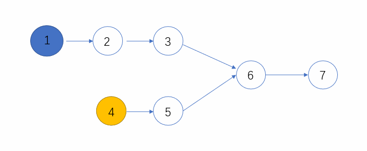
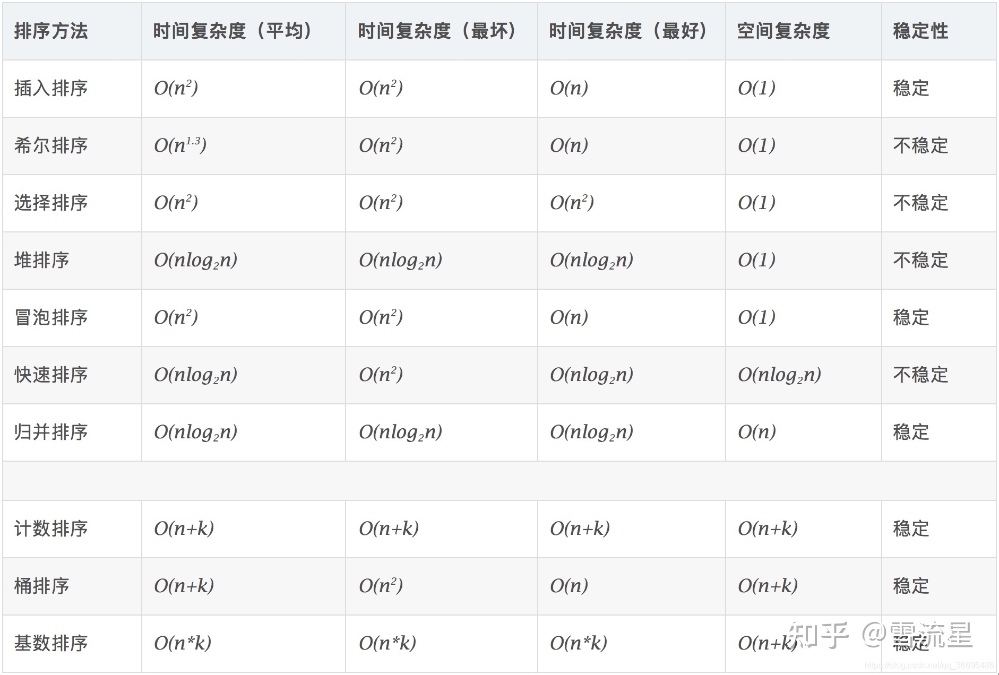

最短路径数量

```c++
#include <iostream>
#include <vector>
using namespace std;

int main()
{
	int n;
	cin >> n;

	vector<vector<int>> path(n, vector<int>(n, (1 << 31) - 1));

	int a, b, x;

	for (int i = 0; i < n; ++i) {
		cin >> a >> b >> x;
		if (a > b)
			swap(a, b);

		path[a][b] = min(x, path[a][b]);
	}

	cout << path[0][0];

	return 0;
}
```


### 常用函数

- `swap(a,b)` 

## String

#### 最大回文数

⭐

**问题**：给定一个只包含 0 - 9 的字符串 `s`，返回 `s` 中数字能组成的最大回文数，返回的数字不能以 0 开头

**思路**：

- 记录 0 - 9 每位数字的数量
- 回文左右对称，必定只有一个数字的数量可以是奇数，其余数字的数量全为偶数
- 要求返回最大的回文数，因此从后向前遍历 `nums[]` 中每个数字的数量，大于 1 即可加入回文串中
- 回文前后分开储存，最后相加

```c++
#include <iostream>
using namespace std;

int main()
{
	string s;
	cin >> s;
	int nums[] = { 0, 0, 0, 0, 0, 0, 0, 0, 0, 0 };		// 储存数字数量
    
	for (char c : s) {
		++nums[c - 48];
	}

	string s_forward, s_backward;

	for (int i = 9; i > -1; --i) {
		if (nums[i] > 1) {    // 某个数字两个以上，都看作偶数
            
			if (s_forward.empty() && i == 0) 	// 排除首位是零
				break;
            
			s_forward += string(nums[i] / 2, (char)(i + 48));
			s_backward = string(nums[i] / 2, (char)(i + 48)) + s_backward;
		}
	}
	
	for (int i = 9; i > -1; --i) {    // 处理奇数
		if (nums[i] % 2 == 1) {
			cout << s_forward + (char)(i + 48) + s_backward;
			break;
		}
	}
    
	return 0;
}s
```


#### 最长回文字符串 No.5 

⭐⭐⭐

**问题**：给你一个字符串 `s`，找到 `s` 中最长的回文子串。

**思路：**两层循环，第一层找每一个回文的中心，找到后，确定回文左侧和右侧的边界，然后与当前最长的比较长度

**难点：**

- 确定边界。找到回文时，如果在两侧不相等时才确定长度，会在整串边界时被规避掉，从而无法正确返回整串边界的子串信息
- 边界溢出

**Tips**：先正确，再优化。第一次写如果考虑优化，得到错误答案，会浪费更多时间 debug

```c++
class Solution {
public:
//中心扩散法
    string longestPalindrome(string s) {
        if(s.size() < 1)
            return "";

        int maxsub_left = 0;
        int l = 0;

        for(int i = 1; i < s.size(); ++i){
            //aa，长度为偶数
            for(int j = 1; i + j - 1 < s.size() && i - j >= 0; ++j){
                if(s[i + j - 1] == s[i - j]){
                    if(2*j - 1 > l){
                        maxsub_left = i - j;
                        l = 2*j - 1;
                    }
                }
                else
                    break;
            }

            //a, aba 长度为奇数
            for(int j = 1; i - j >= 0 && i + j < s.size(); ++j){
                if(s[i - j] == s[i + j]){
                    if(2*j > l){
                        maxsub_left = i - j;
                        l = 2*j;
                    }
                }
                else
                    break;
            }
        }
        
        return s.substr(maxsub_left, l + 1);
    }
};
```


## 栈

#### 包含min函数的栈 Jz.30 

⭐

**问题**：完成栈的数据结构，加入 min 函数，永远返回栈内的最小值

**思路**：新建一个 stack 记录所有阶段的 min，stack pop时，记录 min 的 stack 也 pop


#### 栈的压入、弹出序列 Jz.31

⭐⭐

**问题**：给定栈的压入顺序，判断数组是否可以为栈的弹出顺序

**思路**：辅助栈，模拟一下


#### 滑动窗口的最大值 Jz.59

⭐⭐⭐


## 链表

```c++
struct ListNode {
      int val;
      struct ListNode *next;
      ListNode(int x):
            val(x), next(NULL) {
      }
};
```


#### 从尾到头打印链表 Jz.6

**问题**：  输入一个链表的头节点，按链表从尾到头的顺序返回每个节点的值（用数组返回）

**递归**：

- 新建一个函数，递归，从尾到头把链表数字加入数组中
- 尽量检测 head 是否为空，而不是 head -> next

```c++
class Solution {
  public:
    vector<int> ret;

    void recursion(ListNode* head) {	// 新建的函数
        if (head != nullptr) {
            recursion(head -> next);
            ret.push_back(head -> val);
        }
    }

    vector<int> printListFromTailToHead(ListNode* head) {
        recursion(head);
        return ret;
    }
};
```


**迭代**

- 先储存正向的数组
- 反转正向数组

```c++
class Solution {
public:
    vector<int> printListFromTailToHead(ListNode* head) {
        vector<int> stack;
        
        while(head){
            stack.push_back(head->val);
            head = head->next;
        }
        
        int n = stack.size();
        int c;
        
        for(int i = 0; i < n/2; i++)
        {
            c = stack[i];
            stack[i] = stack[n-i-1];
            stack[n-i-1] = c;
        }

        return stack;
    }
};
```


#### 删除链表中重复的结点 Jz.76

**问题：**在一个排序的链表中，存在重复的结点，请删除该链表中重复的结点，重复的结点不保留，返回链表头指针。 例如，链表 1->2->3->3->4->4->5 处理后为 1->2->5 

**思路**：直接比较删除


```c++
class Solution {
  public:
    ListNode* deleteDuplication(ListNode* pHead) {
        if(!pHead){
            return nullptr;
        }

        ListNode* preHead = new ListNode(-1);
        preHead -> next = pHead;

        ListNode* cur = preHead;

        while(cur -> next != NULL && cur -> next -> next != NULL){
            //遇到相邻两个节点值相同
            if(cur -> next -> val == cur -> next -> next -> val){
                int temp = cur -> next -> val;
                //将所有相同的都跳过
                while(cur -> next != NULL && cur -> next -> val == temp){
                    cur -> next = cur -> next -> next;
                }
            }
            else
                cur = cur -> next;
        }

        return preHead -> next;

    }
};
```


#### 反转链表 Jz.24

**问题**：  

**迭代**

- 初始设置


- 逐步迭代，更新三个指针位置


- 返回 newHead
- 如此设置的好处
  - 可以处理输入为空
  - 不用特殊处理开头和结尾的节点

```c++
class Solution {
  public:
    ListNode* ReverseList(ListNode* pHead) {
        ListNode* newHead = nullptr;
        ListNode* nex = pHead;

        while (nex) {
			pHead = pHead -> next;
			nex -> next = newHead;
			newHead = nex;
			nex = pHead;
        }

        return newHead;
    }
};
```


#### 合并有序链表 No.21

**问题**：将两个升序链表合并为一个新的 **升序** 链表并返回

**递归**

思路：

- 想象编麻花辫，反过来。辫子尾部已经编好了，只需要捏着编好的一股绳子
- 注意递归传递回去时，链表状态已经改变
- 时间复杂度 O(n)
- 空间复杂度 O(n)

```c++
class Solution {
public:
    ListNode* mergeTwoLists(ListNode* list1, ListNode* list2) {
        if(!list1)
            return list2;
        else if(!list2)
            return list1;
        else if(list1 -> val < list2 -> val){
            list1 -> next = mergeTwoLists(list1 -> next, list2);
            return list1;
        }
        else{
            list2 -> next = mergeTwoLists(list2 -> next, list1);
            return list2;
        }
    }
};
```


#### 移除给定链表元素 No.203

**问题**：给定链表的头节点 `head` 和整数 `val` ，删除链表中所有满足 `Node.val == val` 的节点，并返回 **新的头节点** 。

**递归**

- 递归何时调用本函数，调用本函数前是否需要return，涉及的参数是否会被改变，都要仔细考虑
- 时间复杂度：O(n)
- 空间复杂度：O(n)

```c++
class Solution {
public:
    ListNode* removeElements(ListNode* head, int val) {
        if(!head)
            return nullptr;
        else if(head -> val == val)
            return removeElements(head -> next, val);
        else{
            head -> next = removeElements(head -> next, val);
            return head;
        }
    }
};
```

**迭代**

- prehead 节点和 pre 节点，真好用
- 循环时只有下一个结点没被删除，pre才能进入下一个，不然会漏
- 时间复杂度 O(n)
- 空间复杂度 O(1)

```c++
class Solution {
public:
    ListNode* removeElements(ListNode* head, int val) {
        if(!head)
            return nullptr;

        ListNode *preHead = new ListNode();
        preHead -> next = head;
        ListNode* pre = preHead;

        while(pre && pre -> next){
            if(pre -> next -> val == val)
                pre -> next = pre -> next ->next;
            else
                pre = pre -> next;
        }
        return preHead -> next;
    }
};
```


### 双指针

#### 两个链表的第一个公共结点 Jz.25     

**问题**：  输入两个无环的单向链表，找出它们的第一个公共结点，如果没有公共节点则返回空。

**思路**：

- 维护两个指针，p1 和 p2，交叉遍历两个列表
- 有公共节点的时候，p1和p2必会相遇，两者相等时即为第一个公共节点 
- 无公共节点的时候，此时 p1 和 p2 都会走到终点，都是null，也相等了 




```c++
class Solution {
public:
    ListNode* FindFirstCommonNode( ListNode* pHead1, ListNode* pHead2) {
        ListNode* p1 = pHead1, * p2 = pHead2;

		while(p1 != p2){
			p1 = p1 ? p1 -> next : pHead2;
			p2 = p2 ? p2 -> next : pHead1; 
		}

		return p1;
    }
};
```


#### 盛水最多的容器 No.3

**问题**：给定一个长度为 n 的整数数组 height 。有 n 条垂线，第 i 条线的两个端点是 (i, 0) 和 (i, height[i]) 。

​			找出其中的两条线，使得它们与 x 轴共同构成的容器可以容纳最多的水。


**思路**：双指针法

- 两个指针，分别从左右向内收缩，哪个小缩那个，记录形成最大的容器

```c++
class Solution {
public:
    int maxArea(vector<int>& height) {
        int water = 0;
        for(int left = 0, right = height.size() - 1; right > left; ){
            water = max(water, (right - left) * min(height[left], height[right]));
            
            if(height[left] < height[right])
                ++left;
            
            else
                --right;
        }
        return water;
    }
};
```


### 快慢指针

#### 有序列表中位数

**问题**：找出有序列表中的中位数

**思路**：fast 指针每次移动两格， slow 指针每次移动一格。fast 指针移动到末尾时，slow 正好移动到中间。


#### 链表中倒数k个结点  Jz.22

**问题**：输入一个长度为 n 的链表，返回该链表中倒数第 k 个节点

**思路**：维护两个指针，一个比另外一个慢 k 步

- 注意边界，k = n 时怎么处理

```c++
class Solution {
  public:
    ListNode* FindKthToTail(ListNode* pHead, int k) {
        ListNode* p = pHead, * res = pHead;

        while(p){
            p = p -> next;
            if(--k < 0){
                res = res -> next;
            }
        }

        if(k > 0)
            return nullptr;

        return res;
    }
};
```


#### 环形列表 No.141

**问题**：判断列表中是否有环

**思路**：fast 指针每次移动两格， slow 指针每次移动一格， 如果存在环路， 则fast最终一定会和slow相遇

时间复杂度O(n)，空间复杂度O(1)

```c++
bool hasCycle(ListNode *head) {
    ListNode *fast = head, *slow = head;
    
    while(fast != NULL && fast->next != NULL ){
        fast = fast->next-> next;
        slow = slow->next;
        if(fast == slow)
            return true;
    }
    
    return false;
}
```


#### 环形列表 Ⅱ No.142

**问题**：给定一个链表，返回链表开始入环的第一个节点。 如果链表无环，则返回 `null`

**思路**


- 快慢指针判断链表中是否有环，记录相遇位置 z
- 两个指针分别从 z 和 x 同时出发，每次移动一个单位，相遇位置为环的起点
- 时间复杂度O(n)，空间复杂度O(1)


**详解**

在 z 相遇时，slow 指针移动距离为 $a+b$ ，fast 指针移动距离为 $a + n(b + c )+ b$ 

行动次数相同时，fast 指针走过的距离是 slow 指针走过的距离的2倍，即 $a + b + n(b + c) = 2 (a + b)$，简化得 $ a = (n-1)(b + c) + c$

可以看出，a 的长度，即为 n - 1 倍环的长度，再加上 c 的长度

因此，再放速度相同的两个指针，分别从 x 和 z 出发， 它们相遇位置即为环的起点

```c++
ListNode *detectCycle(ListNode *head){
    ListNode *fast = head, *slow = head;
    while (fast != NULL && fast->next != NULL){
        fast = fast->next->next;
        slow = slow->next;
        if (fast == slow)
            break;
    }

    if (fast == NULL || fast->next == NULL)
        return NULL;

    fast = head;
    while (fast != slow){
        fast = fast->next;
        slow = slow->next;
    }
    return fast;
}
```


## 树

### 二叉树

```c++
struct TreeNode {
	int val;
	struct TreeNode *left;
	struct TreeNode *right;
	TreeNode(int x) :
			val(x), left(NULL), right(NULL) {
	}
};
```

技巧：从最基本的 每个 tree node 怎么办去思考


#### 二叉树的深度 Jz.55 

**问题**：输入一棵二叉树，求该树的深度

**思路**：递归

```c++
class Solution {
public:
    int maxDepth(TreeNode* root) {
        //空节点没有深度
        if(root == NULL) 
            return 0;
        //返回子树深度+1
        return max(maxDepth(root->left), maxDepth(root->right)) + 1; 
    }
};
```


#### 判断是不是平衡二叉树 Jz.79

**问题**：判断一个数是否为平衡二叉树。平衡二叉树是左子树的高度与右子树的高度差的绝对值小于等于1

**递归**：

- 自底向上看每个节点是否平衡
- 后序遍历正好是自底向上的

```c++
class Solution {
public:
    // 计算每个节点的高度，顺便判断是否平衡
    // 平衡的话，返回当前节点高度；不平衡则返回 -1
    int Depth(TreeNode* root){
        if(!root)
            return 0;
		
        int leftDepth = Depth(root->left);	// 左子树高度
        if(leftDepth == -1)		// 左子树如果不平衡，直接返回 -1
            return -1;
        
        int rightDepth = Depth(root->right);	// 右子树同理，并判断当前
        if(rightDepth == -1 || leftDepth - rightDepth < -1 || leftDepth - rightDepth > 1)
            return -1;
        
        return max(Depth(root->left), Depth(root->right)) + 1;	// 当前节点平衡，则返回当前节点高度
    }

    bool IsBalanced_Solution(TreeNode* pRoot) {
        if(Depth(pRoot) == -1)
            return false;

        return true;
    }
};
```


#### 二叉树的镜像 Jz.27

**问题**：操作给定的二叉树，将其变换为源二叉树的镜像。

**思路：**

- 交换每一个节点的左子树和右子树
- 递归

```c++
class Solution {
public:
    TreeNode* Mirror(TreeNode* pRoot) {
        if(pRoot == NULL)
            return NULL;
        
        TreeNode* temp(pRoot -> left);
        pRoot -> left = pRoot -> right;
        pRoot -> right = temp;
        Mirror(pRoot -> left);
        Mirror(pRoot -> right);
         
        return pRoot;
    }
};
```


#### 前中后序遍历

前序遍历、中序遍历和后序遍历是三种利用深度优先搜索遍历二叉树的方式


##### 前序遍历

- 父结点 —> 左结点 —> 右节点
- 1 2 4 5 3 6

```c++
void preorder(TreeNode* root) {
	visit(root);
	preorder(root->left);
	preorder(root->right);
}
```


##### 中序遍历

- 左结点 —> 父结点 —> 右节点
- 4 2 5 1 3 6

```c++
void preorder(TreeNode* root) {
	preorder(root->left);
    visit(root);
	preorder(root->right);
}
```


##### 后序遍历

- 左结点 —> 右节点 —> 父结点
- 4 5 2 6 3 1

```c++
void preorder(TreeNode* root) {
	preorder(root->left);
	preorder(root->right);
    visit(root);
}
```


#### 二叉树的下一个结点  Jz.8

**问题**：给定一个二叉树其中的一个结点，请找出中序遍历顺序的下一个结点并且返回。

- 注：此树每个节点包含 next 指针，指向父节点

```c++
class Solution {
public:
    TreeLinkNode* GetNext(TreeLinkNode* pNode) {
        //中序遍历，左边的节点都已经遍历过了，不用考虑，只考虑右节点与父节点
        if(pNode -> right){ 
            //有右节点，右节点的最深左子节点即为后继节点，无最深左子节点则为右节点本身
            pNode = pNode -> right;
            while(pNode -> left)
                pNode = pNode -> left;
        }
        else if(pNode -> next){ //有父节点
            //若有，使此节点为左子节点的最近父节点，为后继节点
            while(pNode -> next != NULL && pNode -> next -> left != pNode){
                pNode = pNode -> next;
            }
            pNode = pNode -> next;
        }
        else //没有右节点也没有父节点
            pNode = NULL;
        return pNode;
    }
};
```


#### 层次遍历

- 我们可以使用广度优先搜索进行层次遍历。
- 用一个队列储存未被打印的节点


#### 从上往下打印二叉树 Jz.32

**问题**：不分行从上往下打印出二叉树的每个节点，同层节点从左至右打印

**思路**：

- 建立队列，从根节点开始，对每个节点执行以下操作
- 打印当前节点，并把它的左右节点存入队列


```c++
class Solution {
public:
    vector<int> PrintFromTopToBottom(TreeNode* root) {
        vector<int> ret; 		//储存结果
        if(!root) return ret; 	//树为空
        
        queue<TreeNode*> q; 	//储存未被打印的节点
        q.push(root);
        while(q.size()){ 		//检验q不为空
            if(q.front() -> left)
                q.push(q.front() -> left); 	//把q头节点的左右节点加入q
            if(q.front() -> right)
                q.push(q.front() -> right);
            ret.push_back(q.front() -> val); //打印q头节点的值
            q.pop();
        }
        return ret;
    }
};

```


#### 按之字形顺序打印二叉树 Jz.77

**问题**：给定一个二叉树，返回该二叉树的之字形层序遍历（第一层从左向右，下一层从右向左）

**思路**：

- 用栈控制输出顺序
- 定义两个栈，分别存储奇数层和偶数层的节点


```c++
class Solution {
public:
    vector<vector<int>> Print(TreeNode* pRoot) {
        //辅助栈
        stack<TreeNode*> s1, s2;
        s1.push(pRoot);
        
        vector<vector<int>> res;
        
        while(!s1.empty()){
            vector<int> temp;
            
            //奇数层
            while(!s1.empty()){
                if(s1.top() != NULL){
                    s2.push(s1.top() -> left);
                    s2.push(s1.top() -> right);
                    temp.push_back(s1.top() -> val);
                }
                s1.pop();
            }
			
            //奇数层加入结果
            if(!temp.empty()){
                res.push_back(temp);
                temp.clear();
            }
            
            //偶数层
            while(!s2.empty()){
                if(s2.top()!= NULL){
                    s1.push(s2.top() -> right);
                    s1.push(s2.top() -> left);
                    temp.push_back(s2.top() -> val);
                }
                s2.pop();
            }
			
            //偶数层加入结果
            if(!temp.empty()){
                res.push_back(temp);
                temp.clear();
            }
        }

        return res;

    }
    
};
```


### 二叉搜索树


#### 二叉搜索树的后序遍历 Jz.33

**题目: **输入一个数组，判断它是不是某二叉搜索树的后序遍历结果

**思路**：

- 后序遍历，先左再右，最后父节点
- 对二叉搜索树的每个节点来说，左子树不能大于右子树
- 实现在数列上，即为，从后向前遍历，出现小于当前数的数之后，前面不能有比这个数更大的数
- 建立数组，存储由前向后到每一位的最大值

```c++
class Solution {
public:
    bool VerifySquenceOfBST(vector<int> sequence) {
        if(sequence.size() == 0) return false;
        
        //建立数组，存储由前向后到每一位的最大值
        vector<int> forwardmax(sequence.size());
        forwardmax[0] = sequence[0];
        for(int i = 1; i < sequence.size(); ++i){
            forwardmax[i] = max(forwardmax[i - 1], sequence[i]);
        }
        
        for(int i = sequence.size(); i > 0; --i){
            for(int j = i - 1; j >= 0; --j){
                if(sequence[j] < sequence[i] && forwardmax[j] > sequence[i])
                    return false;
            }
        }
        
        return true;
        
    }
};
```


#### 二叉搜索树与双向链表 Jz.36

**问题**：将二叉搜索树原地转换为双向链表，返回第一个节点的指针


**思路**：

- preNode 指向当前节点 root 的双向链表中的前继节点
- 中序遍历，思考每个节点与它的两个孩子，假设左孩子已经处理完，右孩子还未处理

```c++
class Solution {
public:
    TreeNode* preNode;
    void inorder(TreeNode* root){
        if(!root) return; //判断树是否为空
        
        inorder(root -> left); //处理左边
        
        root -> left = preNode; //处理当前
        if(preNode)
            preNode -> right = root;
        preNode = root; 
        
        inorder(root -> right);//处理右边
    }
    
    TreeNode* Convert(TreeNode* pRootOfTree) {
        if(!pRootOfTree) return NULL;
        
        // 将返回的指针指向最小的节点
        TreeNode* ret = pRootOfTree;
        while(ret -> left)
            ret = ret -> left;
        
        inorder(pRootOfTree);
        return ret;
    }
};
```


## 排序算法

#### Bubble sort

```c++
int bubblesort(vector<int> data) {
    int n = data.size();
    bool sorted;
    for(int i = 0; i < n - 1; --n){
        sorted = true;
        for(int j = 0; j < n - 1; ++j){
            if(data[j] > data[j + 1]){
                sorted = false;
                swap(data[j], data[j + 1]);
            }
        }
        if(sorted == true) break;
    }
    return cnt;
}
```

#### Merge sort

```c++
void merge(int lo, int mi, int hi){
    
}
```




| 查找算法 | 时间复杂度 | 数据结构 |
| -------- | ---------- | -------- |
| 二分查找 | $O(logn)$  |          |
|          |            |          |
|          |            |          |


### 堆

- 理论时间复杂度 O(nlogn)，实际表现和冒泡相似

- 空间复杂度 O(1)

- 不稳定排序

  

**父子节点规律**

- parent  $=(i - 1) / 2 $
- c1  $=2i + 1$
- c2   $=2i + 2$


#### 从小到大的堆排序

1. 调整一个节点，以及其调整后变化的子节点，建立局部大根堆
   - 如果堆已经建好，只改变其中一个节点，对它的父节点进行 heapfiy 即可完成对整个堆的维护

```c++
void heapfiy(vector<int>& nums, int n, int i) {
    if (i >= n) {
        return;
    }

    int c1 = i * 2 + 1;
    int c2 = i * 2 + 2;
    int max = i;
    if (c1 < n && nums[max] < nums[c1]) {
        max = c1;
    }
    if (c2 < n && nums[max] < nums[c2]) {
        max = c2;
    }

    if (max != i) {
        swap(nums[max], nums[i]);
        heapfiy(nums, n, max);
    }
}
```


2. 将乱序的完全二叉树变成大根堆

```c++
void build_heap(vector<int>& nums, int n) {
    int last_node = n - 1;
    int parent = (last_node - 1)/2;
    for (int i = parent; i >= 0; --i) {
        heapfiy(nums, n, i);
    }
}
```


3. 通过将第一个节点放到最后，调整堆进行排序，得到从小到大的数组

```c++
void heap_sort(vector<int>& nums, int n) {
    build_heap(nums, n);
    for (int i = n - 1; i >= 0; --i) {
        swap(nums[i], nums[0]);
        heapfiy(nums, i, 0);
    }
}
```


- 测试

```c++
int main() {
    vector<int> nums = { 5,3,4,6,2,1 };
    heap_sort(nums, 6);
    
    for (int n : nums) {
        cout << n << " ";
    }
}
```


#### 数组中第 k 个最大元素 No.215

**问题**：给定整数数组 nums 和整数 k，请返回数组中第 k 个最大的元素，时间复杂度 O(n)

**思路**：建立 k 个元素的小根堆，维护堆顶为当前第 k 个最大的元素

**时间复杂度**：

```c++
class Solution {
public:
    void heapfiy(vector<int>& nums, int n, int i) {
        if (i >= n) {
            return;
        }
        int c1 = i * 2 + 1;
        int c2 = i * 2 + 2;
        int min = i;
        if (c1 < n && nums[min] > nums[c1]) {
            min = c1;
        }
        if (c2 < n && nums[min] > nums[c2]) {
            min = c2;
        }

        if (min != i) {
            swap(nums[min], nums[i]);
            heapfiy(nums, n, min);
        }
    }

    void build_heap(vector<int>& nums, int n) {
        int last_node = n - 1;
        int parent = (last_node - 1)/2;
        for (int i = parent; i >= 0; --i) {
            heapfiy(nums, n, i);
        }
    }

    int findKthLargest(vector<int>& nums, int k) {
        build_heap(nums, k);

        int n = nums.size();
        for(int i = k; i < n; ++i){
            if(nums[0] < nums[i]){
                nums[0] = nums[i];
                heapfiy(nums, k, 0);
            }
        }

        return nums[0];
    }
};
```

堆排序讲解：https://www.bilibili.com/video/BV1Eb41147dK/?spm_id_from=333.788.recommend_more_video.-1&vd_source=120074d428e56ab223e0ce014bbd58b7

时间复杂度讲解：https://www.bilibili.com/video/BV1gX4y1G77q?spm_id_from=333.337.search-card.all.click&vd_source=120074d428e56ab223e0ce014bbd58b7


### 栈

#### 有效的括号 No.20

**问题**：给定一个只包括 '('，')'，'{'，'}'，'['，']' 的字符串 s ，判断 s 中括号是否全部正确闭合

**思路**：

考虑特殊情况：

- string 为空
- 右括号多出
- 左括号多出
- 括号对不上

```c++
bool isValid(string s) {
        if(s == "" || s.size() % 2 == 1)
            return false;

        stack<char> box;
        box.push(' ');
        for(char c : s){
            if (c == '(' || c == '{' || c == '['){
                box.push(c);
                continue;
            }
            else if(c == ']'){
                if('[' != box.top())
                    return false;
            }
            else if(c == '}'){
                if('{' != box.top())
                    return false;
            }
            else if('(' != box.top()){
                return false; 
            }
            box.pop();
        }
        if(box.top() != ' ')
            return false;
        return true;
    }
```


## 动态规划

#### Longest Zig-Zag Subsequence

⭐

If a sequence {𝑥1, 𝑥2, … 𝑥𝑛} is alternating sequence then its element satisfy one of the following relation:

- x1 < x2 > x3 < x4 > x5 < … xn 
- x1 > x2 < x3 > x4 < x5 > … xn 

```c++
int main() {
	int n = 10;
	vector<vector<int>> dp(n, vector<int>(2, 1));
	vector<int> num = { 1,3,2,4,3,5,4,3,7,8 };

	int sizeOfLongestSequence = 0;

	for (int i = 1; i < n; ++i) {
			if (num[i] > num[i - 1]) {
				dp[i][0] = dp[i - 1][1] + 1;
			}
			else if (num[i] < num[i - 1]) {
				dp[i][1] = dp[i - 1][0] + 1;
			}
			sizeOfLongestSequence = max(max(dp[i][0], dp[i][1]), sizeOfLongestSequence);
	}
	cout << sizeOfLongestSequence;
}
```


#### Longest Subsequence with Equal Step

⭐

**问题**：数组 `nums` 中，最长的步长为`step` 的子序列（不要求连续）

输入：

```c++
2 4 1 7 -2 -3 -5	//一个序列
-3					// 步长
```

输出： `4` 

解释：最长特定步长子序列为 ` 4 1 -2 -5`

**思路**：

- 从前向后遍历，`dp[i]` 记录以 `nums[i]` 为结尾的最长子序列

```c++
int LongestSubsequenceWithEqualStep(vector<int> nums, int step) {
	
	int ret = 1;
	int n = nums.size();

	vector<int> dp(n, 1);

	for (int i = 0; i < n; ++i) {
		int pre = nums[i] - step;

		for (int j = i - 1; j > -1; --j) {
			if (nums[j] == pre) {
				dp[i] = dp[j] + 1;
				break;
			}
		}
		ret = max(ret, dp[i]);
	}

	return ret;
}
```

相似题目：No. 1027 最长等差数列 ⭐⭐


#### 跳台阶 No.70

**题目**：需要 `n` 阶才能到达楼顶，每次可以爬 `1` 或 `2` 个台阶，有多少种不同的方法可以爬到楼顶呢？

**思路**：经典斐波那契数

```c++
class Solution {
public:
    int climbStairs(int n) {
        if(n == 1)
            return 1;
        if(n == 2)
            return 2;

        int f = 1;
        int g = 2;
        for(int i = 3; i < n + 1; ++i){
            g = f + g;
            f = g - f;
        }
        return g;
    }
};
```


#### 最长公共子序列 No.1143

**问题**：给定两个字符串 `text1` 和 `text2`，返回这两个字符串的最长 **公共子序列** 的长度。如果不存在 **公共子序列** ，返回 `0` 。

**思路**：

- 通过递归分析，得到迭代结果
- 第一行和第一列，初始化为 0
- 其他每个数字格，记录左上方到这里的最长子序列
- 当前数字格，如果对应的字母相等，直接分割考虑不包括它，左上侧字串最大 + 1
- 当前数字格，如果对应的字母不等，则保留两种都有可能，继承左侧与上侧较大的数字
- 按照特定顺序，如从左到右，从上到下，保证当前数字格左上侧所有都已算出


```c++
class Solution {
public:
    int longestCommonSubsequence(string text1, string text2) {
        int m = text1.size();
        int n = text2.size();
        //额外做出第0行和第0列，全部填充0
        vector<vector<int>> v(n + 1, vector<int>(m + 1, 0));
		
        // i 横向迭代，长度为 m；j 纵向迭代，长度为 n
        for(int j = 1; j < n + 1; ++j){
            for(int i = 1; i < m + 1; ++i){
                if(text1[i - 1] == text2[j - 1]){
                    v[j][i] = v[j - 1][i - 1] + 1;
                }
                else{
                    v[j][i] = max(v[j - 1][i], v[j][i - 1]);
                }
            }
        }
        return v[n][m];
    }
};
```

递归分析过程：

https://www.xuetangx.com/learn/thu08091000384intl/thu08091000384intl/3995174/video/4413045


#### [打家劫舍](https://leetcode.cn/problems/house-robber/)  No.198

**问题**：如果两间相邻的房屋在同一晚上被小偷闯入，系统会自动报警。给定一个代表每个房屋存放金额的非负整数数组 `nums[i]`，计算不触动警报装置的情况下 ，一夜之内能够偷窃到的最高金额。

**思路**：

- 定义 dp 数组，`dpSteal[i]` 存储偷第 `i` 间房子的最大金额
- `dpSteal[i] = max(dpSteal[i - 1], dpSteal[i - 2] + nums[i])`

```c++
class Solution {
public:
    int rob(vector<int>& nums) {
        if(nums.size() < 2){	// 处理数组过短
            return nums[0];
        }

        vector<int> dpSteal(nums.size());

        dpSteal[0] = nums[0];
        dpSteal[1] = max(nums[1], nums[0]);

        for(int i = 2; i < nums.size(); ++i){
            dpSteal[i] = max(dpSteal[i - 1], dpSteal[i - 2] + nums[i]);
        }

        return dpSteal[nums.size() - 1];

    }
};
```


**优化储存空间**

```c++
class Solution {
public:
    int rob(vector<int>& nums) {
        int i_2 = 0, i_1 = 0;
        
        for(int i = 0; i < nums.size(); ++i){
            i_2 = max(i_2 + nums[i], i_1);
            swap(i_2, i_1);
        }

        return max(i_2, i_1);

    }
};
```


#### 最短路径条数

⭐⭐⭐

**问题**：有 n 个点，求点 0 到点 n 之间的最短路径个数

**输入**：

- 第一行为 n，为点的个数
- 接下来每行三个数，前两个表示点，最后一个是它们之间的路径长度


**思路**：

**Dijkstra**：

- `preNode[a][i] ` 记录点 `a` 最短路径的前继节点
- `book[a]` 记录点 `a` 是否已经找点 0 到它的最短路径， `dis[i]` 记录点 0 到 点 `a` 最短路径的长度，初始值为 max
- 每个循环，找到所有 `book[i]` 为 `false` 中 `dis[i]` 最小的点 `a` ，更新所有与点 `a` 直接相连点的 `dis` 与 `preNode` 
- 重复以上过程，直到所有点 booked


**从 `preNode ` 中提取最短路径条数**：

- Set `numOfShortest[i]` denote number of shortest paths from node `0` to node `i`
- `numOfShortest[i]`  is equals to all `numOfShortest[preNode[i][j]]` puls together
- Then use iteration, calculate `numOfShortest[i]` for all nodes, the `answer is numOfShortest[n - 1]`

```c++
#include <iostream>
#include <vector>
using namespace std;

int main()
{
	int n;
	cin >> n;
    
	int a, b, x;
	const int MAXINT = 2147483647;
	vector<vector<int>> path(n, vector<int>(n, MAXINT));

	while (cin >> a >> b >> x) {
		path[a][b] = min(x, path[a][b]);
		path[b][a] = min(x, path[b][a]);
	}
    
// ---------------------------------------- Dijkstra ------------------------------------------
    vector<bool> book(n, false);
	vector<int> dis(n, MAXINT);
	vector<vector<int>> preNode(n, vector<int>(n, -1));
    dis[0] = 0;
    
	while(true){
		int min_unbook = -1;
		for(int i = 0; i < n; ++i){
			if(!book[i] && dis[i] < MAXINT){
				if(min_unbook == -1)
					min_unbook = i;
				else if(dis[min_unbook] > dis[i])
					min_unbook = i;
			}
		}

		if(min_unbook == -1)
			break;
		
		book[min_unbook] = true;

		for(int i = 0; i < n; ++i){
			if(!book[i] && path[min_unbook][i] < MAXINT){
				// 找到路径更短的
				if(path[min_unbook][i] + dis[min_unbook] < dis[i]){
					dis[i] = path[min_unbook][i] + dis[min_unbook];
					for(int j = 0; j < n; ++j){
						if(preNode[i][j] == -1)
							break;
						preNode[i][j] = -1;
					}
					preNode[i][0] = min_unbook;
				}
				// 路径最短路径一样长
				else if(path[min_unbook][i] + dis[min_unbook] == dis[i]){
					for(int j = 0; j < n; ++j){
						if(preNode[i][j] == -1){
							preNode[i][j] = min_unbook;
							break;
						}
					}
				}
			}
		}
	}

    //--------------------------------- 从 preNode 中提取最短路径条数 ------------------------------
	vector<int> numOfShortest(n, 0);
	numOfShortest[0] = 1;

	while(numOfShortest[n-1] == 0){
		int i = -1;
		while(i < n - 1){
			++i;
			if(numOfShortest[i] != 0){
				continue;
			}

			int j = 0;
			while(preNode[i][j] != -1 && j < n){
				if(numOfShortest[preNode[i][j]] == 0){
					j = -1;
					break;
				}
				++j;
			}

			if(j == -1){
				continue;
			}

			j = 0;
			while(preNode[i][j] != -1 && j < n){
				numOfShortest[i] += numOfShortest[preNode[i][j]];
				++j;
			}
		}
	}

	cout << numOfShortest[n-1] << endl;

	return 0;
}

```


## 查找算法

### 二分查找

- 重点关注边界问题

#### 二分查找  No.704

⭐

**问题**：顺序 nums 中找 target，nums 中元素不重复

**思路**：

- 确定边界条件，确保查全
- low <= high，确保全部搜索
- mid - 1、mid + 1 确保每次 low 或 high 都有变化，(2 + 3) / 2 = 2
- mid 查中时 return

```c++
class Solution {
public:
    int search(vector<int>& nums, int target) {
        int low = 0, high = nums.size() - 1;
        while(low <= high){
            int mid = (low + high)/2;

            if(target < nums[mid] )
                high = mid - 1;
            else if(nums[mid] < target)
                low = mid + 1;
            else
                return mid;
        }
        return -1;
    }
};
```


#### 数字在升序数组中出现的次数  Jz.53

⭐

**问题**：给定一个长度为 n 的非降序数组和一个非负数整数 k ，返回 k 在数组中出现的次数

**思路**：

- 利用 float，精确定位边界

```c++
class Solution {
public:
    //二分查找
    int bisearch(vector<int>& data, float k){ 
        int left = 0;
        int right = data.size() - 1;
        //二分左右界
        while(left <= right){ 
            int mid = (left + right) / 2;
            if(data[mid] < k)
                left = mid + 1;
            else if(data[mid] > k)
                right = mid - 1;
        }
        return left;
    }
    int GetNumberOfK(vector<int> data ,int k) {
        //分别查找k+0.5和k-0.5应该出现的位置，中间的部分就全是k
        return bisearch(data, k + 0.5) - bisearch(data, k - 0.5);
    }
};
```


#### 无重复字符最长子串 No. 3

**问题**：给定一个字符串 `s` ，找出其中不含有重复字符的 **最长子串** 的长度

**思路**：滑动窗口

- unordered map 进行任何操作只需O(1) 时间

```c++
class Solution {
public:
    int lengthOfLongestSubstring(string s) {
        unordered_map<char, int> m;
        int left = 0, right = 0;
        int ret;
        
        for(int i = 0; i < s.size(); ++i){
            // 新字符插入字典成功，right右移，最大长度+1
            if(m.insert({s[i], 1}).second == true){
                right = i;
                ret = max(right - left  + 1, ret);
            }
			//插入失败，说明已经存在。right +1，left 右移到不包含相同字符，left 右移部字典中全部删除
            else{
                right = i;
                int j = left;
                for(;j < i && s[j] != s[i]; ++j){		//注
                    m.erase(s[j]);
                }
                left = j + 1;
            }
        }

        return ret;
    }
};
```

- 注：未解之谜：不加 j < i，结果可能会返回一个超大的数，如测试数据 "alouzxilkaxkufsu"，返回 32767


### 脑筋急转弯

#### 二维数组中的查找 Jz.4

**问题**

二维数组中（每个一维数组的长度相同），每行从左到右递增，每一列从上到下递增。判断数组中是否含有一个整数。

[[1,2,8,9],
 [2,4,9,12],
 [4,7,10,13],
 [6,8,11,15]] 

- 给定 target = 7，返回 true
- 给定 target = 3，返回 false


**思路**

- 从左下角开始查找，大则向右，小则向上
- 时间复杂度 O(N)


## 贪心

直接做出当前问题中看起来最优的解，而不是考虑到子问题的解


#### 股票的最大收益 No.122

**问题**

- 整数数组 `prices`，其中 `prices[i]` 表示某支股票第 i 天的价格。
- 每一天，可以购买和出售无限次但最多只能持有一股。也可以先购买，然后在同一天出售。

- 返回最大利润


**思路**

- a <= b <=c <= d 时，每天卖出后买入，等价于 d - a
- a <= b >=c <= d 时，a 买入，b卖出，c买入，d卖出即可
- 因此只要判断 i 和 i+1 天，若 i 的价格小于 i+1，则 i 天应该买入，并在 i+1 天卖出


#### 跳跃游戏 No.55

**问题**

- 给定一个非负整数数组 nums ，你最初位于数组的 第一个下标 。

- 数组中的每个元素代表你在该位置可以跳跃的最大长度。

- 判断你是否能够到达最后一个下标。


**思路**

- 如果某一个作为 **起跳点** 的格子可以跳跃的距离是 3，那么表示后面 3 个格子都可以作为 **起跳点**
- 对每一个能作为 **起跳点** 的格子都尝试跳一次，把 **能跳到最远的距离** 不断更新
- 如果可以一直跳到最后，就成功了


## 回溯

排列组合，**画树形图** ！！！

#### 电话号码的字母组合 No.17

**问题**：

给定一个仅包含数字 2-9 的字符串，返回所有它能表示的字母组合。答案可以按 **任意顺序** 返回。


**思路**：

- 全局变量，分别为 `ret` 结果列表，和 `tel` 数字对应打表
- 创造递归函数 `backrack` ，参数为 **已有前置组合** 与 **所剩数字**
- **所剩数字** 不存在时，直接将 **已有前置组合** 添加到结果列表中
- **所剩数字** 存在时，循环最前数字所有字母，并对每种可能 `backrack` 

```c++
class Solution {
public:
    vector<string> ret;
    vector<string> tel = {"abc","def","ghi","jkl","mno","pqrs","tuv","wxyz"};

    vector<string> letterCombinations(string digits) {
        if(digits.empty())
            return {};

        backTrack("", digits);
        return {ret};
    }

    void backTrack(string combination, string digits){
        
        if(digits.empty())
            ret.push_back(combination);
        
        else{
            for(char l : tel[digits[0] - '0' - 2])  // 也可以写成 digits[0] - 50 // = digits[0] - 48 - 2
                backTrack(combination + l, digits.substr(1));
        }
    }
};
```


#### 括号生成 No.22

**问题**：数字 `n` 代表生成括号的对数，请你设计一个函数，用于能够生成所有可能的并且 **有效的** 括号组合

**思路**：

- 画排列组合树！会发现是二叉树，每个节点的最多只能有 **两个子节点**（左括号或右括号）
- 接下来只要限制括号完整性的条件即可。
  - 设置三个参数，总括号数 `n` ，已生成左侧括号数 `left` ，已生成右侧括号数 `right` 
  - 保证 `right < left < n` 即可


```c++
class Solution {
public:
    vector<string> ret;

    vector<string> generateParenthesis(int n) {
        if(n == 0)
            return {};

        backTrack("", n, 0, 0);
        return ret;
    }

    void backTrack(string combination, int n, int left, int right){
        if(left == n && right == n){
            ret.push_back(combination);
            return;
        }
        
        if(left < n)
            backTrack(combination + '(', n, left + 1, right);
        
        if(right < left)
            backTrack(combination + ')', n, left, right + 1);
    }
};
```


## DFS

https://leetcode-cn.com/problems/number-of-islands/solution/dao-yu-lei-wen-ti-de-tong-yong-jie-fa-dfs-bian-li-/

树的前中后序遍历


#### 岛屿数量 No.200


```c++

```


### 循环不变量

#### ⭐颜色分类 No.75

**问题**：只有 0，1，2 的数组，**原地** 排序，只用一趟扫描

**思路**：

- 循环的时候，维持 0，1，2 不同分区不变，注意分区的开闭


```c++
class Solution {
public:
    void sortColors(vector<int>& nums) {
        int n = nums.size();
        int p0 = 0, p2 = n - 1;
        
        // [0, p0): 0
        // [p0, i): 1
        // (p2, n]: 2

        for(int i = 0; i <= p2; ++i){
            while(i <= p2 && nums[i] == 2){
                swap(nums[i], nums[p2]);
                --p2;
            }
            if(nums[i] == 0){
                swap(nums[i], nums[p0]);
                ++p0;
            }
        }
    }
};
```


### 掰扯不清楚

#### ⭐下一个排列 No.31

**问题**：求出数组 `nums` 字典序大一点的下一个排列

**思路**：

- 找出最靠右顺序对后，反转后面的所有数字


#### 接雨水 No.42

**问题**：给定 `n` 个非负整数表示每个宽度为 `1` 的柱子的高度图，计算按此排列的柱子，下雨之后能接多少雨水


**思路**：

- 从左到右，依次计算每个柱子可以接多少雨水
- 用指针，实时更新当前柱子左侧最高的柱子
- 建立数组，记录每根柱子右侧最高的柱子


本题多种解法，推导过程 和 双指针都挺有趣的，可以看看其他题解

```c++
class Solution {
public:
    int trap(vector<int>& height) {
        if(height.size() < 3)
            return 0;

        int left_high = height[0];
        int bottom = 1;
        
        // 对每一个bottom 记录 right high
        vector<int> right_max_high(height.size());
        right_max_high[height.size() - 1] = height[height.size() - 1];
        for(int i = height.size() - 2; i > 0; --i){
            right_max_high[i] = max(height[i], right_max_high[i + 1]);
        }

        int water = 0;
        for(int i = 1; i < height.size(); ++i){
            //维护 left_high
            left_high = max(left_high, height[i-1]);

            //计算雨水
            water += max(min(left_high, right_max_high[i]) - height[i], 0);
        }

        return water;
    }
};
```


#### 记录字母出现次数：哈希表

- 例中字母全为小写

```c++
string s = "apple";
vector<int> table(26, 0);

for(char c : s)
    ++table['z' - c];
```


### 快速幂

#### Pow(x, n)

**问题**：实现 pow (x, n)，即 x 的 n 次幂函数

**思路** ：暴力解中，x乘n次，时间复杂度O(n)；用二分法去乘，可以降为O(logn)


##### 方法1：递归快速幂

- 反向推导，n = n/2 + n/2
- 特殊情况： n 为负数，n = 0，最小负数 n 变为正数后超界
- 因此主函数处理特殊情况，辅助函数实现递归
- 空间复杂度 O(logn)，即为递归的层数，递归会使用额外的栈空间

```c++
//递归函数
double Pow(double x, long n) {
    if (n == 1)
        return x;
    else {
        double half = Pow(x, n / 2);
        return n % 2 == 1 ? half * half * x : half * half;
    }
}

//主函数
double myPow(double x, int n) {
    long N = n;
    if (N < 0) {
        x = 1 / x;
        N = -N;
    }
    else if (N == 0)
        return 1;

    return Pow(x, N);
}
```


##### 方法2：迭代快速幂

- 77 的二进制为 1001101，$77 = 2^0 + 2 ^ 2 + 2^3 + 2^6$ 

- $3^{77} = 3^1 * 3^4 * 3 ^ 8 * 3 ^ {64}$
- 每次迭代中，多项式下一项等于上一项的平方，而最终结果等于 n 二进制表示为 1 时的项的乘积

```c++
double myPow(double x, int n) {
    long N = n;
    if (n == 0)
        return 1;
    else if (n < 0) {
        x = 1 / x;
        N = -N;
    }

    double ans = 1;
    double x_contribute = x;

    while (N > 0) {
        if (N % 2 == 1) {
            ans *= x_contribute;
        }
        N = N / 2;
        x_contribute *= x_contribute;
    }

    return ans;
}
```


#### 超级次方

**问题**：计算 `pow(a, b)` 对 `1337` 取模，`a` 是一个正整数，`b` 是一个非常大的正整数且会以数组形式给出

**思路**：

- a 先取一次模，每次计算都取模，防止超出范围
- $2^{31}= (2^3)^{10} * 2^1$
- 递归快速幂

```c++
long long Pow(int a, int n) {
    if (n == 1)
        return a;
    else if (n == 0 || a == 1)
        return 1;
    else {
        long long half = Pow(a, n / 2);
        return n % 2 == 1 ? half * half * a % 1337 : half * half % 1337;
    }
}

int superPow(int a, vector<int>& b) {
    int N = b.size();
    a = a % 1337;
    long long ans = 1;
    for (int i = 0; i < N; ++i) {
        ans = Pow(ans, 10) * Pow(a, b[i]) % 1337;
    }
    return ans;
}
```


# 数据结构


#### 定义

- **数据结构**：是相互之间存在一种或多种特定关系的数据元素的集合，包括逻辑结构和物理结构。
- **数据类型**：是一个值的集合和定义在这个值集上的一组操作的总称。
- **抽象数据类型**：是指一个数学模型以及定义在该模型上的一组操作。

#### 常用时间

- 现代计算机一秒计算 10^9^ 次
- 10^5^ sec  $\approx$  1 day
- 10^10^ sec  $\approx$  10^5^ day  $\approx$  3 century

#### 斐波那契数列

- $\phi = (1 + \sqrt5)/2 = 1.61803..$ 
- $\phi^{36} =  2^{25}$
- $\phi^{5} =  10$


## 注意

#### 常见特殊情况

- 0，null
- 容器为空时输出


#### 因小失大

- 不要为了简洁，省略感觉非必要的条件！！先完成，再优化！
