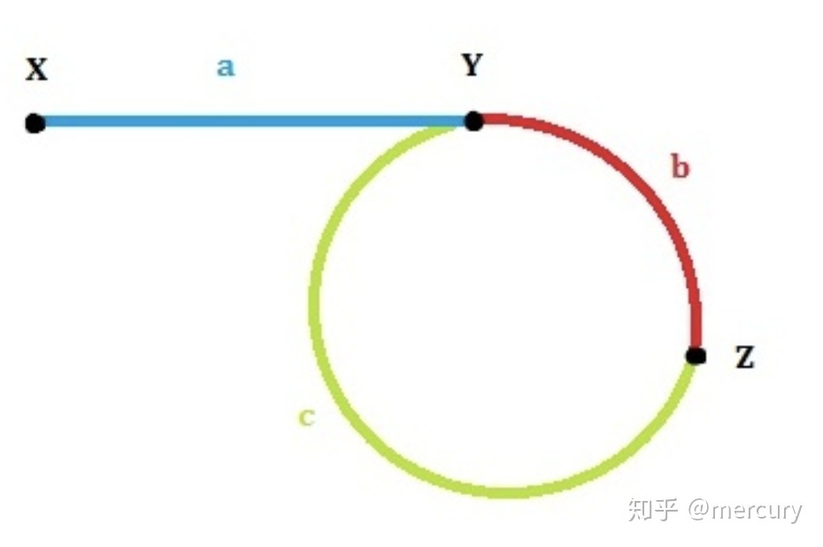

### 快慢指针

#### 有序列表中位数

**问题**：找出有序列表中的中位数

**思路**：fast 指针每次移动两格， slow 指针每次移动一格。fast 指针移动到末尾时，slow 正好移动到中间。


#### 环形列表 No.141

**问题**：判断列表中是否有环

**思路**：fast 指针每次移动两格， slow 指针每次移动一格， 如果存在环路， 则fast最终一定会和slow相遇

时间复杂度O(n)，空间复杂度O(1)

```c++
bool hasCycle(ListNode *head) {
    ListNode *fast = head, *slow = head;
    
    while(fast != NULL && fast->next != NULL ){
        fast = fast->next-> next;
        slow = slow->next;
        if(fast == slow)
            return true;
    }
    
    return false;
}
```


#### 环形列表 Ⅱ No.142

**问题**：给定一个链表，返回链表开始入环的第一个节点。 如果链表无环，则返回 `null`

**思路**



- 快慢指针判断链表中是否有环，记录相遇位置 z
- 两个指针分别从 z 和 x 同时出发，每次移动一个单位，相遇位置为环的起点
- 时间复杂度O(n)，空间复杂度O(1)


**详解**

在 z 相遇时，slow 指针移动距离为 $a+b$ ，fast 指针移动距离为 $a + n(b + c )+ b$ 

行动次数相同时，fast 指针走过的距离是 slow 指针走过的距离的2倍，即 $a + b + n(b + c) = 2 (a + b)$，简化得 $ a = (n-1)(b + c) + c$

可以看出，a 的长度，即为 n - 1 倍环的长度，再加上 c 的长度

因此，再放速度相同的两个指针，分别从 x 和 z 出发， 它们相遇位置即为环的起点

```c++
ListNode *detectCycle(ListNode *head){
    ListNode *fast = head, *slow = head;
    while (fast != NULL && fast->next != NULL){
        fast = fast->next->next;
        slow = slow->next;
        if (fast == slow)
            break;
    }

    if (fast == NULL || fast->next == NULL)
        return NULL;

    fast = head;
    while (fast != slow){
        fast = fast->next;
        slow = slow->next;
    }
    return fast;
}
```


#### 合并两个有序链表

**问题**：给定两个升序链表头节点，返回合并后新的升序链表

**迭代思路**：

- 设置头部哨兵节点 preHead，用 **new 初始化**，结果返回 `preHead -> next`
- 循环终止时，非空链表接在最后即可

```c++


```


**递归思路**

- 倒着推，从后向前合并，pre 指向， List1 与 List2 为未合并链表的头节点
- 先考虑循环截止情况，某个链表（比如 List2）结束了，此时 pre 指向 List1，函数返回 List 1
- 循环截止的上一步，List 2 还剩最后一个节点，


### DFS

https://leetcode-cn.com/problems/number-of-islands/solution/dao-yu-lei-wen-ti-de-tong-yong-jie-fa-dfs-bian-li-/

##### 树

```c++
void traverse(TreeNode root) {
    if (root == null)
        return;
    
    traverse(root.left);
    traverse(root.right);
}
```


#### 岛屿数量 No.200


```c++

```


## 哈希表应用

#### 记录字母出现次数

- 例中字母全为小写

```c++
string s = "apple";
vector<int> table(26, 0);

for(char c : s)
    ++table['z' - c];
```


# 数据结构

#### 两个栈实现队列   剑指09

**问题**：用两个栈，实现头部出队和尾部入队

**思路**：

- 一个插入栈，一个输出栈
- 输出栈为空时，转移输入栈中元素到输出站

```c++
class CQueue {
public:
    stack<int> in_stack, out_stack;
	
    
    void appendTail(int value) {
        in_stack.push(value);
    }
    
    int deleteHead() {
        if(out_stack.empty()){
            if(in_stack.empty())
                return -1;

            while(!in_stack.empty()){
                out_stack.push(in_stack.top());
                in_stack.pop();
            }
        }

        int out = out_stack.top();
        out_stack.pop();
        return out;
    }
};
```


#### 包含 min 函数的栈   No.155

**问题**：实现栈的数据结构，包含 min 函数，且时间复杂度为 O(1) 

**思路**：

- 建立主栈和 min 栈，min 栈栈顶是最小元素
- 最小元素重复出现时，min 栈也要重复入栈
- pop 时，比较主栈顶和 min 栈顶，一致则都出栈

```c++
class MinStack {
public:
    stack<int> min_stack, s_stack;
    
    void push(int x) {
        if(min_stack.empty() || min_stack.top() >= x)
            min_stack.push(x);

        s_stack.push(x);
    }
    
    void pop() {
        if(min_stack.top() == s_stack.top())
            min_stack.pop();
        
        s_stack.pop();
    }
    
    int top() {
        return s_stack.top();
    }
    
    int getMin() {
        return min_stack.top();
    }
};
```


# 理论


#### 定义

- **数据结构**：是相互之间存在一种或多种特定关系的数据元素的集合，包括逻辑结构和物理结构。
- **数据类型**：是一个值的集合和定义在这个值集上的一组操作的总称。
- **抽象数据类型**：是指一个数学模型以及定义在该模型上的一组操作。

#### 常用时间

- 现代计算机一秒计算 10^9^ 次
- 10^5^ sec  $\approx$  1 day
- 10^10^ sec  $\approx$  10^5^ day  $\approx$  3 century

#### 斐波那契数列

- $\phi = (1 + \sqrt5)/2 = 1.61803..$ 
- $\phi^{36} =  2^{25}$
- $\phi^{5} =  10$​


## 排序算法

#### Bubble sort

```c++
int bubblesort(vector<int> data) {
    int n = data.size();
    bool sorted;
    for(int i = 0; i < n - 1; --n){
        sorted = true;
        for(int j = 0; j < n - 1; ++j){
            if(data[j] > data[j + 1]){
                sorted = false;
                swap(data[j], data[j + 1]);
            }
        }
        if(sorted == true) break;
    }
    return cnt;
}
```

#### Merge sort

```c++
void merge(int lo, int mi, int hi){
    
}
```


| 排序算法 | 时间复杂度    | 最好情况      | 最坏情况      | 数据结构   |
| -------- | ------------- | ------------- | ------------- | ---------- |
| 归并排序 | $O(nlogn)$    |               |               | 向量、列表 |
|          |               |               |               |            |
| 插入排序 | $O(n^2)$      | $O(n)$        | $O(n^2)$      | 列表       |
| 选择排序 | $\Theta(n^2)$ | $\Theta(n^2)$ | $\Theta(n^2)$ | 列表       |
| 冒泡排序 | $O(n^2)$      |               |               |            |


| 查找算法 | 时间复杂度 | 数据结构 |
| -------- | ---------- | -------- |
| 二分查找 | $O(logn)$  |          |
|          |            |          |
|          |            |          |


## 注意

#### 常见特殊情况

- 0，null
- 容器为空时输出


#### 因小失大

- 不要为了简介，省略感觉非必要的条件！！