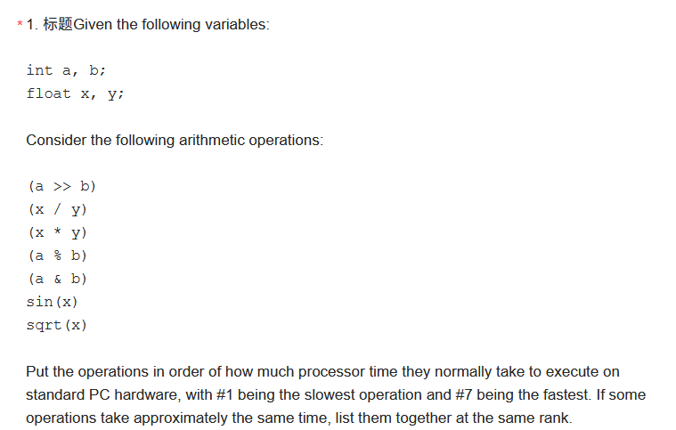

```
#1  sin(x)
#2  sqrt(x)
#3  (x / y)
#4  (x * y)
#5  (a % b)
#6  (a >> b), (a & b)
```


```c++
#include<iostream>
#include <fstream>
#include <algorithm>
#include <time.h>
#include<windows.h>
using namespace std;

int main()
{
	float i, j, k, count = 1000;
	double tmp, time;
	clock_t start_time = clock();

	DWORD dwEnd, dwStart = GetTickCount();
	for (k = 0; k < count; ++k)
	{
		for (i = 0; i < 256; ++i)
		{
			for (j = 1; j < 256; ++j)
			{
				//	tmp = atan(double(i) / j);
				tmp = rand();
				//	cout << tmp << endl;
			}
		}
	}
	dwEnd = GetTickCount();
	cout << "The rand run time is:" << (dwEnd - dwStart) << "ms!" << endl;//输出运行时间


	dwStart = GetTickCount();
	for (k = 0; k < count; ++k)
	{
		for (int i = 0; i < 256; ++i)
		{
			for (int j = 1; j < 256; ++j)
			{
				tmp = i >> j;// / RAND_MAX;
			}
		}
	}

	dwEnd = GetTickCount();
	cout << "The a >> b run time is:" << (dwEnd - dwStart) << "ms!" << endl;//输出运行时间

	dwStart = GetTickCount();
	for (k = 0; k < count; ++k)
	{
		for (float i = 0; i < 256; ++i)
		{
			for (float j = 1; j < 256; ++j)
			{
				tmp = i / j;// / RAND_MAX;
			}
		}
	}

	dwEnd = GetTickCount();
	cout << "The x/y run time is:" << (dwEnd - dwStart) << "ms!" << endl;//输出运行时间

	dwStart = GetTickCount();
	for (k = 0; k < count; ++k)
	{
		for (float i = 0; i < 256; ++i)
		{
			for (float j = 1; j < 256; ++j)
			{
				tmp = i * j;// / RAND_MAX;
			}
		}
	}

	dwEnd = GetTickCount();
	cout << "The x*y run time is:" << (dwEnd - dwStart) << "ms!" << endl;//输出运行时间

	dwStart = GetTickCount();
	for (k = 0; k < count; ++k)
	{
		for (int i = 0; i < 256; ++i)
		{
			for (int j = 1; j < 256; ++j)
			{
				tmp = i % j;// / RAND_MAX;
			}
		}
	}

	dwEnd = GetTickCount();
	cout << "The a % b run time is:" << (dwEnd - dwStart) << "ms!" << endl;//输出运行时间

	dwStart = GetTickCount();
	for (k = 0; k < count; ++k)
	{
		for (int i = 0; i < 256; ++i)
		{
			for (int j = 1; j < 256; ++j)
			{
				tmp = i & j;// / RAND_MAX;
			}
		}
	}

	dwEnd = GetTickCount();
	cout << "The a & b run time is:" << (dwEnd - dwStart) << "ms!" << endl;//输出运行时间

	dwStart = GetTickCount();
	for (k = 0; k < count; ++k)
	{
		for (float i = 0; i < 65536; ++i)
		{
			tmp = sin(i);// / RAND_MAX;

		}
	}

	dwEnd = GetTickCount();
	cout << "The sin(x) run time is:" << (dwEnd - dwStart) << "ms!" << endl;//输出运行时间

	dwStart = GetTickCount();
	for (k = 0; k < count; ++k)
	{
		for (float i = 0; i < 65536; ++i)
		{
			tmp = sqrt(i);// / RAND_MAX;
		}
	}

	dwEnd = GetTickCount();
	cout << "The sqrt(i) run time is:" << (dwEnd - dwStart) << "ms!" << endl;//输出运行时间

	return 0;
}
```


```c++
void MyFunction(unsigned int a, unsigned int b)
{
    unsigned int c = b & 31;
    unsigned int d = a << 3;
    unsigned int e = (a >> 1) + (b >> 1);
    
    const float DEVIDE_SCALE_FACTOR = 1.0f / 7.0f;
    float f = a * DEVIDE_SCALE_FACTOR;
}
```


```c++
bool Check2DLength(float x, float y, float threshold){
    float length = x*x + y*y;
    threshold = threshold * threshold;
    
    if(length < threshold)
    {
        return true;
    }
    else
    {
        return false;
    }
}
```


```c++
int MyFunction(int a, int b){
    return a + b;
}
```
