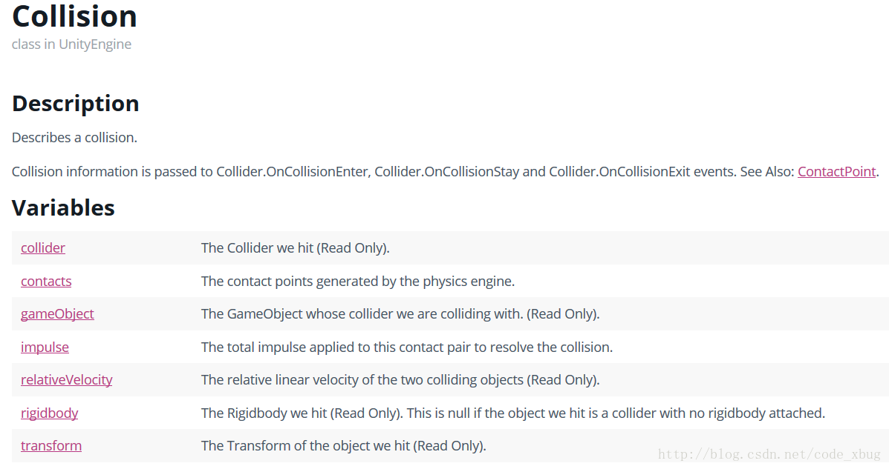
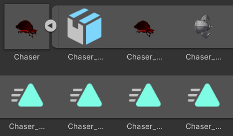
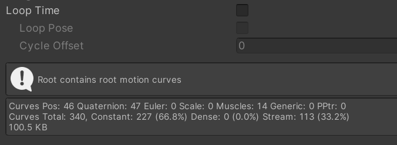
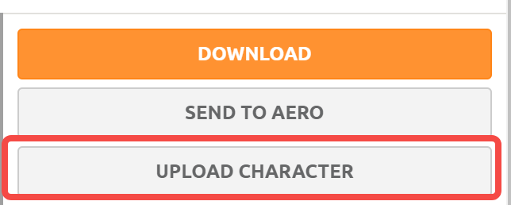
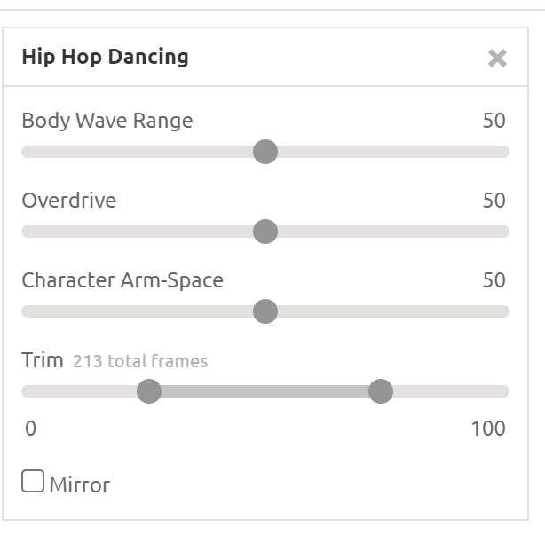
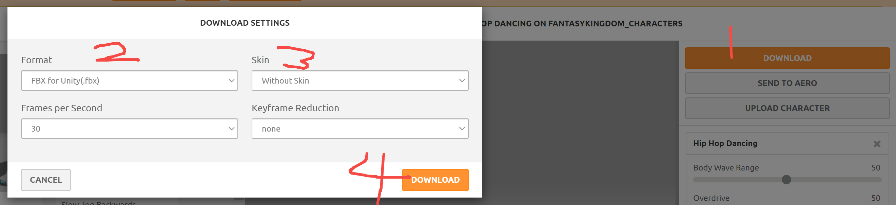
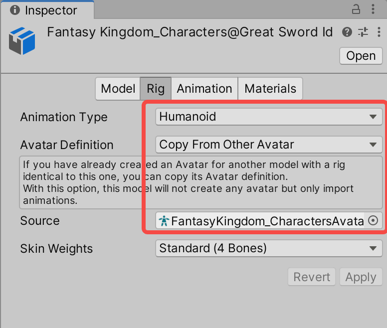

##### ⭐：待解决

## 特效

#### 【教程】VFX 入门

https://www.bilibili.com/video/BV1Fz4y1Z78p?spm_id_from=333.999.0.0&vd_source=120074d428e56ab223e0ce014bbd58b7

#### **【教程】爆炸效果**

https://www.youtube.com/watch?v=WDnbZUMENlQ 

#### 【资源】爆炸及火焰 Flipbook

https://blog.unity.com/technology/free-vfx-image-sequences-flipbooks

## Unity Shadergraph

官方文档

https://docs.unity3d.com/Packages/com.unity.shadergraph@14.0/manual/index.html

图文教程

https://blog.csdn.net/linxinfa/article/details/108049048

2d视频教程

https://www.bilibili.com/video/BV1aR4y1u7Uf/?spm_id_from=333.788&vd_source=120074d428e56ab223e0ce014bbd58b7

# 物理

#### OnCollision和OnTrigger无法响应的可能原因

##### void OnCollisionEnter（Collision other）

- 需要双方都有Collider或者Rigidbody
- 双方如果有Rigidbody，那么不得勾选isKinematic

##### void OnTriggerEnter（Collider other）

- 需要双方至少有一个Rigidbody
- 可以勾选isKinematic
- 双方必须勾选Collider组件上的isTrigger

我在开发中遇到的问题是，两个都带Collider，但其中一方有Rigidbody，而且之前勾选了isKinematic，从而导致OnCollisionEnter无法响应。由于带Rigidbody的那个我不想让它受到刚体物理引擎的影响，所以采用另一种策略：将Gravity Scale设为0，isKinematic取消勾选。

除了使用上的差异，二者的功能也有所不同，从二者的参数就可以看出。Collision得到的信息比Collider要多，除了Collider包含的信息，Collision还可以获取二者接触的点的坐标等。

https://blog.csdn.net/code_xbug/article/details/54091674

## 未归档

**修改 tile 图片大小**

https://blog.csdn.net/l1179237106/article/details/117252744

**平台跳跃代码**

https://zhuanlan.zhihu.com/p/466355010

https://doc.weixin.qq.com/doc/w3_AfIA3AaxAGohkK5sIhgQDWUUw0Bfz?scode=AMQAsAcJAAsm14wL1mAfIA3AaxAGo&sid=z9dILYw5WmYuLTNrAKNuWAAA&force_open_in_wx=1

1.Awake不管物体是否被激活都会执行。变量赋值顺序：公共变量 unity 面板 → awake → start

2.start里面的语句执行前提是物体被激活setactive（true）。

3.如果a物体中的awake把b物体关闭setactive（false），那么b中的start语句是不会执行的，没执行到就关掉物体了。

awake不管物体打不打开，全局一次，都会运行。

start要求物体必须打开才能执行，全局一次，之后再打开也不会执行，过了那个全局start时间。

OnEnable是物体（或者说脚本）每一次打开都会执行一次。

# 动画

##### ⭐控制动画切换

- m_animator.CrossFadeInFixedTime
- idle 和 walk 可以设置成 blendtree，根据速度切换

### fxb动画

#### 修改动画文件

在FBX下的动画无法直接修改，此时 Ctrl + D 复制出来即可修改

#### Loop

Loop Time：循环播放动画

Loop Pose：让最后一帧的模型位置平滑回到第一帧

Cycle Offest：范围0 - 1，循环播放时，从 % 帧开始播放动画

#### Root Motion

https://www.bilibili.com/read/cv6571938/

#### 旋转角色

transform.lookat

transform.rotation = quaterinion.lookrotation(green.transform.position - red.transform.position）

quaternion rou = quaterinion.lookrotation(green.transform.position - red.transform.position）

rigidbody.moverotation(rou)

## 使用Mixamo获取角色动画

[Mixamo](https://www.mixamo.com/#/)是Adobe旗下一个免费提供角色和动画的网站。

使用前需注册账号。

#### 上传角色

选择Unity项目中带有Humanoid Avater的FBX。

然后预览里就是这个FBX了。

##### 调整动作

通常会有些参数可以调整

##### 下载动作

有些参数可以选

#### 导入到Unity

将下载得到的FBX文件复制到Unity工程目录下，然后在编辑器里打开

`Rig`里需要设置下，`Source`需要选择刚才上传的FBX里的Avatar。

`Animations`里可能也需要调整，比如`Loop Time`之类的。

然后就可以放到`Animator`里使用了。

参考资料

- [How to animate a character with Mixamo for Unity - (Tutorial) by #SyntyStudios](https://www.youtube.com/watch?v=9H0aJhKSlEQ&ab_channel=syntystudios)
