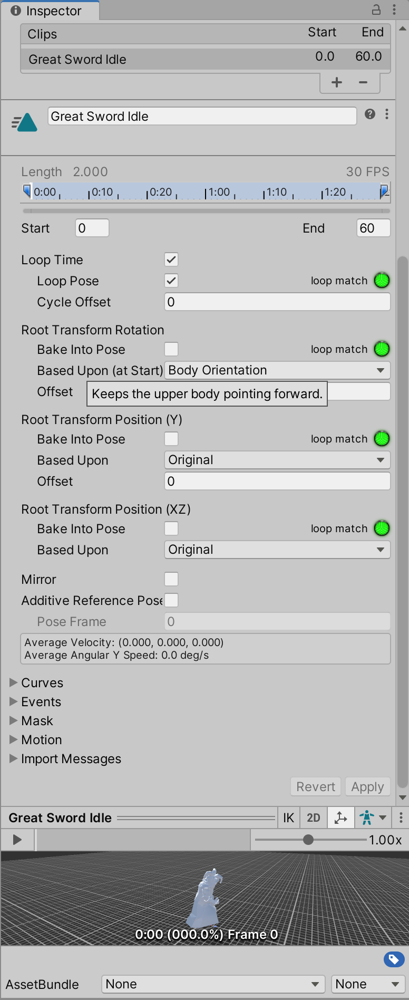

# 动画

### fxb动画

#### 修改动画文件

在FBX下的动画无法直接修改，此时 Ctrl + D 复制出来即可修改

#### Loop

Loop Time：循环播放动画

Loop Pose：让最后一帧的模型位置平滑回到第一帧

Cycle Offest：范围0 - 1，循环播放时，从 % 帧开始播放动画

#### Root Motion

https://www.bilibili.com/read/cv6571938/

#### 协程

## 使用Mixamo获取角色动画

[Mixamo](https://www.mixamo.com/#/)是Adobe旗下一个免费提供角色和动画的网站。

使用前需注册账号。

#### 上传角色

选择Unity项目中带有Humanoid Avater的FBX。

然后预览里就是这个FBX了。

##### 调整动作

通常会有些参数可以调整

##### 下载动作

有些参数可以选

#### 导入到Unity

将下载得到的FBX文件复制到Unity工程目录下，然后在编辑器里打开

`Rig`里需要设置下，`Source`需要选择刚才上传的FBX里的Avatar。

`Animations`里可能也需要调整，比如`Loop Time`之类的。

然后就可以放到`Animator`里使用了。

参考资料

- [How to animate a character with Mixamo for Unity - (Tutorial) by #SyntyStudios](https://www.youtube.com/watch?v=9H0aJhKSlEQ&ab_channel=syntystudios)
