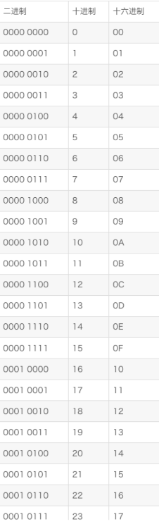

#### 叠纸笔试

- 出了很多春招原题！


#### 指针访问二维数组

```c++
int a[3][4], i = 1, j = 1;
二维数组当一维数组访问：
*(p + i)

数组指针访问：
*(*(a + i) + j)
    
```

https://blog.csdn.net/rubstone/article/details/103186898


#### 设计模式分类

    创建型模式，共五种：工厂方法模式、抽象工厂模式、单例模式、建造者模式、原型模式。
    结构型模式，共七种：适配器模式、装饰器模式、代理模式、外观模式、桥接模式、组合模式、享元模式。
    行为型模式，共十一种：策略模式、模板方法模式、观察者模式、迭代子模式、责任链模式、命令模式、备忘录模式、状态模式、访问者模式、中介者模式、解释器模式。 


#### 位运算：检查数字 n 的二进制中有几个 1

- `flag <<= 1`  不断循环，flag 最后会等于 0，无论一开始 flag 的值是多少

```c++
int NumOfOne(int n) {
    int res = 0;
    unsigned int flag = 1;
    while (flag) {
        if (n & flag)
            ++res;
        flag <<= 1;
    }

    return res;
}
```


#### 16 进制

- c++ 中前缀 0x 表示为 16 进制

```c++
0Xa：  10
0xA：  10
0x10： 16
```





### 内存空间 ？？？

Surface：4，4，128

台式机：8， 8，128 

```c++
void Foo(char* c = nullptr) {
    void* p = malloc(256);
    int strInside[128];
    char output = sizeof(p) + sizeof(c) + sizeof(strInside);
    cout << sizeof(p) << " " << sizeof(c) << " " << sizeof(strInside);
}
```


|                        | 字节 (sizeof) |                                                         |
| ---------------------- | ------------- | ------------------------------------------------------- |
| **char**               | 1             | -128 到 127                                             |
| **unsigned char**      | 1             | 0到 255                                                 |
| **int**                | 4             | -2147483648 到 2147483647                               |
| **unsigned int**       | 4             | 0到 4294967295                                          |
| **short int**          | 2             | -32768 到 32767                                         |
| **unsigned short int** | 2             | 0 到 65.535                                             |
| **long int**           | 8             | -9,223,372.036.854,775,808 到 9,223,372,036,854,775,807 |
| **unsigned long int**  | 8             | 0 到 18,446.744.073.709.551.615                         |
| **float**              | 4 (32位)      | +/- 3.4e  +/- 38  (~7个数字)                            |
| **double**             | 8 (64位)      | +/- 1.7e  +/- 308 (~15个数字)                           |
| **long double**        | 16 (128位)    | (18 ~ 19个数字)                                         |
| **wchar_t**            | 2 或 4        | ~15个数字                                               |


#### **下面关于“单例模式”错误的是（）**                                        

- ```
  它可以保证某个类在程序运行过程中最多只有一个实例，也就是对象实例只占用一份内存资源。
  ```

- ```
  使用单例，可以确保其它类只获取类的一份数据。
  ```

- ```
  对于一些不需要频繁创建和销毁的对象，单例模式可以提高系统的性能。
  ```

- ```
  由于单例模式中没有抽象层，因此单例很难进行类的扩展。
  ```

**答案：C**


##### **构造函数不能是虚函数**

**调用构造函数后， 才能生成一个对象。 假设构造函数是虚函数， 虚函数存在于虚函数表中， 而去找虚函数表又需要虚函数表指针， 而虚函数表指针又存在于对象中， 这样就矛盾了： 都没有生成对象， 哪有什么虚函数表指针呢？**

##### **析构函数可以是虚函数**

**调用构造函数后， 才能生成一个对象。 假设构造函数是[虚函数](https://so.csdn.net/so/search?q=虚函数&spm=1001.2101.3001.7020)， 虚函数存在于虚函数表中， 而去找虚函数表又需要虚函数表指针， 而虚函数表指针又存在于对象中， 这样就矛盾了： 都没有生成对象， 哪有什么虚函数表指针呢？**

**私有函数可以是虚函数**

**https://blog.csdn.net/weixin_45731819/article/details/127899048**

### **括号替换**

```c++
class Solution {
public:
    /**
     * 代码中的类名、方法名、参数名已经指定，请勿修改，直接返回方法规定的值即可
     *
     * 
     * @param originalStr string字符串 原始字符串
     * @return string字符串
     */

    string healper(string originalStr) {
        // write code here
        bool last = false;
        int lastPos = 0;
        string s = "";
        for(int i = 0; i < originalStr.size(); ++i){
            s += originalStr[i];

            if(originalStr[i] == '('){
                ++i;
                lastPos = i;
                while(i < originalStr.size() && originalStr[i] != ')'){
                    if(originalStr[i] == '('){
                        s += "(";
                    }
                    ++i;
                    
                }

                if(i == originalStr.size()){
                    last = true;
                }
                else{
                    s += "*)";
                }
            }
        }

        if(last){
            s += originalStr.substr(lastPos);
        }

        return s;
    }
     
    string ConvertString(string originalStr) {
        // write code here
        string s = healper(originalStr);

        return s;
    }
};
```


#### **同力扣扔鸡蛋**

**方法一：通过25%**

**https://blog.csdn.net/m0_57168704/article/details/126256818**

**最终答案，通过93%，力扣官解方法二**

**https://leetcode.cn/problems/super-egg-drop/description/**

```c++
class Solution {
public:
    /**
     * 代码中的类名、方法名、参数名已经指定，请勿修改，直接返回方法规定的值即可
     *
     * 返回最差情况下扔棋子的最小次数
     * @param n int整型 楼层数
     * @param k int整型 棋子数
     * @return int整型
     */
    int solve(int n, int k) {
        // write code here
        vector<int> dp(n + 1, 0);
        for(int i = 0; i <= n; ++i){
            dp[i] = i;
        }

        for(int j = 2; j <= k; ++j){
            vector<int> dp2(n + 1, 0);
            int x = 1;
            dp2[0] = 0;

            for(int m = 1; m <= n; ++m){
                while(x < m && max(dp[x - 1], dp2[m - x]) >= max(dp[x], dp2[m - x - 2])){
                    ++x;
                }

                dp2[m] = 1 + max(dp[x - 1], dp2[m - x]);
            }

            for(int m = 1; m <= n; ++m){
                dp[m] = dp2[m];
            }
        }

        return dp[n];
    }
};
```


### **简答题：液体和小白鼠**

**1000 瓶液体，其中有一瓶剧毒。每轮实验中，小白鼠可以喝无限液体，一轮实验过后，喝到毒药的小白鼠死亡。至少需要多少小白鼠，才能确定哪瓶是毒药？**

#### **一轮实验，一瓶有毒**

**至少需要 10 只可怜的小白鼠首先我们将100个瓶子做上标记为1-1000，然后将所有的数字用二进制表示，编号为 1 的小白鼠喝下所有编号中第一位为 1 的瓶子，编号为 2 的小白鼠喝下所有编号中第 2 位为 1 的瓶子。最后通过死亡的小白鼠来确定瓶子具体编号。**

#### **二轮实验，一瓶有毒**

**7只**

**第一轮：**

**三进制给瓶子编号，编号为 1 的小白鼠喝下所有编号中第一位为 2 的瓶子，编号为 2 的小白鼠喝下所有编号中第 2 位为 2 的瓶子。最后通过死亡的小白鼠，可以筛选出所有可能有毒的瓶子的 2 的位置，通过活着的小白鼠，排除所有没毒的瓶子。**


**第二轮：**

**用二进制**

**至少需要 10 只可怜的小白鼠首先我们将100个瓶子做上标记为1-1000，然后将所有的数字用二进制表示，编号为 1 的小白鼠喝下所有编号中第一位为 1 的瓶子，编号为 2 的小白鼠喝下所有编号中第 2 位为 1 的瓶子。最后通过死亡的小白鼠来确定瓶子具体编号。**

**https://blog.csdn.net/weixin_30830327/article/details/95870588**

#### **一轮实验，两瓶有毒**

**https://zhuanlan.zhihu.com/p/372808704**


