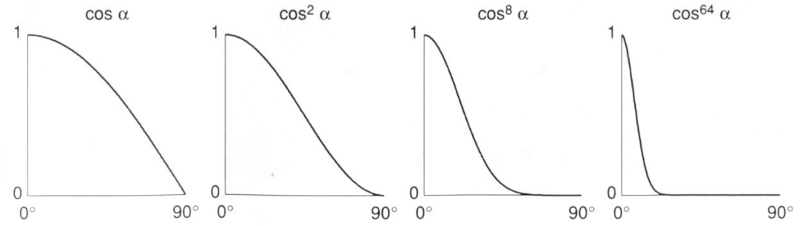
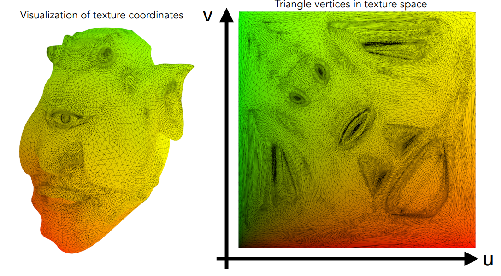
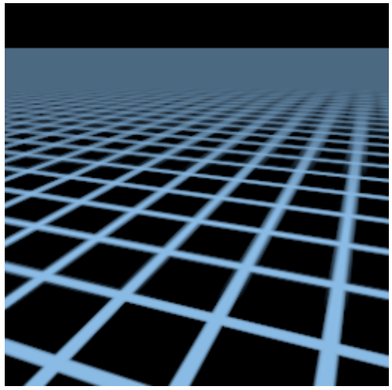

# 线性代数

### 向量

- $\vec{AB} = B - A$ 

- 单位向量
  - 长度为 1
  - $\hat{a} = \vec{a} / ||\vec{a}||$ 
  - 常用来表示方向


##### 向量相加

- 几何上，首尾相连
- 代数上，坐标相加


##### 笛卡尔坐标系

- $A = \left(
  \begin{matrix}
  x \\
  y
  \end{matrix}
  \right)$ 
- $A^T = ( x, y )$ 
- $||A|| = \sqrt{x^2 + y^2}$ 


#### 点乘 Dot Production

- $\vec{a} ·\vec{b} = ||\vec{a}||\ ||\vec{b}||\ cos\theta$ 

- $cos\theta =\Large \frac{\vec{a}\  ·\ \vec{b} }{||\vec{a}||\ ||\vec{b}||}$ 

- 单位向量    $cos\theta = \vec{a} ·\vec{b}$ 

- 性质

  - $\vec{a} ·\vec{b} = \vec{b} ·\vec{a}$ 

  - $\vec{a} ·(\vec{b} + \vec{c}) = \vec{a} ·\vec{b} + \vec{a} ·\vec{c}$  

  - $\vec{a} ·(k\ \vec{b}) = k(\vec{a} ·\vec{b})$ 

    

- 笛卡尔坐标系

  - 2D：$\vec{a} ·\vec{b} = \left( \matrix{x_a \\ y_a} \right) \left( \matrix{x_b \\ y_b} \right) = x_a x_b + y_ay_b$ 

    

  - 3D:  $\vec{a} ·\vec{b} = \left( \matrix{x_a \\ y_a \\ z_a} \right) \left( \matrix{x_a \\ y_b \\ z_c} \right) = x_a x_b + y_ay_b + z_az_b$ 

    

- 图形学中的点乘

  - 夹角，光和物体法线
  - $\vec{b}_\bot $ :  $\vec{b}$ 在 $\vec{a}$ 上的投影
    - $\vec{b}_\bot = k\vec{a}$	$\vec{b}$ 一定沿着 $\vec{a}$ 的方向
    - Magnitude：$k = ||\vec{b}_\bot|| = \vec{b}\ cos\theta$ 
  - $cos\theta$ 两个向量方向是否一致（1）、相反（-1）、垂直（0）


#### 叉乘 Cross Product

- $||a\times b ||=||a||\ ||b|| \ sin\theta$ 
- 叉积垂直于原来的两个向量
- 右手定则决定方向


- 右手坐标系：$\vec{x} \times \vec{y} = \vec{z}$ 
- 性质
  - $\vec{a} \times \vec{b} = -\vec{b} \times \vec{a}$ 
  - $\vec{a} \times \vec{a} = \vec{0}$ 
  - $\vec{a}\times (\vec{b}+\vec{c}) = \vec{a}\times \vec{b}+ \vec{a}\times \vec{c}$ 
  - $\vec{a} ·(k\ \vec{b}) = k(\vec{a} ·\vec{b})$ 
- 笛卡尔坐标系 
  - $\vec{a} \times \vec{b} = x_ay_b-y_ax_b$ 
  - $\vec{a} \times \vec{b} = \left( \matrix{y_az_b-y_bz_a\\z_ax_b-x_az_b\\x_ay_b-y_ax_b} \right)$ 
- 图形学中的叉乘
  - 定义坐标系
  - 判断左右：右手系中，若 $\vec{a}\  \vec{b}$ 在 x，y 的二维平面上， $\vec{a} \times \vec{b} > 0$ ， $\vec{b}$ 在 $\vec{a}$ 的左侧；$\vec{a} \times \vec{b} < 0$， $\vec{b}$ 在 $\vec{a}$ 的右侧
    - 三维中 $\vec{a} \times \vec{b}$ 得到向量与所在平面法向量同向， $\vec{b}$ 在 $\vec{a}$ 的左侧
  - 判断内外：ABC 到 P 的向量都在三条边的左边或右边，则点 P 在三角形内


### 矩阵

​        _target.position.x) +(transform.position.x)

- 相乘：(M x N) (N x P) = (M x P)
- 性质
  - $AB \ne BA$ 
  - $(AB)^T = B^TA^T$ 
  - $(AB)C = A(BC)$ 
  - $A(B +C) = AB + AC$ 
- 矩阵和向量相乘，永远认为向量是列向量，在矩阵右边
- 单位矩阵
  - $I_{3 \times 3} = \left( \matrix{1&0&0\\0&1&0\\0&0&1} \right)$ 
  - $AA^{-1} = A^{-1}A = I$ 
  - $(AB)^{-1}=B^{-1}A^{-1}$ 

- 点乘： $\vec{a} ·\vec{b} =\vec{a}^T\vec{b} =(x_a\quad y_a\quad z_a)\left( \matrix{x_a \\ y_a \\ z_a} \right) = (x_ax_b + y_ay_b + z_az_b)$ 
- 叉乘：$\vec{a} \times \vec{b} = A^*\ b= \left( \matrix{0&-z_a&y_a\\z_a&0&-x_a\\-y_a&x_a&0} \right)\left( \matrix{x_a \\ y_a \\ z_a} \right) $ 


# 图形管线 Graphics Pipeline

- 可以称作实时渲染管线  Real-time Rendering Pipeline


# 变换 Transformation


## 模型变换 Modeling 

### 2D 变换

#### 矩阵

- $x'=ax+by$ 

  $y' = cx+dy$ 

  

- $\left[ \matrix{x'\\ y'} \right] = \left[ \matrix{a&b\\ c&d} \right] \left[ \matrix{x\\ y} \right]$ 


#### 缩放 Scale

- $\left[ \matrix{x'\\ y'} \right] = \left[ \matrix{s_x&0\\ 0&s_y} \right] \left[ \matrix{x\\ y} \right]$ 


#### 反射 Reflection

- $\left[ \matrix{x'\\ y'} \right] = \left[ \matrix{-1&0\\ 0&1} \right] \left[ \matrix{x\\ y} \right]$ 


#### 切变 Shear

- $\left[ \matrix{x'\\ y'} \right] = \left[ \matrix{1&a\\ 0&1} \right] \left[ \matrix{x\\ y} \right]$ 


#### 旋转 Rotation

- 默认绕圆点、逆时针
- $\bf{R}_\theta = \left[ \matrix{cos\theta &-sin\theta\\ sin\theta&cos\theta} \right]$ 


- 推导

  


- $\bf{R}_{-\theta} = \left[ \matrix{cos\theta &sin\theta\\ -sin\theta&cos\theta} \right] = R_\theta ^T =R_\theta^{-1}$ 
  - 矩阵的逆 = 矩阵的转置，这个矩阵为正交矩阵


#### 平移变换 Translation

- $\left[ \matrix{x'\\ y'} \right] = \left[ \matrix{a&b\\ c&d} \right] \left[ \matrix{x\\ y} \right] + \left[ \matrix{t_x\\ t_y} \right]$ 
- 不是线性变换！
- 为了把所有变换写成 矩阵 X 向量的模式，引入齐次变换


### 齐次坐标 Homogeneous coordinates

- 2D 向量   $ (x,\  y, \ 0)^T$ 
- 2D 点       $ (x,\  y, \ 1)^T$ 
  - $(x,\  y, \ w)^T$  代表点  $({\frac{x}w} ,\  \frac{y}w, \ 1)^T, \quad w \ne 0$ 


- 点 + 点 = 点

  点 - 点 = 向量

  点 + 向量 = 点

  向量 + 向量 = 向量


#### 仿射变换 Affine Transform

- 二维坐标

  $\left[ \matrix{x'\\ y'} \right] = \left[ \matrix{a&b\\ c&d} \right] \left[ \matrix{x\\ y} \right] + \left[ \matrix{t_x\\ t_y} \right]$ 

  

- 齐次坐标

  $\left[ \matrix{x'\\ y'\\1} \right] = \left[ \matrix{a&b&t_x\\ c&d&t_x\\0&0&1} \right] \left[ \matrix{x\\ y\\1} \right]$ 


#### 缩放 Scale

- $\bf{S}(s_x,\ s_y) = \left[ \matrix{s_x&0&0\\ 0&s_y&0\\0&0&1} \right]$ 

#### 旋转 Rotation

- 默认绕圆点、逆时针
- $\bf{R}(\alpha) = \left[ \matrix{cos\alpha &-sin\alpha&0\\ sin\alpha&cos\alpha&0\\0&0&1} \right]$ 

#### 平移 Translation

- $\bf{T}(t_x,\ t_y) = \left[ \matrix{1&0&t_x\\ 0&1&t_y\\0& 0&1} \right]$ 

#### 逆变换 Inverse Transform

- $\bf{M}^{-1}$ 


### 组合变换 Composing Transform

- $T_{(1,\ 0)}·R_{45} \ne R_{45}·T_{(1,\ 0)}$ 
- $A_n(...A_2(A_1(x))) = A_n···A_2·A_1·\left( \matrix{x\\y\\1} \right)$ 


#### 围绕给定点旋转

- 挪回原点 $\rightarrow$ 旋转 $\rightarrow$ 挪回去


- $\bf{T(c)·R(\alpha)·T(-c)}$ 


#### 先线性变换再平移

- $\left[ \matrix{x'\\ y'\\1} \right] = \left[ \matrix{a&b&t_x\\ c&d&t_y\\0&0&1} \right] \left[ \matrix{x\\ y\\1} \right]$    等同于  $\left[ \matrix{x'\\ y'} \right] = \left[ \matrix{a&b\\ c&d} \right] \left[ \matrix{x\\ y} \right] + \left[ \matrix{t_x\\ t_y} \right]$ 


### 3D 变换

- 3D 向量   $ (x,\  y,\ z,\ 0)^T$ 

- 3D 点       $ (x,\  y,\ z, \ 1)^T$ 

  - $(x,\  y,\ z,\ w)^T $  代表点 $ ({\frac{x}w} ,\  \frac{y}w,\  \frac{z}w, \ 1)^T, \quad w \ne 0$ 
  - 如  $(-1,\  -1,\ -1,\ -1)^T $  其实是点 $(1,\  1,\ 1,\ 1)^T $  

- 仿射变换

  $\left[ \matrix{x'\\ y'\\1} \right] = \left[ \matrix{a&b&c&t_x\\ d&e&f&t_y\\g&h&i&t_z\\0&0&0&1} \right] \left[ \matrix{x\\ y\\z\\1} \right]$ 

#### 3D 旋转

**绕 x、y、z 轴旋转 $\alpha$ 度**
$$
\mathbf{R}_x = \left[ \matrix{1&0&0&0\\ 0&cos\alpha&-sin\alpha&0\\0&sin\alpha&cos\alpha&0\\0&0&0&1} \right]
\mathbf{R}_y = \left[ \matrix{cos\alpha&0&sin\alpha&0\\ 0&1&0&0\\-sin\alpha&0&cos\alpha&0\\0&0&0&1} \right]
\mathbf{R}_z = \left[ \matrix{cos\alpha&-sin\alpha&0&0\\ sin\alpha&cos\alpha&0&0\\0&0&1&0\\0&0&0&1} \right]
$$

- y 轴 sin 的负号位置相反，因为对于绕 y 轴来讲，横坐标是 z ，纵坐标是 x，（用右手定则比划一下）
  - xyzxyz，x 前面是 yz，z 前面是 xy，y 前面却是 zx，顺序反了


**任意旋转**

-   $\mathbf{R}_{xyz}(\alpha,\ \beta,\  \gamma)=\mathbf{R}_{x}(\alpha)\ \mathbf{R}_{y}(\beta)\ \mathbf{R}_{z}(\gamma)$ 

-   $\alpha,\ \beta,\  \gamma$ 被称作欧拉角

  


**罗德里格斯旋转公式 Rodrigues' Rotation Formula** 

- 围绕 $\bf n$ 轴旋转 $\alpha$ 度

$$
\bf{R}(\mathbf{n},\ \alpha)=\cos(\alpha)I + (\sf{1}-\cos(\alpha))\ \bf nn^T +\sin(\alpha) \left( \matrix{0&-n_z&n_y\\n_z&0&-n_x\\-n_y&n_x&0} \right)
$$

​	*默认三个轴过圆点，逆时针旋转。在任意点旋转参照 [围绕给定点旋转](#围绕给定点旋转)


## 观测变换 Viewing

### 视图变换 View/Camera Transformation

- 想象摆放一个相机拍照
  - position： 							 $\vec{e}$  摆放位置挪到 (0, 0, 0)
  - Look-at / gaze direction：  $\hat{g}$  看向的方向旋转到 -Z 
  - Up direction：                      $\hat{t}$  上的方向旋转到 Y


**矩阵表示**

- 平移： $\vec{e}\rightarrow(0, \ 0,\ 0)$ 

$$
\mathbf{T}_{view} = \left[ \matrix{1&0&0&-x_e\\ 0&1&0&-y_e\\0&0&1&-z_e\\0&0&0&1} \right]
$$

- 旋转： $\sf \hat g \rightarrow -Z,\ \ \hat t\rightarrow Y,\ \ \hat g \times \hat t \rightarrow X $ 

$$
\mathbf{R}_{view}^{-1} = \left[ 
\matrix{x_{\hat{g}\times \hat{t}}&x_\hat{t}&x_{-\hat{g}}&0
		\\y_{\hat{g}\times \hat{t}}&y_\hat{t}&y_{-\hat{g}}&0
		\\z_{\hat{g}\times \hat{t}}&z_\hat{t}&z_{-\hat{g}}&0
		\\0&0&0&1} \right]
	 &\Rightarrow&
		
\mathbf{R}_{view} = \left[ 
\matrix{x_{\hat{g}\times \hat{t}}&y_{\hat{g}\times \hat{t}}&z_{\hat{g}\times \hat{t}}&0
		\\x_\hat{t}&y_\hat{t}&z_\hat{t}&0
		\\x_{-\hat{g}}&y_{-\hat{g}}&z_{-\hat{g}}&0
		\\0&0&0&1} \right]
$$


### 投影变换 Projection transformation

**参数定义**

- Aspect ratio 长宽比：width / hight
- Field-of-view 垂直可视角度：$FovY$ 


- $tan\Large \frac{FovY}{2}  = \frac{height}{|n|} = \frac{t}{|n|}\normalsize ,\quad aspect = \Large \frac{width}{height} = \frac{r}{t}$ 


#### 正交投影 Orthographic

- 标准正方体（Canonical cube）：中心为 $(0,\ 0,\ 0)$，空间为 $[-1, 1]^3$ 
- 映射一个长方体成为标准正方体，变换矩阵  $M_{ ortho}$ 
- r - l = width, 


- 摄像机沿 -z 方向，因此 z 值近大远小


#### 透视投影 Perspective

##### 从透视到正交

- 把 Frustum 挤压成长方体，映射一个长方体成为标准正方体，求变换矩阵  $M_{persp\ \rightarrow\ ortho}$ 


- 先看 y,  根据三角形相似  $\Large  \frac{y'}{y} = \frac{n}{z}$， x 同理

   $\Rightarrow y'= \Large \frac{n}{z} \normalsize y \ ,\quad  x'= \Large \frac{n}{z} \normalsize x$     


- 齐次坐标表示变换，求 $M_{persp\ \rightarrow\ ortho}$ 
  - 点的四个坐标同时乘 z，还是同一个点

$$
M_{persp\ \rightarrow\ ortho}\left( \matrix{x\\ y\\z\\1} \right)\  \Longrightarrow \  \left( \matrix{\frac{n}{z}x\\ \frac{n}{z}y\\unknown\\1} \right) = \left( \matrix{nx\\ ny\\unknown\\z} \right)
$$

- 求得

$$
M_{persp\ \rightarrow\ ortho}=\left( \matrix{n&0&0&0\\0&n&0&0\\?&?& ?&?\\0&0&1&0} \right)
$$

- 考虑所有最近平面上的点，即  $z = n$ ，又因为齐次坐标中，坐标同时缩放点的位置不变

$$
M_{persp\ \rightarrow\ ortho}\left( \matrix{x\\ y\\n\\1} \right) = \left( \matrix{n&0&0&0\\0&n&0&0\\?&?& ?&?\\0&0&1&0} \right)\left( \matrix{x\\ y\\n\\1} \right)\ \Longrightarrow \ \left( \matrix{x\\ y\\n\\1} \right) = \left( \matrix{nx\\ ny\\n^2\\n} \right)
$$

- 可得 $M$ 的第三行格式必为  $(0\quad 0\quad A\quad B)$ 
- 再考虑最远平面的中心点，挤压后位置不变

$$
(0\quad 0\quad A\quad B) \left( \matrix{x\\ y\\n\\1} \right)=n^2  
& \Longrightarrow & An+B=n^2
\\ \\ (0\quad 0\quad A\quad B) \left( \matrix{0\\ 0\\f\\1} \right)=f^2 
& \Longrightarrow & Af+B=f^2
$$

- 解得 $A = n+f， B = -nf$ 

$$
M_{persp\ \rightarrow\ ortho} = \left( \matrix{n&0&0&0\\0&n&0&0\\0&0& n+f&-nf\\0&0&1&0} \right)
$$


# 光栅化 Rasterization


### 光栅显示器

- 定义屏幕左下角为原点
- 像素长宽为 1，中心为 $ (x + 0.5, y + 0.5)$ 
- (x, y) 从  $[-1, 1]^2 $ 转换为  $[0,\ width] \times [0,\ height]$ 

$$
M_{viewport} = \left( \matrix{width/2 &0&0&width/2\\0&height/2&0&height/2\\0&0&1&0\\0&0&0&1} \right)
$$


### Rasterizing 一个三角形

- 用 inside 函数确定每一个像素是否在三角形内

  $\sf inside(t,\ x,\ y)=\left\{ \array{1&\sf Point\ (x,\ y)\ in \ triangle\ t\\0& \sf otherwise} \right.$  

  - 如何判断内外，详见 [图形学中的叉乘](# 叉乘 Cross Product) 

  

- 确定像素中心是否在三角形内

  ```c++
  for(int x = 0; x < xmax; ++x)
      for(int y = 0; y < ymax; ++y)
          image[x][y] = inside(tri, x + 0.5, y + 0.5);
  ```

- 落在边界上的点可自己定义，目前视作不在三角形内


#### Bounding Box


- 优化计算量
- BoundingBox：三个顶点最外围形成的方块
- 只用计算 Bounding Box 之内的像素！


#### Incremental Triangle Traversal


- 同样是为了减少计算的像素数量
- 但实现起来不是很容易
- 适用于很扁平的三角形


### 反走样 Antialiasing 

#### 走样 Aliasing

- artifact due to sampling 
  - Jaggies 锯齿
  - Moire 摩尔纹
  - Wagon wheel effect - sampling in time

- 原理：信号变化太快，但采样太慢


#### 频域 Frequency Domain 

- 时域的卷积 = 频域的乘积

#### 光栅化反走样

- 先模糊，再做采样处理

  - 对应到频率，模糊即为低通滤波，即拿掉高频，防止采样时频率重叠导致走样

    

- 以一像素为单位，Convolve f(x, y) 


#### MSAA：Antialiasing by Supersampling 

- 是反走样的近似，不能严格意义上解决走样的问题
- 是对信号模糊的操作


- cost：增加计算量
  - 工业界用一些不规则的图案来切分，一些像素还会被复用，以减少计算量


#### FXAA Fast Approximate AA

- 和采样无关，识别出图像上有锯齿，替换成无锯齿的部分


#### TAA Temporal AA

- 对于静止的画面部分，复用上一帧的计算


#### 超分辨率 Super resolution / Super sampling

- 如有一张 480p 的图，变成 1080p 的
- 本质上仍然是采样不够的问题
- 深度学习 DLSS  (Deep Learning Super Sampling) 


### 可见性 Visibility / Occlusion


#### 画家算法 Painter's Algorithm

- 新画的遮挡住之前画的
- 排序时间 O(NlogN)
- 有时难以确定不同的深度排序，如立方体的不同面
- 互相遮挡的情况，无法用画家算法计算


#### Z-Buffer 算法

- 假设 z 是正的，近小远大
- 每个像素一开始记录无限远的深度，不断更新最小的 z 值
- 同时更新两个 Buffer，frame buffer 存储颜色，z buffer 存储深度，即最小的 z 值


- ```c++
  for(each triangle T)
      for(each sample(x, y, z) in T)
          if(z < zBuffer[x, y])
              frameBuffer[x, y] = rgb;
              zBuffer[x, y] = z;
  ```

- n个三角形的复杂度是 O(n) 


# 着色和光照 Shading & illumination


- 将材质应用到物体上的过程  
- 着色不考虑其他物体，因此没有影子

## Blinn-Phong 反射模型

$$
\begin{align}
L &=L_a+L_d+L_s \\ 
&= k_a I_a+ k_d(I/r^2) \max(0,\ \mathbf{ n · l}) + k_s(I/r^2)\max(0,\ \mathbf{ n·h})^p 
\end{align}

\quad ,\quad \bf \\ h = \frac{v+l}{||v+l||}
$$


**Shading point**

- 计算光反射的基本单位
- 每个点都被看作一个平面
- 定义单位向量：
  - 光源方向 Light direction :   l
  - 视觉方向 Viewer direction :   v
  - 法线 Surface direction :  n 
- 表面属性 Surface Parameters (color, shininess 光滑度...)


### 漫反射 Diffuse Reflection

- 光向四面八方反射，和观测角度没有关系


#### Lambertian (Diffuse) Shading

$$
L_d=k_d(I/r^2) \max(0,\ \bf n · l)
$$

**漫反射系数 Diffuse coefficient ：$k_d$** 


**光照强度** :   $cos\theta = \bf n·l$ 

- 将光看作能量，角度越大，吸收到的能量越少


**光的减弱**： $I/r^2$ 


### 镜面反射 Specular Term

$$
L_s =k_s(I/r^2)\max(0,\ \mathbf{ n·h})^p \quad, \quad \bf h = \frac{v+l}{||v+l||}
$$

**反射角度**： $\mathbf{n·h}=cos\alpha$ 

- 光线 **l** 的镜面反射方向为 **R** 
- **h**：**l** 和 **v** 的半程向量 (half vector) 
- **v** 和 **R** 方向相似 = **h** 和 法线 **n** 方向相似


**高光范围系数**：p

- 控制高光范围
- 实际中常为 100 ~ 200




**镜面反射强度** ：$k_s$  


### 环境光 Ambient Term

$$
L_a = k_a I_a
$$

- 添加恒定的颜色，无视光线和阴影
- 不符合真实状况


## 着色频率 Shading Frequencies

|                                                              | 着色方式            |                                                              |
| ------------------------------------------------------------ | ------------------- | ------------------------------------------------------------ |
|  | **Flat** shading    | 一个三角形一条法线                                           |
|  | **Gouraud** shading | 每个顶点一条法向量<br>用插值计算                             |
|  | **Phong** shading   | 每个三角形上插值法向量<br>每个像素上计算光照<br>不是Blinn-Phong 反射模型 |


- 模型足够复杂时，可能 Flat shading 效果更好，开销更大


### 计算顶点法线

- 从构成的几何图形中推断出
  - 如：考虑这是一个球                       
- 用临近的三角形面的法线加权平均


### **计算逐像素的法线** 

#### 三角形插值：重心坐标 Interpolation：Barycentric Coordinates

- 定义在一个三角形上
- 一个三角形上任意一点，都可以用三个顶点来表示


- $\alpha \ \beta \ \gamma $  可以用三角形的面积来求


- **重心**：把三角形分成三个等面积的三角形，重心坐标为（1/3，1/3，1/3）

- 投影变换下，重心坐标可能改变
  - 计算时，二维三角形逆变换到三维，用三维坐标计算插值
- 简化计算公式


##### 顶点线性插值 Linear Interpolation at vertics


## Shader 程序

- 对 vertex 和 fragment 阶段编程
- 每个顶点或像素执行一次，不用手动循环

```glsl
//定义图片，光照方向，插值，顶点法线
uniform sampler2D myTexture;
uniform vec3 lightDir;
varying vec2 uv;
varying vec3 norm;

void diffuseShader(){
    vec3 kd;
    kd = texture2d(myTexture, uv); //纹理相关，暂时忽略
    kd *= clamp(dot(-lightDir, norm), 0.0, 1.0); //认为入射方向向内，结果小于一
    gl_FragColor = vec4(kd, 1.0); //输出颜色
}
```


## 纹理映射 Texture Mapping

- 假设已经获得模型和纹理的映射关系
  - 由美术或者算法来获得
- 纹理中每个三角形都在 u v 之内
- u v 默认在 (0, 1) 之间




## 纹理查询 Texture queries

**纹理映射：漫反射颜色**

- 对每个像素中心 (x,  y)
  - 用重心坐标，计算对应的纹理坐标  (u,  v) ，找距离最近的纹理上的像素
  - texcolor = texture.sample(u,v);
  - set sample’s color to texcolor;  （如替换Blinn-Phong模型中的漫反射系数 $k_d$）


### 纹理过小

#### 双线性插值 Bilinear Interpolation


### 纹理过大


#### 范围查询：Mipmap

- 快速的，正方形的，近似的范围查询
- 存储量多了 1/3


- 随着距离的变化，在不同模糊层级上查询


##### 三线性插值

- 在 Mipmap 的基础上，不同查询层级间进行一次插值，使查询层级效果连贯

  


#### 范围查询：各向异性过滤

- Mipmap 限制：过度模糊                            
- 各向异性过滤                                                  
- 矩形查询
- 不同方向，表现完全不相同
- 开销是原来的三倍
- 参数 x，多少 x 就是压缩多少层
- 开销只和显存相关，不怎么影响计算性能

#### 范围查询：E4XA filtering


- 椭圆形多次查询
- 开销较大


## 纹理应用

- 现代GPU中，纹理 = 内存 + 范围查询


### 环境光贴图

- 假设环境光从无限远处来
- 用一张贴图来记录周围的环境光


##### 金属球贴图  Spherical Map

- 顶部和底部容易变形 distortion


##### 天空盒 Cube Map

- 变形较小
- 需要额外计算观看角度，不过开销不大


### 凹凸贴图 Bump Mapping


- 添加表面细节，但不增加模型三角形
- 记录了每个点 p 的高度 h(p)
- 合成计算表面法向量，添加阴影
  - 原来的 local 法向量：n(p) = (0, 1)
  - p 点凹凸纹理的导数：dp = c * [h(p+1) - h(p)]
  - 干扰后的法向量：n(p) = (-dp, 1).normalized()
  - 将干扰后的法向量，计算到世界坐标中去

- 计算 3D 表面法向量
  - 原来的 local 法向量：n(p) = (0,  0,  1)
  - p 点凹凸纹理的导数：
    - dp/du = c1 * [h(u+1) - h(u)]
    - dp/dv = c2 * [h(v+1) - h(v)]
  - 干扰后的法向量： n = (-dp/du, -dp/dv, 1).normalized()
  - 将干扰后的法向量，计算到世界坐标中去


#### 位移映射 Displacement mapping

- 和凹凸贴图用相同的纹理
- 可以改变模型中三角形的顶点位置


### 外部链接

[GDC演讲：四元数理解与简单应用-笔记 - 简书 (jianshu.com)](https://www.jianshu.com/p/67f40d7234e9)


