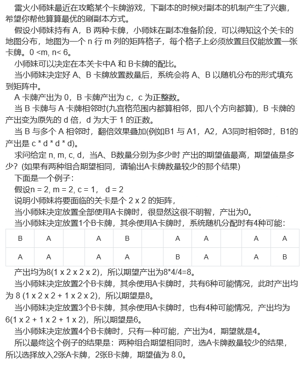
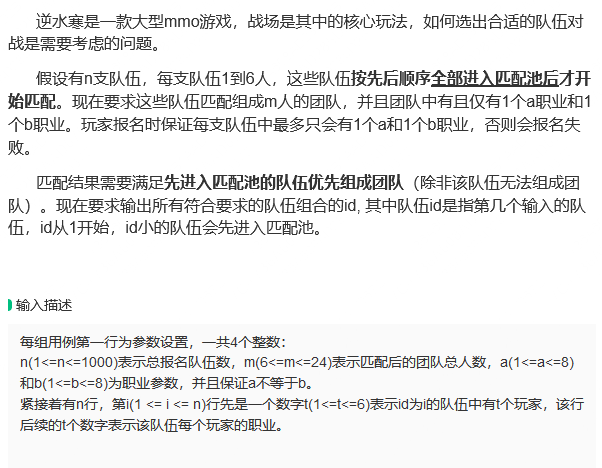
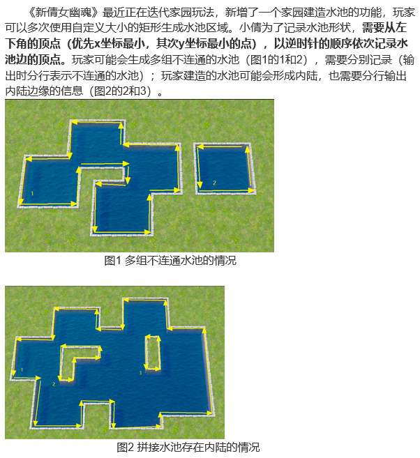
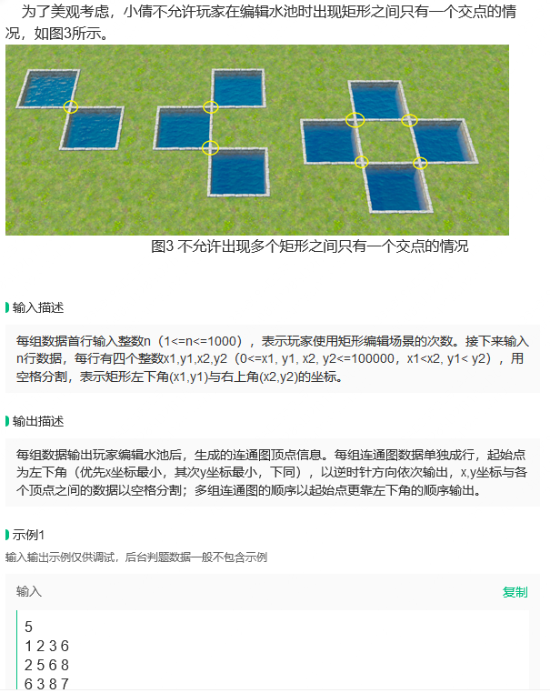
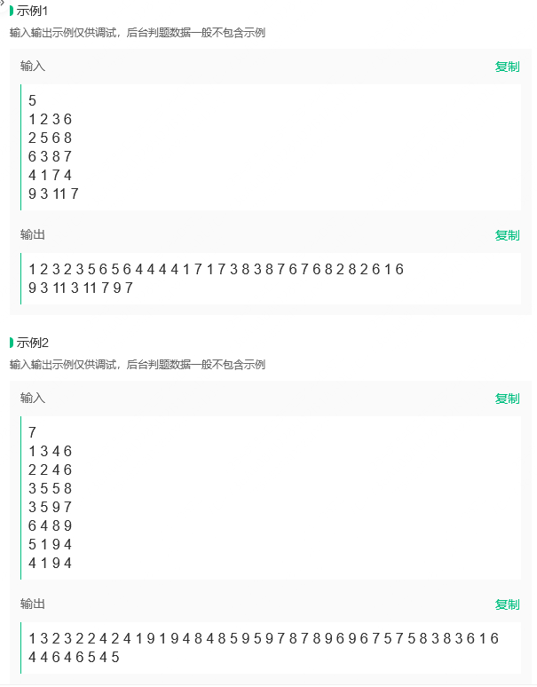

### 掌趣

111.101 转十进制

##### 浮点数比较

abs( fa - fb) < 0.000001

##### 源码，反码，补码


##### helloword子串个数

- n(n + 1)/2


##### 下面选项中，TCP报头不包含的字段是（D）

A.源端口号

B.序列号

C.窗口大小

D.目的IP地址


##### 在TCP协议中，发送方的窗口大小决定于 C 。

A.仅接收方允许的窗口

B.接收方允许的窗口和发送方允许的窗口

C.接收方允许的窗口和拥塞窗口

D.发送方允许的窗口和拥塞窗口


**巫婆与公主**

有个村落住了19个聪明绝顶的巫婆和1个漂亮的公主. 每个巫婆都知道谁吃了公主便能变成为公主. 而每个巫婆都非常渴望拥有公主的美貌.  但他们担心的是如果巫婆变成了公主, 他遍会失去了法术, 随时会被其他巫婆吃掉.  究竟那个公主会不会被吃掉？（巫婆最先考虑保证自己不会被吃掉；在确保安全的情况下会吃掉公主）

答案：想像如果岛上有1巫婆和1公主时, 巫婆必会吃掉公主. 因为当巫婆变了公主后便没有其他巫婆吃他. 想像如果岛上有2巫婆和1公主时,  巫婆便不敢吃公主. 因为巫婆知道当他吃了公主后, 岛上只剩一巫婆一公主, 而在此情况下, 他一定会被吃掉. 当岛上有3巫婆1公主时,  公主必会被其中一个巫婆吃掉. 因为吃掉公主的巫婆知道如果岛上剩2巫婆1公主时, 其他巫婆是不敢碰他的. 如此类推, 当巫婆数目是单数时,  公主会被吃. 巫婆数目是双数时, 公主不会被吃.


##### 三个读代码：

```
#include<iostream>
#include<vector>
using namespace std;

#define ADD(x, y) x + y

int main(){
    1.
    int m = 3;
    m += m*ADD(m, m);
    cout << m << " ";

    2.
    for(int x = 0, y = 0; y <= 5 || !x; y++, x++){
        cout << y;
    }

    3.
    cout << "  " << (0x3E00 ^ 0x9FA5 ^ 0x9FA5);
    
    4. 
    int ret = (int)(((short*)0) + 7);
    cout << ret;
}
```


##### 链表构造栈

```
template<class T>
struct Stack
{
public:
    Stack() mNode(nullptr){}
    
    struct Node{
        Node():val， next(nullptr){}
        T val;
        Node* next;
    };
    
    Node* mNode;
    
    void push(T v){
        Node* temp = new Node;
        temp -> val = v;
        temp -> next = mNode;
        mNode = temp;
    }
    
    void pop(){
        if(mNode == nullptr){
            cout << "Stack is Empty!" << endl;
        }
        else{
            Node* temp = mNode;
            mNode = mNode -> next;
            delete temp;
        }
    }
    
    bool isEmpty(){
        return nullptr == mNode;
    }
    
    int size(){
        Node* temp = mNode;
        int count = 0;
        while(temp != nullptr){
            temp = temp -> next;
            ++count;
        }
        
        return count;
    }
};

```


##### 子串个数

[https://blog.csdn.net/qq_36553828/article/details/108363126?spm=1001.2101.3001.6650.13&utm_medium=distribute.pc_relevant.none-task-blog-2%7Edefault%7EBlogCommendFromBaidu%7ERate-13-108363126-blog-123833352.235%5Ev38%5Epc_relevant_anti_t3_base&depth_1-utm_source=distribute.pc_relevant.none-task-blog-2%7Edefault%7EBlogCommendFromBaidu%7ERate-13-108363126-blog-123833352.235%5Ev38%5Epc_relevant_anti_t3_base&utm_relevant_index=18](https://blog.csdn.net/qq_36553828/article/details/108363126?spm=1001.2101.3001.6650.13&utm_medium=distribute.pc_relevant.none-task-blog-2~default~BlogCommendFromBaidu~Rate-13-108363126-blog-123833352.235^v38^pc_relevant_anti_t3_base&depth_1-utm_source=distribute.pc_relevant.none-task-blog-2~default~BlogCommendFromBaidu~Rate-13-108363126-blog-123833352.235^v38^pc_relevant_anti_t3_base&utm_relevant_index=18)


### 吃葡萄 吉比特2/3

有一排m串葡萄，每串葡萄有一定个数n的葡萄，一次只能吃某串葡萄的2个加上它左右两边葡萄各1个（1 + 2 + 1），问至少吃完两串葡萄最少需要吃多少次？

输入样例1：

```
3
10 6 5
```

输出样例1：

```
4
```

解释：3串葡萄。吃中间的三次，再吃右边的一次，一共4次就可以吃完两串葡萄。

以下两种样例题目不会给，但是是需要考虑的另外两种情况：

输入样例2：

```
3
1 99 1
```

输出样例2：

```
1
```

解释：3串葡萄。吃中间那一串一次，两边的两串就被吃完了。

输入样例3：

```
4
1 99 99 1
```

输出样例3：

```
2
```

解释：4串葡萄。最左和最右各吃一次，就有两串被吃完了。（或者其它吃法也可以实现2次）


**思路**

- 情况一：吃两串相邻的葡萄
  1. 对于每两串相邻的葡萄，我们可以计算吃完它们所需要的次数。
     - 对于每两串相邻的葡萄：`a[i]`和`a[i+1]`，首先我们可以吃掉`a[i]`的葡萄，吃的次数为`(a[i] + 2) / 4`，`a[i+1]`也会减去对应的葡萄数。同样的，吃`a[i+1]`的次数为`(a[i+1] + 2) / 4`，`a[i]`也会减去对应的葡萄数。取这两种方法中较小的吃的次数。
  2. 从左到右对所有相邻的两串葡萄进行**遍历**，计算出最少需要的次数。

- 情况二：吃两串不相邻的葡萄
- 比较情况一和情况二哪个小


### 比赛排名 吉比特1/3

给定一组长度为n的字符串（'a'-'z'）,代表n只队伍，进行n次比赛，让你求出名次

排名优先判定，排名相同看最高名次的场次，也相同字典序最先

也就是说，a得过第一名，一定比没得过第一名的某队名次高

**案例一**

```cpp
3
abc
abc
abc
```

输出

> abc

a得三次第一，b的三次第二，c的三次第三

**案例二**

```cpp
3
abc
cba
cba
```

输出

> cab

a得一次第一，c得两次第一，所以c第一

b得三次第二，但是由于a得过一次第一，所以a得第二

b得第三


**思路**

理解：每个队伍进行`n`次比赛，每次比赛都会得到一个名次。名次判定的优先级为：最高名次 > 得到该名次的次数 > 字典序。

- 思路一：用数字 rank 记录排名，遍历比赛得第一名 +1000000，第二名 +1000，字典序 +1，最后计算排名即可
- 思路二：记录每个比赛名字，依次排序

```cpp
sort(teams.begin(), teams.end(), [](const pair<string, vector<int>>& a, const pair<string, vector<int>>& b) {
        for(int i = 0; i < a.second.size(); i++) {
            if(a.second[i] > b.second[i]) return true;
            if(a.second[i] < b.second[i]) return false;
        }
        return a.first < b.first;
    });
```


```c++sort(filtered.begin(), filtered.end(), [](vector<int> &v1, vector<int> &v2) -> bool {
sort(filtered.begin(), filtered.end(), [](vector<int> &v1, vector<int> &v2) -> bool {
    return v1[1] > v2[1] || (v1[1] == v2[1] && v1[0] > v2[0]);
});
```





```c++
#include <iostream>
#include<vector>
using namespace std;
vector<vector<vector<bool>>> allAplace;

    //flase 是 B， true 是 A
float calculate(vector<vector<bool>>& place, int m, int n, int c, float d){
    float ans = 0;
    for(int i = 0; i < m; ++i){
        for(int j = 0; j < n; ++j){
            if(!place[i][j]){
                float res = c;
                if(i - 1 > -1 && place[i - 1][j])
                    res *= d;
                if(i - 1 > -1 && j - 1 > -1 && place[i - 1][j - 1])
                    res *= d;
                if(i - 1 > -1 && j + 1 < n  && place[i - 1][j + 1])
                    res *= d;
                if(i + 1 < m && place[i + 1][j])
                    res *= d;
                if(i + 1 < m && j - 1 > -1 && place[i + 1][j - 1])
                    res *= d;
                if(i + 1 < m && j + 1 < n  && place[i + 1][j + 1])
                    res *= d;
                if(j - 1 > -1 && place[i][j - 1])
                    res *= d;
                if(j + 1 < n  && place[i][j + 1])
                    res *= d;
                
                ans += res;
            }
        }
    }
    return ans;
}

void allPlace(int m, int n, int i, int j, int numofA, vector<vector<bool>>& place){
    if(numofA == 0){    // A都放完了，等于完成一种可能
        allAplace.push_back(place);
        return;
    }

    if(i < m){
        if(j < n){
            place[i][j] = true;
            allPlace(m, n, i, j + 1, numofA - 1, place);
            place[i][j] = false;
            allPlace(m, n, i, j + 1, numofA, place);
        }
        else{
            allPlace(m, n, i + 1, 0, numofA, place);
        }
    }
}


int main() {
    int m, n, c;
    float d;
    cin >> m >> n >> c >> d;
    
    vector<vector<bool>> place(m, vector<bool>(n, false));
    allPlace(2, 2, 0, 0, 1, place);

    float ans = 0;
    float sum = 0;
    int possible = 0;
    int ret1, ret2;
    for(int numA = 0; numA < m * n - 1; ++numA){
        sum = 0;
        possible = 0;
        allPlace(m, n, 0, 0, numA, place);
        possible += allAplace.size();
        for(vector<vector<bool>> p : allAplace){
            sum += calculate(p, m, n, c, d);
        }
        //cout << sum << " " << possible << " " << numA << endl;
        if(ans < sum / possible){
            ans = sum / possible;
            ret1 = numA;
            ret2 = n * m - ret1;
        }
        allAplace = {};
    }
    
    cout << ret1<< " "  << ret2<< " ";
    printf("%.1f", ans);

}
// 64 位输出请用 printf("%lld")
```


85% !!nb!





```
6 6 1 2
1 1
2 2 3
5 3 3 3 4 2
3 4 5 6
1 1
1 2
```


```
1 2 4
3 5
```






