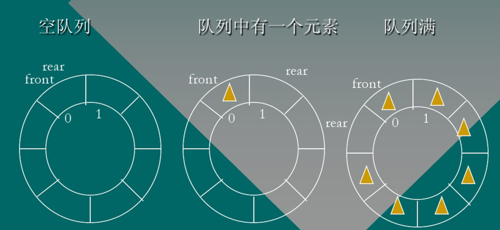

## FunPlus

##### 87的100次幂除以7的余数是多少 4

正解：D

  原理：

  \1. (A*B)%C = (A%C)*(B%C)%C 

  \2. An        %C=((A-A%C)+A%C)n%C=(  A%C)  n  %C

   解：  

   \1.    将87100简化成3100：87 % 7=3  

   \2.    找到mod7为1的部分：36(=729) % 7 =1  

   \3.    所以87100-->3100-->(36)16*34-->1*81-->4    (mod 7)  


##### 关于C  标准模板库,下列说法错误的有哪些:多选 AD    

A.std::auto_ptr类型的对象,可以放到std::vector容器中

B.std::shared_ptr类型的对象,可以放到std::vector容器中

C.对于复杂类型T的对象tObj,  tObj和tObj  的执行效率相比,前者更高

D.采用new操作符创建对象时,如果没有足够内存空间而导致创建失败,则new操作符会返回NULL


##### 一般情况下，下面哪些操作会执行失败？【多选】（BCD）

```c++
class A  
{  
public:  
    string a;  
    void f1()  
    {  
        printf("Hello World");  
    }  
    void f2()  
    {  
        a = "Hello World";  
        printf("%s",a.c_str());  
    }  
    virtual void f3()  
    {  
        printf("Hello World");  
    }  
    virtual void f4()  
    {  
        a = "Hello World";  
        printf("%s",a.c_str());  
    }  
};  
```

A、A *aptr = NULL; aptr->f1();
B、A *aptr = NULL; aptr->f2();
C、A *aptr = NULL; aptr->f3();
D、A *aptr = NULL; aptr->f4();

至于A为什么正确，因为A没有使用任何成员变量，而成员函数是不属于对象的，所以A正确。其实，A* aptr =  NULL;aptr->f5();也是正确的，因为静态成员也是不属于任何对象的。至于BCD，在B中使用了成员变量，而成员变量只能存在于对象，C有虚表指针，所以也只存在于对象中。D就更是一样了。但是，如果在Class A中没有写public，那么就全都是private，以至于所有的选项都将会失败。


##### 下列关于进程和线程的叙述中,错误的是(BCD )

A.不管系统是否支持线程，进程都是资源分配的基本单位。

B.线程是资源分配的基本单位，进程是调度的基本单位。

C.系统级线程和用户级线程的切换都需要内核的支持。

D.同一进程中的各个线程拥有各自不同的地址空间。


##### 以下哪些做法是不正确或者应该极力避免的：【多选】（ACD ）

A. 构造函数声明为虚函数
B. 派生关系中的基类析构函数声明为虚函数
C. 构造函数中调用虚函数
D. 析构函数中调用虚函数

**解析**

- 构造函数声明为虚函数：所谓虚函数就是多态情况下只执行一个,而从继承的概念来讲,总是要先构造父类对象,然后才能是子类对象,如果构造函数设为虚函数,那么当你在构造父类的构造函数时就不得不显示的调用构造,还有一个原因就是为了防错,试想如果你在子类中一不小心重写了个跟父类构造函数一样的函数,那么你的父类的构造函数将被覆盖,也即不能完成父类的构造.就会出错

- 构造函数中调用虚函数：在构造函数不要调用虚函数。在基类构造的时候，虚函数是非虚，不会走到派生类中，既是采用的静态绑定。显然的是：当我们构造一个子类的对象时，先调用基类的构造函数，构造子类中基类部分，子类还没有构造，还没有初始化，如果在基类的构造中调用虚函数，如果可以的话就是调用一个还没有被初始化的对象，那是很危险的，所以C++中是不可以在构造父类对象部分的时候调用子类的虚函数实现。但是不是说你不可以那么写程序，你这么写，编译器也不会报错。只是你如果这么写的话编译器不会给你调用子类的实现，而是还是调用基类的实现

- 析构函数中调用虚函数：在析构函数中也不要调用虚函数。在析构的时候会首先调用子类的析构函数，析构掉对象中的子类部分，然后在调用基类的析构函数析构基类部分，如果在基类的析构函数里面调用虚函数，会导致其调用已经析构了的子类对象里面的函数，这是非常危险的


##### C++将父类的析构函数定义为虚函数，下列正确的是哪个？正确答案: A  

A 释放父类指针时能正确释放子类对象  

B 释放子类指针时能正确释放父类对象 

C 这样做是错误的 

D以上全错


##### 主存储器和cpu之间增加高速缓冲器的主要目的

主要目的是解决主存与CPU之间速度匹配问题


##### 设数组a[]作为循环队列SQ的存储空间，数组的长度为m，f为队头指示，r为队尾指示，则执行出队操作的语句为（）                                        




**循环队列的相关条件和公式：** 

 队尾指针是rear, 队头是front，其中QueueSize为循环队列的最大长度 

 1.队空条件：rear==front

 2.队满条件：(rear+1) %QueueSIze==front

 3.计算队列长度：（rear - front+QueueSize）% QueueSize 

 4.入队：（rear+1）%QueueSize   //尾指针后移一位

 5.出队：（front+1）%QueueSize  //头指针后移一位


#### 内存大小

```c++
#include<iostream>
#include<vector>
using namespace std;

union{
    int i;
    char x[2];
}a;

void Func(char str1[100] = nullptr)
{
    char str2[100];
    printf("%d %d\n", (int)sizeof(str1), (int)sizeof(str2));
}

int main(){
    a.x[0] = 10;
    a.x[1] = 1;
	Func();
}
```


##### 以下关于文件操作的叙述中，不正确的是(B)。

(A)打开文件的目的是使文件对象与磁盘文件建立联系

 (B)文件的读写过程中，程序将直接与磁盘文件进行数据交换

 (C)关闭文件的目的之一是保证输出的数据写入硬盘文件

 (D)关闭文件的目的之一是释放内存中的文件对象


##### 给定一个数判断是否为2的幂

- 2的幂写成二进制都是 10000的形式，因此 n-1为 11111，进行 & 操作后一定为 0
- 一句话判断 `n>0 && !(n&(n-1))`


##### 实现String类

```c++
#include<iostream>
using namespace std;

class String{
public:
	String(){
		m_data = new char[1];
		m_data = '\0';
	}
	String(const char* other){
		cout << "常量初始化string" << endl;
		m_data = new char[strlen(other) + 1];
		strcpy(m_data, other);
	}
	String(const String& other){
		cout << "拷贝构造函数" << endl;
		m_data = new char[strlen(other.m_data) + 1];
		strcpy(this->m_data, other.m_data);
	}
	String& operator=(const String& other){
		cout << "赋值！！！一个传给另一个" << endl;
		if (this==&other){
			return *this; //如果是自赋值
		}
		delete[] m_data; //不是自赋值，删除原本的指针，防止内存泄漏
		m_data = new char[strlen(other.m_data) + 1];
		//strcpy(m_data, other.m_data);
		memcpy(m_data, other.m_data, strlen(other.m_data)+1); //这样赋值也可以，注意要用strlen
		return *this;

	}
	~String(){
		cout << "析构函数" << endl;
		delete[] m_data;
	}

	void print(){
		char* tmp = m_data;
		printf("%s\n", m_data); //用printf就可以了
	}
	
	String(String&& other){
		cout << "移动构造函数~" << endl;
		m_data = other.m_data;
		other.m_data = nullptr;
	}

private:
	char* m_data;

};
int main(){
	String str1 = "1234565";
	str1.print();
	String str2(move(str1));
	str2.print();
	String str3 = str2;
	str3.print();
	String str4("1asdfgfg"); //此种写法和str1等价
	str4.print();
	String str5;
	str5 = str4;
	str5.print();
}
```


##### C++程序中，调用被C编译器编译后的函数，函数前加什么

- 函数前加 extern “C” 声明
- 加上extern “c”后，会指示C++编译器这段代码按C语言编译。由于C++支持函数重载，编译函数时候会把函数的参数类型和名字编译到代码中，而C不支持函数重载，编译C函数的时候只会包含函数名，没有参数类型。

- C比C++出现的早，底层代码都是用C语言写的，为了更好的兼容原来的C代码和已经写好的函数库，就需要在C++中支持C，extern “c”就是来解决这个问题的。
  


##### c++ 移动构造方法为什么要加noexcept

https://blog.csdn.net/c553110519/article/details/132629860

##### C++关键字noexcept

https://blog.csdn.net/xhtchina/article/details/126094792

## 掌趣

111.101 转十进制

##### 浮点数比较

abs( fa - fb) < 0.000001

##### 源码，反码，补码


##### helloword子串个数

- n(n + 1)/2


##### 下面选项中，TCP报头不包含的字段是（D）

A.源端口号

B.序列号

C.窗口大小

D.目的IP地址


##### 在TCP协议中，发送方的窗口大小决定于 C 。

A.仅接收方允许的窗口

B.接收方允许的窗口和发送方允许的窗口

C.接收方允许的窗口和拥塞窗口

D.发送方允许的窗口和拥塞窗口


**巫婆与公主**

有个村落住了19个聪明绝顶的巫婆和1个漂亮的公主. 每个巫婆都知道谁吃了公主便能变成为公主. 而每个巫婆都非常渴望拥有公主的美貌.  但他们担心的是如果巫婆变成了公主, 他遍会失去了法术, 随时会被其他巫婆吃掉.  究竟那个公主会不会被吃掉？（巫婆最先考虑保证自己不会被吃掉；在确保安全的情况下会吃掉公主）

答案：想像如果岛上有1巫婆和1公主时, 巫婆必会吃掉公主. 因为当巫婆变了公主后便没有其他巫婆吃他. 想像如果岛上有2巫婆和1公主时,  巫婆便不敢吃公主. 因为巫婆知道当他吃了公主后, 岛上只剩一巫婆一公主, 而在此情况下, 他一定会被吃掉. 当岛上有3巫婆1公主时,  公主必会被其中一个巫婆吃掉. 因为吃掉公主的巫婆知道如果岛上剩2巫婆1公主时, 其他巫婆是不敢碰他的. 如此类推, 当巫婆数目是单数时,  公主会被吃. 巫婆数目是双数时, 公主不会被吃.


##### 三个读代码：

```
#include<iostream>
#include<vector>
using namespace std;

#define ADD(x, y) x + y

int main(){
    1.
    int m = 3;
    m += m*ADD(m, m);
    cout << m << " ";

    2.
    for(int x = 0, y = 0; y <= 5 || !x; y++, x++){
        cout << y;
    }

    3.
    cout << "  " << (0x3E00 ^ 0x9FA5 ^ 0x9FA5);
    
    4. 
    int ret = (int)(((short*)0) + 7);
    cout << ret;
}
```


##### 链表构造栈

```
template<class T>
struct Stack
{
public:
    Stack() mNode(nullptr){}
    
    struct Node{
        Node():val， next(nullptr){}
        T val;
        Node* next;
    };
    
    Node* mNode;
    
    void push(T v){
        Node* temp = new Node;
        temp -> val = v;
        temp -> next = mNode;
        mNode = temp;
    }
    
    void pop(){
        if(mNode == nullptr){
            cout << "Stack is Empty!" << endl;
        }
        else{
            Node* temp = mNode;
            mNode = mNode -> next;
            delete temp;
        }
    }
    
    bool isEmpty(){
        return nullptr == mNode;
    }
    
    int size(){
        Node* temp = mNode;
        int count = 0;
        while(temp != nullptr){
            temp = temp -> next;
            ++count;
        }
        
        return count;
    }
};

```


##### 子串个数

[https://blog.csdn.net/qq_36553828/article/details/108363126?spm=1001.2101.3001.6650.13&utm_medium=distribute.pc_relevant.none-task-blog-2%7Edefault%7EBlogCommendFromBaidu%7ERate-13-108363126-blog-123833352.235%5Ev38%5Epc_relevant_anti_t3_base&depth_1-utm_source=distribute.pc_relevant.none-task-blog-2%7Edefault%7EBlogCommendFromBaidu%7ERate-13-108363126-blog-123833352.235%5Ev38%5Epc_relevant_anti_t3_base&utm_relevant_index=18](https://blog.csdn.net/qq_36553828/article/details/108363126?spm=1001.2101.3001.6650.13&utm_medium=distribute.pc_relevant.none-task-blog-2~default~BlogCommendFromBaidu~Rate-13-108363126-blog-123833352.235^v38^pc_relevant_anti_t3_base&depth_1-utm_source=distribute.pc_relevant.none-task-blog-2~default~BlogCommendFromBaidu~Rate-13-108363126-blog-123833352.235^v38^pc_relevant_anti_t3_base&utm_relevant_index=18)


### 吃葡萄 吉比特2/3

有一排m串葡萄，每串葡萄有一定个数n的葡萄，一次只能吃某串葡萄的2个加上它左右两边葡萄各1个（1 + 2 + 1），问至少吃完两串葡萄最少需要吃多少次？

输入样例1：

```
3
10 6 5
```

输出样例1：

```
4
```

解释：3串葡萄。吃中间的三次，再吃右边的一次，一共4次就可以吃完两串葡萄。

以下两种样例题目不会给，但是是需要考虑的另外两种情况：

输入样例2：

```
3
1 99 1
```

输出样例2：

```
1
```

解释：3串葡萄。吃中间那一串一次，两边的两串就被吃完了。

输入样例3：

```
4
1 99 99 1
```

输出样例3：

```
2
```

解释：4串葡萄。最左和最右各吃一次，就有两串被吃完了。（或者其它吃法也可以实现2次）


**思路**

- 情况一：吃两串相邻的葡萄
  1. 对于每两串相邻的葡萄，我们可以计算吃完它们所需要的次数。
     - 对于每两串相邻的葡萄：`a[i]`和`a[i+1]`，首先我们可以吃掉`a[i]`的葡萄，吃的次数为`(a[i] + 2) / 4`，`a[i+1]`也会减去对应的葡萄数。同样的，吃`a[i+1]`的次数为`(a[i+1] + 2) / 4`，`a[i]`也会减去对应的葡萄数。取这两种方法中较小的吃的次数。
  2. 从左到右对所有相邻的两串葡萄进行**遍历**，计算出最少需要的次数。

- 情况二：吃两串不相邻的葡萄
- 比较情况一和情况二哪个小


### 比赛排名 吉比特1/3

给定一组长度为n的字符串（'a'-'z'）,代表n只队伍，进行n次比赛，让你求出名次

排名优先判定，排名相同看最高名次的场次，也相同字典序最先

也就是说，a得过第一名，一定比没得过第一名的某队名次高

**案例一**

```cpp
3
abc
abc
abc
```

输出

> abc

a得三次第一，b的三次第二，c的三次第三

**案例二**

```cpp
3
abc
cba
cba
```

输出

> cab

a得一次第一，c得两次第一，所以c第一

b得三次第二，但是由于a得过一次第一，所以a得第二

b得第三


**思路**

理解：每个队伍进行`n`次比赛，每次比赛都会得到一个名次。名次判定的优先级为：最高名次 > 得到该名次的次数 > 字典序。

- 思路一：用数字 rank 记录排名，遍历比赛得第一名 +1000000，第二名 +1000，字典序 +1，最后计算排名即可
- 思路二：记录每个比赛名字，依次排序

```cpp
sort(teams.begin(), teams.end(), [](const pair<string, vector<int>>& a, const pair<string, vector<int>>& b) {
        for(int i = 0; i < a.second.size(); i++) {
            if(a.second[i] > b.second[i]) return true;
            if(a.second[i] < b.second[i]) return false;
        }
        return a.first < b.first;
    });
```


```c++sort(filtered.begin(), filtered.end(), [](vector<int> &v1, vector<int> &v2) -> bool {
sort(filtered.begin(), filtered.end(), [](vector<int> &v1, vector<int> &v2) -> bool {
    return v1[1] > v2[1] || (v1[1] == v2[1] && v1[0] > v2[0]);
});
```


```c++
#include <iostream>
#include<vector>
using namespace std;
vector<vector<vector<bool>>> allAplace;

    //flase 是 B， true 是 A
float calculate(vector<vector<bool>>& place, int m, int n, int c, float d){
    float ans = 0;
    for(int i = 0; i < m; ++i){
        for(int j = 0; j < n; ++j){
            if(!place[i][j]){
                float res = c;
                if(i - 1 > -1 && place[i - 1][j])
                    res *= d;
                if(i - 1 > -1 && j - 1 > -1 && place[i - 1][j - 1])
                    res *= d;
                if(i - 1 > -1 && j + 1 < n  && place[i - 1][j + 1])
                    res *= d;
                if(i + 1 < m && place[i + 1][j])
                    res *= d;
                if(i + 1 < m && j - 1 > -1 && place[i + 1][j - 1])
                    res *= d;
                if(i + 1 < m && j + 1 < n  && place[i + 1][j + 1])
                    res *= d;
                if(j - 1 > -1 && place[i][j - 1])
                    res *= d;
                if(j + 1 < n  && place[i][j + 1])
                    res *= d;
                
                ans += res;
            }
        }
    }
    return ans;
}

void allPlace(int m, int n, int i, int j, int numofA, vector<vector<bool>>& place){
    if(numofA == 0){    // A都放完了，等于完成一种可能
        allAplace.push_back(place);
        return;
    }

    if(i < m){
        if(j < n){
            place[i][j] = true;
            allPlace(m, n, i, j + 1, numofA - 1, place);
            place[i][j] = false;
            allPlace(m, n, i, j + 1, numofA, place);
        }
        else{
            allPlace(m, n, i + 1, 0, numofA, place);
        }
    }
}


int main() {
    int m, n, c;
    float d;
    cin >> m >> n >> c >> d;
    
    vector<vector<bool>> place(m, vector<bool>(n, false));
    allPlace(2, 2, 0, 0, 1, place);

    float ans = 0;
    float sum = 0;
    int possible = 0;
    int ret1, ret2;
    for(int numA = 0; numA < m * n - 1; ++numA){
        sum = 0;
        possible = 0;
        allPlace(m, n, 0, 0, numA, place);
        possible += allAplace.size();
        for(vector<vector<bool>> p : allAplace){
            sum += calculate(p, m, n, c, d);
        }
        //cout << sum << " " << possible << " " << numA << endl;
        if(ans < sum / possible){
            ans = sum / possible;
            ret1 = numA;
            ret2 = n * m - ret1;
        }
        allAplace = {};
    }
    
    cout << ret1<< " "  << ret2<< " ";
    printf("%.1f", ans);

}
// 64 位输出请用 printf("%lld")
```


85% !!nb!


```
6 6 1 2
1 1
2 2 3
5 3 3 3 4 2
3 4 5 6
1 1
1 2
```


```
1 2 4
3 5
```


