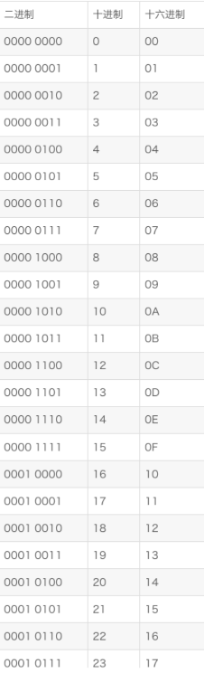
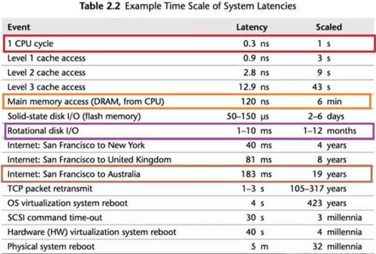

#### 注意事项

- 无法通过全部，可能是因为要 long long！


### 输入输出

https://blog.csdn.net/qq_46046431/article/details/129266738

#### 数字与字符串互转

```c++
string s = to_string(n);
```


```c++
//字符串转为整数,通过减'0'字符,底层用ASCII码相减 
void myAtoi(char str[],long long& m){  
	int i = 0;
	int temp = 0;
	while(str[i] != '\0'){
		temp = temp*10 + (str[i] -'0');
		++i;
	}
	m = temp; //转换后赋值给m
} 

```


### 常用方法

#### 保留小数

```c++
double num = 3.14159 
return round(num * 100) / 100; 
```


#### 二进制

- 进制转换器：

https://jisuan5.com/decimal/


#### 在线c++编译

https://www.nhooo.com/tool/cpp/


#### 指针与重载

```c++
#include <iostream>
using namespace std;

template<typename T>
T Sum(T x, T y){return x + y;}

void f(int & value){
	cout << "A" << value;
}

void f(const int & value){
	cout << "B" << value;
	
}

int f(int&& value){
	cout << "C" << value;
	return value;
}

int main()
{
   f(1);
	int x = 2;
	f(x);
	f(std::move(f(3)));
	
	Sum(2 , 3);
	Sum<double>(2.5 , 3);
	Sum(2.5 , 3.5);
   return 0;
}
```


#### 构造和析构函数调用虚函数

- 理论上来讲，构造函数和析构函数是可以调用虚函数的，但实际应用上不应该调用
- 在Effective C++09中有说明了一这点，当派生类继承了基类的时候，生成一个派生类对象的时候，首先会调用基类的构造函数生成基类的部分，但构造函数里面如果有虚函数，这时候调用的是基类的虚函数，不会下降到派生类的阶层，可以从以下几个角度理解
  - 在执行基类构造函数的时候，派生类的成员变量完全未初始化，那么如果此时调用的是派生类的虚函数，如果里面调用了派生类的成员变量，那么就导致出现错误
  - 派生类对象在基类构造期间，会被认为是一个基类对象，而不是派生类对象，这样设置的原因是对象的派生类部分尚未被初始化，所以面对它们，最安全的做法就是无视它们，对象在派生类构造函数执行之前不会成为一个派生类对象
  - 析构函数也同样适用于上面的理由

#### 构造函数调用顺序

先基类(基类被继承时的声明次序从左到右依次继承)，再对象成员，再派生类

析构函数：与构造函数相反


#### 待处理

计算哪些ip属于同一网段	

进程中的线程共享进程的内存和资源吗

隶属于同一个进程的多个线程[不能共享的是][https://blog.csdn.net/challenglistic/article/details/125896252]

链接阶段发现被调用的函数未定义

资源有序分配策略破坏循环等待条件

类存在虚继承，虚函数的内存占用[问题][https://blog.csdn.net/sinat_27593959/article/details/82218072] 

析构函数 虚函数，释放子类指针

常量成员和静态成员[区别][https://blog.csdn.net/sinat_27593959/article/details/82218072] 

[vector迭代器失效][https://blog.csdn.net/bit_jie/article/details/127592821] 

哈夫曼编码

启发式广度优先搜索 哪个数据结构，双端队列

没有指针的链表[https://blog.csdn.net/CS_COPy/article/details/120695323]

组合和继承的区别与优缺点


## 二进制

#### 进制转换

- 二进制转十进制：$(10110.101) 2=1*2^4+1*2^2+1*2^1+1*2^{-1}+1*2^{-3}=16+3+2+0.5+0.125 $ 


用二进制表示十进制数1到4，分别为1、10、11、100，这些二进制数所有位上1的个数共有5个。那么，用二进制表示的十进制数1到128，所有位上1的个数共有____________个。

https://www.nowcoder.com/questionTerminal/a26078a2d13548349ca54a518a94d790?


#### 16 进制

- c++ 中前缀 0x 表示为 16 进制

```c++
0Xa：  10
0xA：  10
0x10： 16
```





## 数据库

#### 一、关键词意义

【1】select 用来指定查询哪些列，可以使用聚合函数。

【2】from 用来指定查询哪张表。

【3】where用来指定过滤条件，针对原表，那么条件中的列名只能是是原表的列名，不可以是别名或者使用聚合函数。

【4】group by 用来对结果集进行分组，条件中的列可以使用原名，也可以使用别名。

【5】having 用来指定对分组后的数据进行再次过滤的条件，条件中的列可以使用原名，也可以使用别名。

【6】order by 对结果集中某一列进行排序，默认降序。有 asc 升序，desc 降序两种选择。条件中的列可以使用原名，也可以使用别名。

【7】limit 用来取出结果集中的某些行.limit m,n取出的是从第m+1行开始一共n行的数据。limit n相当于limit 0,n

oracle中返回前10条数据不用limit，而是用where rownum<=10;

#### 二、sql语句编写顺序

select .. from ..是必须的，其他的关键词可选。

那么他们的组合顺序为

select ... from ..  where ... group by ... having ... order by ... limit ...

#### 三、sql语句执行顺序

【1】from 用于指定待查询的表

【2】where 由where后面的提交过滤表中的数据,形成结果集1

【3】group by 由后面的列对结果集1中的数据进行分组，形成结果集2

【4】having 对结果集2再次进行过滤，形成结果集3

【5】order by 对结果集3进行排序操作，形成结果集4

【6】limit 取结果集4中的某些行，返回最终结果集


#### 计算机网络

关于TCP协议描述不正确的是（BD） 

- ```
  建立连接需要三次握手
  ```

- ```
  TIME_WAIT状态时不再接受报文
  ```

- ```
  TIME_WAIT状态的持续时间是可以调整的
  ```

- ```
  FIN报文一般由请求方负责发送
  ```


## 计算机组成原理

#### 内存访问速度





可以看到，CPU 最快，一个时钟周期只是 0.3 纳秒，内存访问需要 120 纳秒，固态硬盘访问需要 50-150 微秒，传统硬盘访问需要 1-10毫秒， 网络访问最慢，都是几十毫秒。

如果一个时钟周期如果按 1 秒算

- 内存访问 6 分钟
- 固态硬盘 2-6 天
- 传统硬盘 1-12 个月


### 内存空间

Surface：4，4，128

台式机：8， 8，128 

```c++
void Foo(char* c = nullptr) {
    void* p = malloc(256);
    int strInside[128];
    char output = sizeof(p) + sizeof(c) + sizeof(strInside);
    cout << sizeof(p) << " " << sizeof(c) << " " << sizeof(strInside);
}
```


|                        | 字节 (sizeof) |                                                         |
| ---------------------- | ------------- | ------------------------------------------------------- |
| **char**               | 1             | -128 到 127                                             |
| **unsigned char**      | 1             | 0到 255                                                 |
| **int**                | 4             | -2147483648 到 2147483647                               |
| **unsigned int**       | 4             | 0到 4294967295                                          |
| **short int**          | 2             | -32768 到 32767                                         |
| **unsigned short int** | 2             | 0 到 65.535                                             |
| **long int**           | 8             | -9,223,372.036.854,775,808 到 9,223,372,036,854,775,807 |
| **unsigned long int**  | 8             | 0 到 18,446.744.073.709.551.615                         |
| **float**              | 4 (32位)      | +/- 3.4e  +/- 38  (~7个数字)                            |
| **double**             | 8 (64位)      | +/- 1.7e  +/- 308 (~15个数字)                           |
| **long double**        | 16 (128位)    | (18 ~ 19个数字)                                         |
| **wchar_t**            | 2 或 4        | ~15个数字                                               |


#### 内存对齐

- 空间换时间

- 中文的写法：一个字节=8比特=8位
- 英文的写法：1Bite=8bit


```c++
struct A{
    long a1;
    short a2;
    int a3;
    int *a4;
};

int main(){
    cout << sizeof(struct A);	16
}
```


## 奇奇怪怪算法题

- 校验和
- 均匀打点 给定二维平面上有一组点,一次连起来形成一条折现
- 大数相乘
- 通过扩欧得出线性同余方程的通解以及x的最小正整数解[a][https://blog.csdn.net/qq_42873341/article/details/88753079]
- 哈夫曼编码


求长方体交集

```c++
#include <iostream>
#include<vector>
using namespace std;

vector<vector<int>> intersect(vector<vector<int>> a, vector<vector<int>> b) {
    vector<vector<int>> res = {{0, 0}, {0, 0}};
    res[0][0] = max(a[0][0], b[0][0]);
    res[0][1] = max(a[0][1], b[0][1]);
    res[1][0] = min(a[1][0], b[1][0]);
    res[1][1] = min(a[1][1], b[1][1]);

    return res;
}

int main() {
    
    vector<vector<int>> res = intersect({ {1, 1}, {3, 3} }, { {2, 2} , {4, 4} });
    cout << res[0][0] << " " << res[0][1] << "   " << res[1][0] << " " << res[1][0];

    return 0;
}
```

