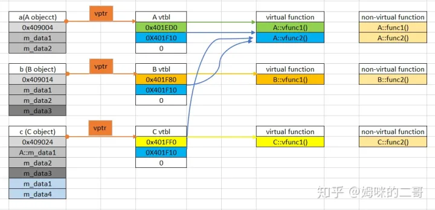
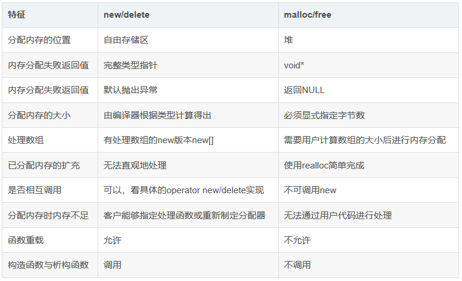

九阳真经

https://zhuanlan.zhihu.com/p/417640759


育碧 英文简历

#### 陶陶的面试经验：

最有成就感的事


困境：game jam，都没做过，新手

二选一：3d跳跃躲避障碍，还是全新的交互互动

（和领导交互）

结果：拿到最佳游戏


最大的障碍


当时被砍掉，后来重新做了并上线了


# Unity

#### 装箱拆箱

**1　　首先先来谈下值类型与引用类型**

**引用类型：**引用类型包含指向存储数据的其他内存位置的指针，引用类型总是从托管堆上分配。c#的new操作符返回的就是对象位于托管堆中的内存地址—该内存地址指向对象占用数据位。使用引用类型是我们必须考虑一些性能问题：

- 内存必须从托管堆上分配。
- 每个在托管堆中分配的对象都有一些与之关联的额外附加成员必须被初始化。
- 从托管堆中分配对象可能会导致执行垃圾收集器。

**值类型：**值类型实例在它自己的内存分配中存储数据，通常分配在线程的堆栈上。表示值类型实例的变量不包含指向实例的指针，变量本身即包含了实例的所有字段，操作实例时无需再解析指针引用。值类型实例不受垃圾收集器的控制，因此减少了托管堆的压力，以及应用程序在整个生存周期中需要垃圾回收的次数。

**2　　接着看装箱与拆箱**

**装箱：**将一个值类型转换为一个引用类型。装箱操作通常有以下几步组成：

1. 从托管堆中为新生成的引用类型对象分配内存。分配内存的大小为值类型实例本身的大小加上其他额外的将值类型实例视为真正的引用类型所需的空间，这些额外的空间包括1个方法表指针和一个SyncBlockIndex。
2. 将值类型的实例字段拷贝到托管堆上新分配的对象内存中。
3. 返回托管堆中新分配对象的地址。该地址就是一个指向对象的引用。值类型实例也就变成了一个引用类型对象。

**拆箱：**从引用类型中获取指向对象中包含的值类型部分（数据字段）的指针，拆箱仅仅到此。然而紧接着拆箱之后典型的操作往往就是字段的拷贝。

**由此可见，装箱和拆箱/拷贝操作会从速度和内存两个方面损伤应用程序的性能。因此我们应该清楚编译器会在何时自动产生执行这些操作的指令，并使我们编写的代码尽可能减少导致这种情况发生的机会。**


#### GC 机制

##### 全称 garbage collection，垃圾回收

- 主要作用在堆空间上


##### 堆上的变量在存储时，分为以下几步：

1）首先，unity检测是否有足够的闲置内存单元，如果有，则分配对应大小的内存单元；

2）如果没有足够的存储单元： 垃圾回收。如果垃圾回收后有足够大小的内存单元，则进行内存分配。

3）如果垃圾回收后没有足够的内存单元：unity 会扩展堆内存的大小（很缓慢），然后分配对应大小的内存单元给变量。


##### 垃圾回收时的操作

当堆内存上一个变量不再处于激活状态的时候，其所占用的内存并不会立刻被回收，不再使用的内存只会在GC的时候才会被回收。


##### 运行GC的时候，主要进行下面的操作：

1）GC会检查堆内存上的每个存储变量；

2）对每个变量会检测其引用是否处于激活状态；

3）如果变量的引用不再处于激活状态，则会被标记为可回收；

4）被标记的变量会被移除，其所占有的内存会被回收到堆内存上。

##### 触发GC

1） 在堆内存上进行内存分配操作而内存不够时

2） GC会自动触发，不同平台运行频率不一样

3） GC可以被强制执行


##### 降低GC的几种方法：

1.**使用对象池** 

对象池，顾名思义就是一定数量的已经创建好的对象(Object)的集合。当需要创建对象时，先在池子中获取，如果池子中没有符合条件的对象，再进行创建新对象，同样，当对象需要销毁时，不做真正的销毁，而是将其setActive(false)，并存入池子中。这样就避免了大量对象的创建。

2.**string和StringBuilder的使用** 

对于执行大量字符串操作的例程 (例如在循环中多次修改字符串的应用程序) ，重复修改字符串可能会显著降低性能。 替代方法是使用 StringBuilder ，它是一个可变字符串类。 可变性是指在创建类的实例后，可以通过追加、移除、替换或插入字符来修改它。 StringBuilder对象维护缓冲区以容纳对字符串的扩展。 如果空间可用，则会将新数据追加到缓冲区;否则，将分配一个新的更大的缓冲区，将原始缓冲区中的数据复制到新缓冲区，然后将新数据追加到新缓冲区。

3.**减少装箱操作** 

装箱指的是值类型转换成引用类型，拆箱则是反过来。

装箱和取消装箱过程需要进行大量的计算。 对值类型进行装箱时，必须创建一个全新的对象。 这可能比一些简单的引用赋值耗时最多能长 20 倍。 取消装箱的过程所需时间也可达赋值操作的四倍，所以尽量避免装箱和拆箱。

4.关键帧限制协程调用（startcoroutine()实际上是new一个对象）

5.用for代替foreach（5.5版本以前有装箱操作，会在堆内存上产生一个system.object）

6.struct中不要有引用类型变量（struct是值类型，而如果struct中有引用类型的变量，GC会检查整个struct）【增加GC的方式是让它检查不必检查的对象】

7.主动调用GC


#### 内存碎片和垃圾回收

https://blog.csdn.net/weixin_53501436/article/details/132670960


#### 常见设计模式

https://blog.csdn.net/qq_36612242/article/details/129464792


#### 闭包

https://blog.csdn.net/zhudaokuan/article/details/113032690


#### Unity 生命周期

https://www.bilibili.com/video/BV19a41157WP/?spm_id_from=333.337.search-card.all.click&vd_source=120074d428e56ab223e0ce014bbd58b7

https://blog.csdn.net/jiexiaopei_2004/article/details/80027455

**Start（） 注意事项**

在 Start（）中进行初始化不是很安全，因为它可能被其他自定义的函数抢先。

即在脚本A中调用脚本B中的Fun()函数，因为脚本B是被禁用的，所以它在此之前只执行了Awake（）函数而没有执行Start（）函数，当脚本A调用Fun()函数时，会先执行Fun（）函数，再根据脚本是否被禁用而决定是否启用Start（）函数，这会出现如下问题：当Fun（）函数中有些变量需要在Start函数中初始化时，就会出现错误（包括逻辑错误和程序错误）。


#### 协程

和进程，线程区别

https://blog.csdn.net/qq_42956653/article/details/122500452

#### UI自适应

1. 将Canvas Scaler的UI Scale Mode属性设置成Constant Pixel Size
2. 对Canvas下的子对象设定锚点


# 物理解算

## Bounds(包围盒)

### 1.什么是包围盒?

包围盒算法是一种求解离散点集最优包围空间的方法。
 基本思想是用体积稍大且特性简单的几何体称为包围盒来近似地代替复杂的几何对象。
 最常见的包围盒算法有AABB包围盒Axis-aligned bounding box包围球Sphere方向包围盒OBBOriented bounding box固定方向凸包FDHFixed directions hulls或k-DOP。

### 2.包围盒的类型

#### 2.1 AABB包围盒(Axis-aligned bounding box)

AABB是应用最早的包围盒。它被定义为包含该对象且边平行于坐标轴的最小六面体。故描述一个AABB仅需六个标量。AABB构造比较简单存储空间小但紧密性差尤其对不规则几何形体冗余空间很大当对象旋转时无法对其进行相应的旋转。处理对象是刚性并且是凸的不适合包含软体变形的复杂的虚拟环境情况。AABB也是比较简单的一类包围盒。但对于沿斜对角方向放置的瘦长形对象其紧密性较差。由于AABB相交测试的简单性及较好的紧密性因此得到了广泛的应用还可以用于软体对象的碰撞检测。

#### 2.2 包围球(Sphere)

包围球被定义为包含该对象的最小的球体。确定包围球首先需分别计算组成对象的基本几何元素集合中所有元素的顶点的xyz坐标的均值以确定包围球的球心再由球心与三个最大值坐标所确定的点间的距离确定半径r。包围球的碰撞检测主要是比较两球间半径和与球心距离的大小。

#### 2.3 OBB方向包围盒(Oriented bounding box)

OBB是较为常用的包围盒类型。它是包含该对象且相对于坐标轴方向任意的最小的长方体。OBB最大特点是它的方向的任意性这使得它可以根据被包围对象的形状特点尽可能紧密的包围对象但同时也使得它的相交测试变得复杂。OBB包围盒比AABB包围盒和包围球更加紧密地逼近物体能比较显著地减少包围体的个数从而避免了大量包围体之间的相交检测。但OBB之间的相交检测比AABB或包围球体之间的相交检测更费时。

#### 2.4 FDH固定方向凸包(Fixed directions hulls或k-DOP)

FDHk-DOP是一种特殊的凸包继承了AABB简单性的特点但其要具备良好的空间紧密度必须使用足够多的固定方向。被定义为包含该对象且它的所有面的法向量都取自一个固定的方向k个向量集合的凸包。FDH比其他包围体更紧密地包围原物体创建的层次树也就有更少的节点求交检测时就会减少更多的冗余计算但相互间的求交运算较为复杂。

#### 2.5 包围盒选择

任何实时三维交互式程序如果没有碰撞检测都是没有价值甚至无法使用的。游戏中最常用的碰撞检测技术莫过于包围盒bounding  volume碰撞检测。对于以60pfs运行的游戏来说处理每一帧数据的时间只有0.0167s左右对于不同的游戏碰撞检测大概需要占10～30%的时间也就是说所有碰撞检测必须在0.002～0.005s内完成非常巨大的挑战。
 因此任何包围盒都应该满足以下特性

1. 快速的碰撞检测
2. 能紧密覆盖所包围的对象
3. 包围盒应该非常容易计算
4. 能方便的旋转和变换坐标
5. 低内存占用。

最常见的包围盒有SphereAABBOBB等外加一个比较特殊的frustum。Sphere能很好的满足1345条但通常包含了太多无用的空间容易导致错误的碰撞结果。AABB应该是sphere与obb之间的解决方案同时兼顾了效率和空间覆盖范围。OBB是三者中精度最高的但检测代价也是最高的。
 最终使用哪一种包围盒是一个非常痛苦的过程我们需要在效率和精度之间做出权衡取舍。前几天刚好完成了基本的碰撞检测函数以下是我的一些测试数据在一定程度上可以作为参考。纯C#代码实现没有任何GPU加速单线程在Q6600上运行。

- AABB包围盒Axis-aligned bounding box100万次测试1000次碰撞耗时0.014s。
- 包围球Sphere100万次测试大约有16000次碰撞耗时0.016s。
- OBB方向包围盒Oriented bounding box)使用传统的separate axis算法100万次测试30万次碰撞耗时0.160s左右。对于没有碰撞的情况几乎在前6条轴的检测中就能结束检测也就是说大约50万次50%测试都在检测第七条轴之前结束。
- Vertical-agliened OBB普通OBB的特殊版本只能绕Y轴旋转。100w次测试同样30万次碰撞耗时0.08s几乎比普通OBB快了一倍。
- Frustum-AABB使用<< Optimized View Frustum Culling Algorithms for Bounding Boxes  >>中的算法100w次测试6万次碰撞耗时0.096s。目前我计算n-vertex和p-vertex的方法是瓶颈大约0.016s的时间花在计算这两个点上。 相比XNA中的BoundingFrustum.Intersects同样的测试需要0.5s左右。

(以上均为对随机数据的测试因此不同包围盒之间的实际碰撞次数并没有可比性,也不代表不同类型间的精度)
  显然AABB是性价比最高的OBB虽然有较高精度但相对其计算代价来说并不划算可以考虑用多个AABB来近似OBB或者使用代价相对较低的Vertical-agliened OBB。Sphere看起来简单但计算涉及到开方虽然Math.Sqrt会直接编译为fsqrt指令)因此仍然没有AABB快只需要6条逻辑比较指令


####  c#数据类型 Array，ArrayList，dictionary， hashtable，List 详解

1：Array   数组在内存中是连续的存储的（只需存储velue值），所以索引速度很快 时间复杂度 o1，声明数组的时候 必须同时声明数组的长度，插入和删除效率比较低，需要移动大量的元素

2：ArrayList（动态数组） 继承自IList接口，声明的时候不需要声明数组的长度，会动态进行扩充和收缩的，可以插入不同类型的数据，因为类型是object类型的，会频繁的装箱拆箱

3：List （泛型List）继承自IList接口，存储内存类型跟ArrayList相似，区别是声明List集合的时候同时需要声明类型，不能插入不同的类型

4： 不支持泛型，Hashtable中key-value键值对均为object类型，所以Hashtable可以支持任何类型的keyvalue键值对，任何非 null 对象都可以用作键或值。允许单线程写入, 多线程读取, 无序

5：dictionary   支持泛型，单线程读取速度对比Hashtable有优势，Dictionary<K,V>是泛型的，当K或V是值类型时，其速度远远超过Hashtable。，如果key是字符串型，Dictionary的效率没有Hashtable快。有序（遍历时输出的顺序就是加入的顺序）

HashTable或者Dictionary，他是根据Key和Hash算法分析产生的内存地址，因此在宏观上是不连续的，由于这样的不连续，在遍历时，Dictionary必然会产生大量的内存换页操作，而List只需要进行最少的内存换页即可，这就是List和Dictionary在遍历时效率差异的根本原因。而且在尾部插入时，List只需要在其原有的地址基础上向后延续存储即可，而Dictionary却需要经过复杂的Hash计算，这也是性能损耗的地方。

##### hashtable 和dictionary  的区别

[1] 单线程程序中推荐使用 Dictionary, 有泛型优势, 单条读取速度较快, 容量利用更充分.

[2] 多线程程序中推荐使用 Hashtable, 默认的 Hashtable 允许单线程写入, 多线程读取, 对 Hashtable 进一步调用  Synchronized() 方法可以获得完全线程安全的类型. 而 Dictionary 非线程安全, 必须人为使用 lock 语句进行保护,  效率大减.

[3] Dictionary 有按插入顺序排列数据的特性 (注: 但当调用 Remove() 删除过节点后顺序被打乱), 因此在需要体现顺序的情境中使用 Dictionary 能获得一定方便.


C++ STL 几个容器的底层实现

https://blog.csdn.net/weixin_43778179/article/details/116662605


linux系统从开机到登陆界面的启动过程

https://blog.csdn.net/qq_15041569/article/details/90576945


解决哈希表冲突

https://blog.csdn.net/qq_48241564/article/details/118613312


帧同步和状态同步

https://zhuanlan.zhihu.com/p/357973435


RenderTexture 刮刮乐

https://blog.csdn.net/YuAnHandSome/article/details/106411281

# c#

https://blog.csdn.net/qq_38199336/article/details/123673608

反射

- 你在MonoBehaviour里写上一句private void Start()的时候，背后就是反射在支撑它的工作

- https://juejin.cn/post/7064757077813985310


String类型中的索引长度是只读的，也就是不能修改的。

#### String 和 **String Builder**

- String是.NET类库中比较特殊的一个引用类型，每一个String对象都是一个字符串常 量，而修改字符串的方法实际上都是返回一个新的String对象，原字符串仍然留在内存 中等待回收，那么当字符串较长或是操作频繁时就消耗大量的资源


#### **String Builder**

- 用于对字符串 进行动态的管理，而不是每次都生成新的字符串
- 可以使用无参构造函数来创建，也可以基于一个现有字符串来创建

- StringBuilder与String类的用法有很多类似之处，如通过Length属性获取字符串长 度，通过索引函数访问字符，但StringBuilder的**索引函数是可读写的**
- StringBuilder 也提供了Insert、Remove、Replace这些操作字符串的方法；尽管它们的返回类型为 StringBuilder，但方法并没有创建新的对象，返回的仍是当前对象。 
- 此外，StringBuilder的 ToString 方法直接返回所包含的字符串内容。

##### String Builder字符连接操作

为了方便频繁的字符连接操作，StringBuilder提供了Append、AppendLine和 AppendFormat这3个方法。

- Append方法用于将一个新串加到字符串的尾端，参数可以是字符串，可以是基本值类型。
- AppendLine方法会在追加新串后再增加一个换行符。
- AppendFormat方法在追加新串的同时进行参数格式化。
  


## 设计模式

##### 单例模式 :heavy_check_mark:

https://www.cnblogs.com/zhili/p/singletonpatterm.html


[C#设计模式总结 - Learning hard - 博客园 (cnblogs.com)](https://www.cnblogs.com/zhili/p/DesignPatternSummery.html)


# c++ 

### 左值引用与右值引用的区别？右值引用的意义？

#### 什么是左值，什么是右值？

左值：在[内存](https://so.csdn.net/so/search?q=内存&spm=1001.2101.3001.7020)有确定存储地址、有变量名，表达式结束依然存在的值，简单来说左值就是非临时对象。

- 可以放到等号左边
- 举例：变量名、返回左值引用的函数调用，前置自增或自减++i、--i、赋值运算或复合赋值运算，解引用

右值：就是在内存没有确定存储地址、没有变量名，[表达式](https://so.csdn.net/so/search?q=表达式&spm=1001.2101.3001.7020)结束就会销毁的值，简单来说右值就是临时对象

- 不可以放到等号左边
- **纯右值**：包含字面值，非引用类型的函数返回值，后置自增与自减，算数表达式、比较表达式、lambda表达式、取地址表达式等(&a)。
- **将亡值**：将亡值是C++11引用的右值引用（移动语义）相关的类型。将亡值用来触发移动构造函数和移动赋值构造函数，进行资源转移，之后将亡值会调用析构函数

左值可以分为两类：非常量左值和常量左值，

    int a=10;              	// a 为非常量左值（有确定存储地址，也有变量名）
    const int a1=10;      //a1 为常量左值（有确定存储地址，也有变量名）
    const int a2=20;      //a2 为常量左值（有确定存储地址，也有变量名）

右值也可以分为两类：非常量右值和常量右值。

```
int a=10;              	// 10 为非常量右值
const int a1=10;      
const int a2=20;      
a1+a2               	// (a1+a2) 为常量右值
```


#### 什么是左值引用和右值引用？有什么区别？

- **左值引用**：对左值进行引用，通过&来获得左值引用。

  - 非常量左值引用只能绑定到非常量左值上；常量左值引用可以绑定所有的值类型

  - ```c++
    int a=10;              //非常量左值（有确定存储地址，也有变量名）
    const int a1=10;       //常量左值（有确定存储地址，也有变量名）
    const int a2=20;       //常量左值（有确定存储地址，也有变量名）
     
    //非常量左值引用
    int &b1=a;            //正确，a是一个非常量左值，可以被非常量左值引用绑定
    int &b2=a1;           //错误,a1是一个常量左值，不可以被非常量左值引用绑定
    int &b3=10;           //错误，10是一个非常量右值，不可以被非常量左值引用绑定
    int &b4=a1+a2;        //错误,（a1+a2）是一个常量右值，不可以被非常量左值引用绑定
    
    //常量左值引用
    const int &c1=a;      //正确，a是一个非常量左值，可以被非常量右值引用绑定
    const int &c2=a1;     //正确,a1是一个常量左值，可以被非常量右值引用绑定
    const int &c3=a+a1;   //正确，（a+a1）是一个非常量右值，可以被常量右值引用绑定
    const int &c4=a1+a2;  //正确,（a1+a2）是一个常量右值，可以被非常量右值引用绑定
    ```

- **右值引用**：对右值进行引用，通过&&来获得右值引用

  - 非常量右值引用只能绑定到非常量右值上；常量右值引用可以绑定到非常量右值、常量右值上。

  - 可以使用std::move函数强制把左值转换为右值。

  - ```c++
    int a=10;             //非常量左值（有确定存储地址，也有变量名）
    const int a1=20;      //常量左值（有确定存储地址，也有变量名）
    const int a2=20;      //常量左值（有确定存储地址，也有变量名）
    
    //非常量右值引用
    int &&b1=a;            //错误，a是一个非常量左值，不可以被非常量右值引用绑定
    int &&b2=a1;           //错误,a1是一个常量左值，不可以被非常量右值引用绑定
    int &&b3=10;           //正确，10是一个常量右值，可以被非常量右值引用绑定
    int &&b4=a1+a2;        //正确,（a1+a2）是一个常量右值，不可以被非常量右值引用绑定
    
    //常量右值引用
    const int &&c1=a;      //错误，a是一个非常量左值，不可以被常量右值引用绑定
    const int &&c2=a1;     //错误,a1是一个常量左值，不可以被常量右值引用绑定
    const int &&c3=a+a1;   //正确，（a+a1）是一个非常量右值，可以被常量右值引用绑定
    const int &&c4=a1+a2;  //正确,（a1+a2）是一个常量右值，不可以被常量右值引用绑定
    
    int &&c = std::move(a); // ok
    ```

- **功能差异**：左值引用的目的是防止函数在进行传参和返回值的时候进行对象拷贝。右值引用是为了移动语义和完美转发，可以延长临时对象的生命周期。

  - 移动语义：转移左右权，对于存储在堆区的数据，如果深拷贝消耗资源比较多。对于那块资源，转为自己所拥有，别人不再拥有也不会再使用

  - 完美转发：可以写一个接受任意实参的函数模板，并转发到其它函数，std::forward()。


## 1. C++从源文件到可执行文件的步骤[#](https://www.cnblogs.com/lihaoxiang/p/17435810.html#1-c从源文件到可执行文件的步骤) 

​	(1) **预处理**：处理所有的预编译指令，生成.i文件。

​	(2) **编译**：经过词法分析、语法分析、语义分析和优化后生成**汇编语言**。生成.s文件

​	(3) **汇编**：将编译阶段生成的汇编文件转化成**机器码**，生成可重定位目标文件。生成.o文件

​	(4) **链接**：将多个目标文件及所需要的库链接成最终的可执行目标文件。生成.out文件

## 2. C++多态[#](https://www.cnblogs.com/lihaoxiang/p/17435810.html#2-c多态) 

### 1）多态的方式有几种[#](https://www.cnblogs.com/lihaoxiang/p/17435810.html#1多态的方式有几种)

**（1）静态多态（重载，模板）**

是在**编译的时候**，就确定调用函数的类型。

**（2）动态多态（覆盖，虚函数实现）**

在**运行的时候**，才确定调用的是哪个函数，动态绑定。运行基类指针指向派生类的对象，并调用派生类的函数。

### 2）多态是什么[#](https://www.cnblogs.com/lihaoxiang/p/17435810.html#2多态是什么)

一个名字多种状态

允许将子类类型的指针赋值给父类类型的指针。多态在C++中都是通过虚函数实现的

虚函数实现原理：虚函数表和虚函数指针。

##### 虚函数与纯虚函数

- 虚函数主要作用是建立抽象模型，方便系统扩展，理解虚函数+继承实现的多态；
- 纯虚函数是被标明为不具体实现的函数，是一种特殊的函数。
- 虚函数必须是类的非静态成员，其访问权限可以是public或者protected；
- 纯虚函数是虚函数的一个子集，用于抽象类，含有纯虚函数的类就是抽象类，他不能生成对象；
- 很多情况下，基类本身生成对象不合理，比如说，动作作为一个基类，可以派生出猴子、老虎等等具体的一种动物，但是动物类本身生成对象明显不合理。
- 为了解决上述问题，引入纯虚函数，将函数定义为纯虚函数，编译器要求在派生类中必须予以重载或者重写而实现多态；同时含有纯虚函数的类他不能生成对象

##### 抽象类

- 抽象类不能实例化；
- 抽象类必须通过继承有派生来实现其方法；即对抽象类不能使用 new 关键字，他也不能被封装；
- 抽象类一定要包含纯虚函数；


### 3）虚函数表和虚指针

虚表是一个指针数组，其中存储了类中所有虚函数的地址。

每个类都有一个虚表，其中存储了该类的所有虚函数的地址。

编译器在编译的时候，发现Base类中有虚函数，此时编译器会为每个包含虚函数的类创建一个虚表（即vtable），该表是一个[一维数组](https://so.csdn.net/so/search?q=一维数组&spm=1001.2101.3001.7020)（而不是一个链表），在这个数组中存放每个虚函数的地址。由于Base类和Derive类都包含了一个虚函数func()，编译器会为这两个类都建立一个虚表。

当一个类被继承时，子类会继承父类的虚表，并在其后面添加自己的虚函数地址。这样，当子类对象调用父类的虚函数时，会通过父类对象的虚指针找到父类的虚表，然后调用相应的函数。而当子类对象调用自己的虚函数时，会通过子类对象的虚指针找到子类的虚表，然后调用相应的函数。

**那么如何定位虚表呢？** 
 编译器另外还为每个带有虚函数的类的对象自动创建一个虚表指针（即vptr），这个指针指向了对象所属类的虚表。在程序运行时，根据对象的类型去初始化vptr，从而让vptr正确的指向所属类的虚表。所以在调用虚函数时，就能够找到正确的函数。


[](https://pic2.zhimg.com/80/v2-e2f479ca9b1c56ac33dfae896ce56f49_720w.webp)

**那么虚表指针在什么时候，或者说在什么地方初始化呢？** 
 答案是在构造函数中进行虚表的创建和虚表指针的初始化。


##### 1.构造函数是否可以为虚函数？

构造函数不可以是虚函数，虚函数表和虚函数表指针的建立在构造函数之后，构造函数就是虚函数了就G了。

##### 2.析构函数是否可以为虚函数？

一个类是基类的话，必须使用virtual修饰析构函数。否则调用一个派生类的析构函数的时候就只调用它自己的析构函数，它的父类子类的析构函数都调不了，就会资源泄露。

##### 3.构造函数、析构函数可以调用虚函数吗？

不可以。

语法（有的编译器语法可以，有的不得行）上可以，实际上不可以。

正如1所说，构造函数之后才会有虚函数表和虚函数表指针，咋调。析构函数中虚函数表和虚函数表指针已经先没了（不一定先没，也可能还在，但是已经调不到了），也调不到虚函数。


effective c++


### 一、malloc与free

堆的特征：执行的速度相对较慢；空间较大；生存期由“自己”决定，malloc申请，free释放；作用域很大（整个程序都可以访问）；无名空间，只能通过指针使用；

申请堆空间：void *malloc(size_t size);

功能：在堆中申请空间

size:要申请的空间的大小（字节数）　　　　　　

返回值类型：void * 该类c返回型表明mallo的地址空间中的数据类型是不确定，必须经过强制类型转换才可以使用。

返回值：成功时，返回malloc申请的空间的起始地址，失败时，返回NULL。

特点：①malloc申请的空间为连续空间；②malloc申请的是没有初始化的空间；

释放空间：void free(void *ptr);

参数ptr:①不能传NULL；

②不能给ptr传申请的空间的一部分，例如：③不能释放已经被释放的空间；④不能使用已经被释放的空间；

### 二、new、operator new、placement new、delete([ ])

#### 1.new与delete

A* p = new A();

在这个代码中，这里的new实际上是执行如下3个过程：

(1)调用operator new分配内存，大小为A对象所占用内存大小；

(2)调用构造函数生成类对象；

(3)返回相应指针。

注：在C++中使用new关键字相当于先申请内存后执行构造函数；使用delete相当于先执行析构函数后释放内存。

在执行new的过程中，实际上有分三步：申请内存、调用构造函数和返回指针

#### 2.operator new

申请内存的过程其实就是调用了operator new，operator new默认情况下调用分配内存的代码，尝试得到一段堆上的空间，如果成功就返回，如果失败就调用一个new_handler，然后继续前面的过程。

#### 3.placement new

在使用new关键字建立一个新的对象的时候，在编译器的第二步就是调用对象的构造函数生成类对象。这一步使用的就placement new来实现的，即在取得了一块可以容纳指定类型对象的内存之后，在这块内存上构造一个对象。

如果要使用placement new， 需要包含头文件<new>或者<new.h>

使用placement new的方法就像下面这样奇奇怪怪的：

p = new(raw) Foo();
当我们觉得默认的new operator对内存的管理不能满足我们的需要，而想自己手工管理内存时，就可以使用placement new了。

使用new操作符分配内存需要在堆中查找足够大的剩余空间，这个操作速度是很慢的，而且有可能出现无法分配内存的异常（空间不够）。placement new就可以解决这个问题。我们构造对象都是在一个预先准备好了的内存缓冲区中进行，不需要查找内存，内存分配的时间是常数；而且不会出现在程序运行中途出现内存不足的异常。所以，placement new非常适合那些对时间要求比较高，长时间运行不希望被打断的应用程序。

#### 4.delete([])

 A *a = new A[10];
(1)  delete a;      仅释放了a指针指向的全部内存空间 但是只调用了a[0]对象的析构函数 剩下的从a[1]到a[9]这9个用户自行分配的m_cBuffer对应内存空间将不能释放 从而造成内存泄漏

(2)delete [] a;      //调用使用类对象的析构函数释放用户自己分配内存空间并且   释放了a指针指向的全部内存空间

总结:如果ptr代表一个用new申请的内存返回的内存空间地址，即所谓的指针，那么：
   delete   ptr   代表用来释放内存，且只用来释放ptr指向的内存。 
   delete[]   rg   用来释放rg指向的内存，！！还逐一调用数组中每个对象的destructor(析构函数)！
   对于像int/char/long/int*/struct等等简单数据类型，由于对象没有destructor，所以用delete 和delete [] 是一样的！但是如果是C++对象数组就不同了！

关于 new[] 和 delete[]，其中又分为两种情况：(1) 为基本数据类型分配和回收空间；(2) 为自定义类型分配和回收空间。 

使用delete析构对象数组后果关键在于调用析构函数上。此程序的类没有使用操作系统的系统资源（比如：Socket、File、Thread等），所以不会造成明显恶果。如果你的类使用了操作系统资源，单纯把类的对象从内存中删除是不妥当的，因为没有调用对象的析构函数会导致系统资源不被释放，如果是Socket则会造成Socket资源不被释放，最明显的就是端口号不被释放，系统最大的端口号是65535(216 _ 1，因为还有0)，如果端口号被占用了，你就不能上网了，呵呵。如果File资源不被释放，你就永远不能修改这个文件，甚至不能读这个文件(除非注销或重器系统)。如果线程不被释放，这它总在后台运行，浪费内存和CPU资源。这些资源的释放必须依靠这些类的析构函数。所以，在用这些类生成对象数组的时候，用delete[]来释放它们才是王道。而用delete来释放也许不会出问题，也许后果很严重，具体要看类的代码了.

三、new与malloc的区别　


①他们都可用于申请动态内存和释放内存。new/delete比malloc/free更加智能，其实底层也是执行的malloc/free。为啥说new/delete更加的智能？因为new和delete在对象创建的时候自动执行构造函数，对象消亡之前会自动执行析构函数。

既然new/delete的功能完全覆盖了malloc和free，为什么C++中不把malloc/free淘汰出局呢？因为c++程序经常要调用c函数，而c程序智能用malloc/free管理动态内存。

②new返回指定类型的指针，并且可以自动计算出所需要的大小。如 ：

int *p;    p = new int; //返回类型为int*类型，大小为sizeof(int);

int *pa; pa = new int[50];//返回类型为int *，大小为sizeof(int) * 100;

③malloc必须用户指定大小，并且默然返回类型为void*,必须强行转换为实际类型的指针。


#### 继承和组合的区别

1. 在类之间的关系上，继承强调的是is-a的关系，即子类是父类的一种，例如：人和动物，人是动物的一种，那么人和动物之间就存在继承的关系，人为子类，动物为父类。而组合强调的是have-a的关系，即类内部被使用的那个类是该类所拥有的东西，例如：人和心脏，心脏为人所拥有的东西，那么人和心脏之间就存在组合的关系，在人这一个类的内部可以定义一个心脏类型的变量。

2. 子类继承父类后，父类的所有属性和方法都可以被子类访问和调用，并且子类可以根据自己的需求重写父类方法的实现细节，也就是说，父类方法的实现细节对子类是可见的，所以继承又被称为“白盒复用“。而将部分类组合使用成整体类时，只要求建立一个好的接口，整体类和部分类之间不会关心各自的实现细节，所以被称为“黑盒复用”。因为子类能拥有和改写父类中的属性和方法，所以组合在封装性上要优于继承。同时，由于继承中子类和父类的耦合度较高，使子类缺乏一定的独立性，并在父类代码进行修改时，子类也不得不进行相应的修改，增加了维护的难度。

3. 继承是在编译时刻静态定义的，即是静态复用，在编译后子类和父类的关系就已经确定了。而组合是运用于复杂的设计，它们之间的关系是在运行时候才确定的，即在对象没有创建运行前，整体类是不会知道自己将持有特定接口下的哪个实现类。因此，在扩展方面组合比继承更具有广泛性，同时也能使每个类更专注于自身的功能，但组合的使用会使得在程序运行的过程中创建许多对象。


# 图形学

#### 渲染管线

https://www.bilibili.com/read/cv14506870/


渲染的主要功能：

- 给定虚拟相机、三维对象、光源
- 生成二维图像

对物体外观的决定因素：

- 材质属性

- 光源

- 贴图

- 着色方程


#### 应用阶段 、几何阶段、光栅化阶段、 像素处理阶段

最慢的阶段会影响整个管线的速度


#### 应用阶段

CPU为我们准备一些所需要的数据和一些粗粒度的剔除，具体操作如下：

1. **准备基本场景数据**
   a. 物体变换数据，位置、旋转、缩放
   b. 物体网格数据、顶点位置、uv贴图

   **摄像机数据**（fov near far）

   a. 位置、方向，远近裁切平面
   b. 正交/透视（fov）
   c. 视口比例/尺寸等

   **光源信息和阴影数据**

   a. 光源类型，方向光、点光、聚光（每个灯光种类的一些信息）
   b. 位置、方向、角度等其他参数
   c. 设置阴影：是否需要阴影，光源可见范围是否有可投射阴影的物体、阴影参数，对应光源序号、阴影强度、级联参数、深度偏移、面偏移等
   d. 逐光源绘制阴影贴图：面偏移、绘制阴影贴图等

   **其他全局数据**


2. **加速算法、粗粒度剔除**

   - 碰撞检测

   - 遮挡剔除

   - 加速算法
     a. 可见光裁剪
     b. 可见场景物体裁剪：八叉树、BSP树、K-D树、BVH

3. **设置渲染状态，准备渲染参数**

   - 相对摄像机距离


   - 材质RenderQueue


   - UICanvas 等


   - 合批方式（动态 静态）


   - 绘制设置 （不同物体 有不同的shader）


   - 绘制顺序（透明和不透明物体的渲染顺序）


   - 渲染目标（渲染之后把结果输出到 Render Texture 或者 framebuffer


   - 渲染模式（Forward 或者是 Deferred ）

4. **调用DrawCall 输出渲染图元到显卡**

   - 顶点数据（位置，颜色，发现，uv坐标等）


   - 其他数据（MVP矩阵、纹理贴图等）


#### 几何阶段

几何阶段主要分为以下几个步骤：顶点着色器（视图变换，顶点着色）、可选顶点处理（几何、曲面细分）、投影（透视、正交）、裁剪（CVV，正面或者背面剔除）、屏幕映射（连续到离散，坐标系差异DX/openGL）

顶点着色器

    （模型坐标系）---模型变换(M)--->（世界坐标系）-----视图变换(V)------->（视锥坐标系）--------投影变换(P)-------->（投影坐标系）--------视口变换-------（视口坐标系）
    
    顶点色

曲面细分/几何

    曲面细分生成更多的顶点
    
    几何可以生成各种形状的图元类型

投影

OpenGL（-1 ~ 1 ） D3D(0 ~ 1) w的分量是把物体映射到这个区间内

    正交投影
    a. 大小一样
    
    透视投影
    b. 近大远小

裁剪

    裁剪是GPU自动裁剪，不需要我们手动操作

屏幕映射

    OpenGL 屏幕坐标 左下到右上
    
    D3D 屏幕坐标 左上到右下

#### 光栅化阶段

光栅化主要分为两个阶段 1. 三角形设置 2. 三角形遍历

    三角形设置
        设置边界信息
    
    三角形遍历
    a. 得到三角形的边界信息之后，扫描所有像素，得到所覆盖的三角形所有片元（此刻屏幕上的这个片元可能会有多个三角形的片元重合）
    b. 对三角形内的片元进行插值
    
    抗锯齿
    a. SSAA 渲染分辨率放大N倍 对放大N倍的buffer下采样
    b. MSAA 光栅化阶段 计算多个覆盖样本
    c. FXAA/TXAA 后处理技术

#### 逐片元操作

逐片元操作主要分为以下几个步骤：片元着色（PS）、 颜色混合 （透明测试，深度测试，模板测试，blending） 参考链接、 目标缓冲区

- 片元着色
  - 三个顶点进行线性插值

- 颜色混合- 透明度测试
  - 小于透明度阈值的舍弃

- 颜色混合-深度/模板测试
  - 深度值和深度缓冲做对比，舍弃比较大的

- 混合 参考图书 （unity shader 入门精要）

#### 后处理

后处理 主要是对输出的缓冲区/渲染贴图进行处理 最常见的 Bloom，HDR，FXAA，边缘检测，运动模糊等等


# 操作系统

#### 前台线程，后台线程

https://blog.csdn.net/gengyiping18/article/details/113877163

分段机制

虚拟内存地址，占用连续一维线性空间

多级页表为了解决页表数量过大

#### 进程，线程，协程

https://blog.csdn.net/weixin_44211968/article/details/123007764


#### 死锁，互斥，银行家算法

#### 进程间通信

https://blog.csdn.net/OYMNCHR/article/details/124728256

# 计算机网络

#### 三次握手四次挥手

https://blog.csdn.net/bingyuea/article/details/130368214

https://blog.csdn.net/challenglistic/article/details/126469581

close wait 四次挥手没有正确执行？


# 3D数学

#### 向量点乘与叉乘的概念及几何意义

**点乘**（Dot Product）的结果是点积，点积是两个向量的长度与它们夹角余弦的积

- 表示 a 在 b 方向上的**投影**与的乘积，反映了两个向量在方向上的相似度，结果越大越相似。基于结果可以判断这两个向量是否是同一方向，是否正交垂直，具体对应关系为：

  - 大于 0 则方向基本相同，夹角在0°到90°之间

  - 等于 0 则正交，相互垂直

  - 小于 0 则方向基本相反，夹角在90°到180°之间


**叉乘** 

- 运算结果是一个向量，并且与这两个向量都垂直，是这两个向量所在平面的法线向量
- 使用右手定则确定其方向
- 如果以向量 a 和 b 为边构成一个平行四边形，那么这两个向量外积的模长与这个平行四边形的面积相等

# 算法

### A*算法


- 在广度优先搜索的基础上，进行的进一步优化
- 把搜索过的边界方块标注出来，给每个边界方块计算代价
  - 当前代价：从出发点走到当前方块的路径和（起点的当前代价为 0）
  - 预估代价：当前方块到终点的距离
    - 曼哈顿距离：水平距离 + 竖直距离
    - 欧拉距离：直线距离
- 选择代价最低的方块（用优先队列priority_queue存储）
- 进行周围方块代价的更新


#### 最短路径

- 弗洛伊德
- 迪杰斯特拉：广度优先搜索 + 已走过的代价（当前代价）


### 快速排序的优化

我们知道快速排序在最坏情况下的时间复杂度是O(n^2)，那有没有办法优化它呢？

我们知道，快速排序的时间复杂度其实和分区点的位置有关的，如果每次分区点都在中间位置，那这个时候的时间复杂度是最低的，如果每次分区点都在两端，则时间复杂度是最坏的。

#### 如何尽量避免最坏的情况出现呢？

避免最坏情况的出现的主要方法就是让分区点两边尽量均匀。那如何让分区点两边尽量均匀呢？常见的有两种方法

1. 随机法
   随机法很简单，就是每次从待排序区间中随机挑选一个作为分区点。可能这个分区点不是最佳的分区点，但是从概率角度讲，它也不大可能是最坏的分区点，平均下来也就可以尽可能的避免最坏的情况出现
2. 取中法
   取中法也很简单，就是取一定的数据进行对比，选出中间值，然后以其作为区分点，比较常见的有三数取中、五数取中等


#### 希尔排序

https://www.cnblogs.com/chengxiao/p/6104371.html

https://www.bilibili.com/video/BV1Dv4y147ai


#### 友塔一面

- 棍子长度为target，有L根火柴，问里面的火柴是否可以拼成刚刚好等于棍子的长度
- 回溯 + dp，重点是dp要记录什么
  + 考虑用 `map<int, set<int>>` 记录到每一位置的所有不可能情况

```c++
#include <iostream>
#include<vector>
#include<map>
using namespace std;

bool canBeL = false;
map<int, int> deadEnd = {};

void dfs(const vector<int>& L, int cur, int sum, const int target) {
    sum += L[cur];
    if (deadEnd.find(sum) != deadEnd.end()) {
        return;
    }

    if (canBeL || sum == target) {
        canBeL = true;
        return;
    }
    else if (sum > target) {
        return;
    }

    for (int i = cur + 1; i < L.size(); ++i) {
        dfs(L, i, sum, target);

        if (!canBeL) {
            deadEnd[sum] = cur;
        }
    }
}

int main() {
    int n = 10;
    vector<int> L = {1, 2, 3, 4, 5};

    dfs(L, 0, 0, 70);

    cout << canBeL;

    return 0;
}
```


#### 二叉树的非递归遍历

- 先序遍历
  - 先打印再入栈

```c++
void NoRecursionTraversal(TreeNode* root)
{	
	stack<TreeNode*> sta;
	TreeNdoe* p = root;
	while(p!=NULL||!sta.empty())
	{
		while(p!=NULL)
		{
			cout<<p->val;//打印
			sta.push(p);
			p=p->left;
		}//先将所有左子节点打印并入栈
		
		if(!sta.empty())
		{
			p=sta.top();
			sta.pop();
			p=p->right;
		}//将左子节点出栈并指向右子结点去遍历
	}
}
```

- 中序遍历
  - 出栈时打印

```c++
void NorecursionTraversal(NodeTree* root)//中序遍历非递归
{
	stack<TreeNode*> sta;
 	TreeNdoe* p = root;//辅助指针，表示当前节点指针
	while(p!=NULL||!sta.empty())
	{
		while(p!=NULL)
		{
			sta.push(p);//入栈
			p=p->left;
		}
	
		p=sta.top();//获取栈顶元素
		sta.pop();//出栈
		cout<<p->val;//打印
		p=p->right;
	}
}
```


- 后序遍历
  - 需要一个辅助变量来记录右子结点是否被访问过

```c++
void NorecursionTraversal(TreeNode* root)
{	
	stack<TreeNode*> sta;
	TreeNode* tmp = NULL;//辅助指针，记录当前节点的右子节点是否被访问过
	TreeNode* p=root;
	while(p!=NULL||!sta.empty())
	{	
		if(p!=NULL)
		{
			sta.push(p);
			p=p->left;
		}else{
			p=sta.top();
			if(p->right!=NULL && tmp!=p->right)
			{
				p=p->right;
			}s
			else
			{
				cout<<p->val;
				sta.pop();
				tmp=p;//记录当前节点被访问过
				p=NULL;//将p置空，使得p能够访问栈顶
			}
		}
	}
}
```


### 笔试题目积累


#### 自我介绍

不是展现nb，而是展现合适

自我介绍，扣需求

简历扣需求


面试官你好，我叫朱昱林，今年25岁，香港中文大学深圳，数据科学专业的研究生。我之前是商科的，做过一些互联网运营，金融行研方面的实习。平时玩的游戏蛮多的，也就越来越想做游戏。我参加过两个gamejam，开发的 demo 糖醋排骨拿了益游未尽的最佳游戏奖。在最近的一次实习中，我参与了一款VR arpg游戏的研发，做了两个小怪自动寻路，动画绑定，攻击伤害逻辑，发射炮弹自动追踪的逻辑，也做了boss的喷火技能；并且手动实现了一个 runtime ai 行为树相关。之前那家公司是做物理引擎的，我也做了十几个物理引擎特性的展示 demo，把unity物理系统的模块基本都用了一遍，并且配上了点击拖拽，UI和移动视角相关的逻辑。

以上是我的个人介绍，看面试官您有什么想详细了解的？


祝您工作顺利~


技术领导力怎么评估


# 读代码


```c++
int a[] = {1, 2, 3, 4, 5};
int *p = (int*)(&a + 1);
cout <<*(a + 1) << " " << *(p - 1);
```


### 做人设！

贴标签

英语好，精通业务能力，游戏经验丰富，热爱游戏，学习能力强


很多人普通又自信，也拿到大厂offer，要自信！！！我们本来就是会踏实干活的人，本来就太不会包装自己了，

去欧莱雅都是一些很漂亮，被消费主义裹挟，经常freerider，没有data sense的人，不要对自己要求太高！！


c++ 八股！！背！！！重中之重

leetcode，如果有特别难的题，应该是刁难，应该不会给特别难的题目。如果给个hard应该不想招人

无关的实习可以减少一些

最重要的是项目：埋点！按照简历零零散散的问，会没什么印象，层层递进，按照难度去引导面试官提问。把简历相关的东西研究一下。如果能根据一个点问三四十分钟，肯定会与众不同。可以直接说怎么来！

游戏demo优先级往后，针对项目问引擎相关的内容，问源码，背背八股


不是重点：了解 fps 相关的东西，看看fps相关客户端面经


后台高并发，能聊三四十分钟，但其实做的东西只有五到十分钟


网络和操作系统问的不多


一月份面到六月，失败特别多次，可以无限复活


一天看c++八股

一天改项目中的东西，找个亮点，一到两天（重中之重！能引导过去机会会变大很多！！）

一天看面经

机会有很多！要一直准备，要多投简历，八月份把互联网投一遍，一定要多投多面

九月份投银行之类的


##### 请简述你应聘本职位的优势

我有着跨行业的背景，也有着对于技术与游戏的热爱和执着。商科实习的经验让我对人和市场的运行方式更为了解，擅长沟通和合作。而用写代码将游戏制作出来，脚踏实地的一步步完成，不断优化不断求索，去让作品更接近完美，是我真正享受的部分。
我在技术上追求卓越，也在和人相处中倾注感情。我相信好的游戏需要优秀的技术，也需要进取多元的团队，灵感和热爱的碰撞，人和人的互相理解。和人交流合作，互相鼓励中一起制作出卓越的游戏项目，是我最热爱也会全身心投入的事业。


##### 你最喜欢哪些类型游戏或哪几款游戏，并简述原因 （不超过200字）

我最喜欢能引起我心灵震动的游戏，如赛博朋克2077，空洞骑士，gris。它们也许玩法上并不完美，但有着作者倾注的心血。我相信游戏在给人带来快乐的同时，也可以带来更多。

##### 自我评价

- 热爱技术与游戏,拥有良好的沟通协作能力,跨专业的背景带来对业务更好的理解。
- 有较强的信息检索能力，擅长坚决疑难杂症，通过Google/Github/StackOverflow等国外论坛/文档解决技术问题。 


#### 优质面经！！

https://www.bilibili.com/read/cv23957677


I prefer working in a team. It always cheers me up that get feed back from other teammates.

Passion, diversity and 


INITIAL_RESPONSE = "Welcome to Ecoute 👋"
def create_prompt(transcript):
        return f"""You are a casual pal, genuinely interested in the conversation at hand. A poor transcription of conversation is given below. 
        
{transcript}.

Please respond, in detail, to the conversation. Confidently give a straightforward response to the speaker, even if you don't understand them. Give your response in square brackets. DO NOT ask to repeat, and DO NOT ask for clarification. Just answer the speaker directly. 用中文直接回答"""


写了一半的哈夫曼树

```c++
#include <iostream>
#include<vector>
#include<map>
#include<queue>
using namespace std;

bool canBeL = false;
map<int, int> deadEnd = {};

void Huffman(const vector<int>& L, int cur, int sum, const int target) {
    
}

struct HuffTreeNode {
    int val;
    char c;
    HuffTreeNode* left;
    HuffTreeNode* right;

    HuffTreeNode(int a, char c = ' ', HuffTreeNode* l = nullptr, HuffTreeNode* r = nullptr) : val(a), c(c), left(l), right(r) {}

    HuffTreeNode operator>(HuffTreeNode& h);
};

HuffTreeNode HuffTreeNode::operator>(HuffTreeNode& h) {
    return val > h.val;
}

int main() {
    
    map<char, int> dic = {{'a', 45}, {'b', 13}, {'c', 12}, {'d', 16},{'e', 9}, {'f', 5}};

    vector<int> v = {45, 13, 12, 16, 89, 5};

    //priority_queue<pair<int, HuffTreeNode*>, vector<pair<int, HuffTreeNode*>>, greater<pair<int, HuffTreeNode*>>> q;
    priority_queue<HuffTreeNode, vector<HuffTreeNode>, greater<HuffTreeNode>> q;

    for (int i = 0; i < v.size(); ++i){
        HuffTreeNode h(v[i], i + 'a');
        q.push(h);
    }

    while (!q.empty()) {
        cout << q.top().second <<": " << q.top().first << endl;
        q.pop();
    }
    

    return 0;
}
```


数组等分，背包，排队，两队怪物互打

```c++
#include <iostream>
#include <vector>
#include <algorithm>
using namespace std;
int main() {
    int n, k;
    cin >> n >> k;

    vector<long> a(n);
    vector<vector<long long>> posOf1(n, vector<long long>());

    for (int i = 0; i < n; ++i) {
        
        cin >> a[i];
        

    }

    sort(a.begin(), a.end());

    for (int i = 0; i < n; ++i) {
        long num;
        num = a[i];

        long long pos = 0;

        while (num != 0) {
            if (((1 << pos) & num) != 0) {
                posOf1[i].push_back(pos);
                num = num ^ (1 << pos);
                //cout << pos << " ";
            }
            pos++;
        }

        //cout << endl;
    }

    //找一次
    bool is = true;
    while (k > 0 && is) {
        for (int i = n - 1; i >= 0; ++i) {
            if (a[i] != 0 && posOf1[i].size() < k) {
                k -= posOf1[i].size();
                a[i] = 0;
            }
            else if (i == 0) {
                is = false;
                break;
            }
        }
    }

    int sum = 0;
    for (int i = 0; i < n; ++i) {

        sum += a[i];
    }
    cout << sum;

}
```

